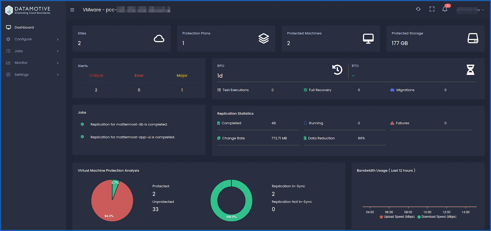

## Objectif

**L'objectif de ce quide est d'introduire la solution Datamotive au sein de l'univers Hosted Private Cloud - VMware on OVHcloud.**

## En pratique

Orchestrateur multi-cloud, Datamotive a reussi à construire une solution qui permet de simplifier le processus d'hybridation des environnements cloud privée et publique.

Elle dispose de 3 produits au sein de ça solution :

* `EasyMigrate` : Transformer la portabilité et la gestion des charges de travail.
* `EasyHybridDR` : Protégez vos charges de travail en toute transparence.
* `EasyAnalytics` : Transformez vos données en informations exploitables.

### Étape 1 - Introduction

#### Depuis la console Datamotive

Pour vous connecter à la console Datamotive, utilisez l'adresse IP ou le nom de domaine que vous avez configuré : 

- `Url` : https://XX.XX.XX.XX:5000/dashboard

Le port d'accès utilisé par défaut à l'interface de management est le port `5000`.

Si vous utilisez un annuaire Active Directory, vous pouvez utiliser le bouton `Sign In with Active Directory`.

{.thumbnail}

Vous serez redirigé sur le dashboard Datamotive.

{.thumbnail}

### Étape 2 - La console Web Datamotive

## Aller plus loin

Si vous avez besoin d'une formation ou d'une assistance technique pour la mise en œuvre de nos solutions, contactez votre Technical Account Manager ou rendez-vous sur [cette page](/links/professional-services) pour obtenir un devis et demander une analyse personnalisée de votre projet à nos experts de l’équipe Professional Services.

Posez des questions, donnez votre avis et interagissez directement avec l’équipe qui construit la solution Datamotive sur le [site Web](https://www.datamotive.io/).

Échangez avec notre [communauté d'utilisateurs OVHcloud](/links/community).