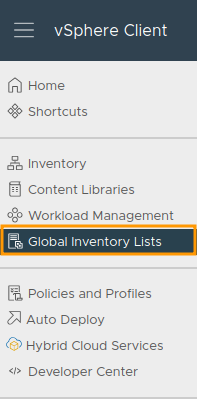
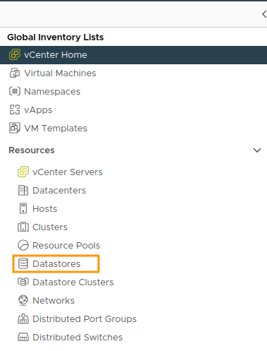

## Objectif

**Découvrez comment téléverser des fichiers dans un dossier de votre banque de données depuis le client HTML VMware vSphere on OVHcloud.**

## Prérequis

- Être connecté à [l'espace client OVHcloud](/links/manager).
- Être administrateur technique de l'infrastructure [VMware on OVHcloud](/links/hosted-private-cloud/vmware).
- Si vous utilisez IAM, vérifiez bien que vous disposez des droits, rôles et actions nécessaires pour téléverser des fichiers ou créer des répertoires dans le datastore. Pour plus d'informations, consultez le guide « [IAM pour VMware on OVHcloud - Présentation et FAQ](/pages/hosted_private_cloud/hosted_private_cloud_powered_by_vmware/vmware_iam_getting_started) ».

## En pratique

> [!primary]
> 
> Ce guide remplace la méthode SFTP, devenue obsolète : [Se connecter en SFTP](/pages/hosted_private_cloud/hosted_private_cloud_powered_by_vmware/sftp_connexion).
>

### Étape 1 - Accéder au datastore

Connectez-vous à l'interface web vSphere, en vous aidant si besoin du guide « [Se connecter à la console Web vSphere on OVHcloud](/pages/hosted_private_cloud/hosted_private_cloud_powered_by_vmware/vsphere_interface_connexion) ».

Vous devez ensuite accéder aux repertoires sur lequel vous voulez stocker vos fichiers (ISO par exemple). L'objectif étant de créer une arborescence afin de retrouver facilement vos éléments au sein de votre vSphere managé.

{.thumbnail}

### Étape 2 - Téléverser des fichiers

Vous disposez de 2 façons d'y accéder, libre à vous de choisir celle qui vous convient le mieux :

**1\. Depuis le menu `Inventaire`{.action} :**

|                                        **Images**                                         | **Étapes**                                                                       |
|:-----------------------------------------------------------------------------------------:|:---------------------------------------------------------------------------------|
| {.thumbnail}      | - Cliquez sur `Inventaire`{.action}.                                         |
| {.thumbnail}<br/> {.thumbnail}| - Depuis `pcc-XXX-XXX-XXX-XXX.ovh.XX`, cliquez sur `Banques de données`{.action}. |

Vous retrouvez alors l'ensemble de vos banques de données (datastores) listées.

Cliquez sur votre banque de données pour voir apparaitre une section `Fichiers`{.action} dans laquelle s'ouvre votre fenêtre automatiquement.

{.thumbnail}

Depuis la section `Fichiers`{.action} de votre banque de données ouverte, cliquez sur `TÉLÉCHARGER DES FICHIERS`{.action}

Localisez l'élément à téléverser depuis votre ordinateur local (un fichier `XXX.iso` par exemple) et cliquez sur `Ouvrir`{.action} pour téléverser le fichier (ISO ou autre) depuis votre machine connectée au client HTML vSphere.

Le téléversement du fichier ISO commence automatiquement sans validation dans le dossier (s'il y en a un) de votre banque de données sélectionnée.

Vous pouvez actualiser l'explorateur de fichiers de la banque de données pour afficher le fichier téléversé dans la liste.

{.thumbnail}

Vous pouvez ainsi lancer ce fichier ISO depuis un périphérique CD/DVD au sein de vote VM et lancer l'installation de l'OS en suivant le processus d'installation. Il est cependant recommandé d'utiliser des modèles de déploiement OVHcloud ou des clones de VM transformés en modèles (*templates*) par vos soins.

**2\. Depuis le menu `Listes d'inventaires globaux`{.action} :**

Ce menu vous renvoie également à l'interface `Fichers`{.action} de téléversement :

|                                        **Images**                                         | **Étapes**                                                |
|:-----------------------------------------------------------------------------------------:|:----------------------------------------------------------|
| {.thumbnail}      | - Cliquez sur `Listes d'inventaires globaux`{.action}. |
| {.thumbnail} | - Puis sur `Banques de données`{.action}.                  |

{.thumbnail}

Cliquez sur le `Datastore` souhaité.

Vous allez vous retrouver dans la section `Fichiers`{.action} ou vous pourrez téléverser des données dans votre banque de données.

Cliquez ensuite sur `TELECHARGER DES FICHIERS`{.action} pour sélectionner le fichier (ISO ou autre) à téléverser depuis votre machine locale.

Localisez l'élément à téléverser depuis votre ordinateur local (un fichier `XXX.iso` par exemple) et cliquez sur `Ouvrir`{.action}

### Étape 3 - Téléverser des dossiers

Depuis votre banque de données, dans la section `Fichiers`{.action}, cliquez sur `TÉLÉCHARGER UN DOSSIER`{.action}.

Localisez l'élément à téléverser depuis votre machine connectée au client HTML vSphere et cliquez sur `Ouvrir`{.action}

Le téléversement ne commencera qu'après la confirmation validée : 

|                                       **Images**                                       | **Étapes**                                       |
|:--------------------------------------------------------------------------------------:|:-------------------------------------------------|
|        {.thumbnail}        | - Pour confirmer, cliquez sur `Envoyer`{.action}. |

### Étape 4 - Déplacer/Copier des fichiers

Depuis votre banque de données, cliquez sur `DÉPLACER VERS`{.action} ou `COPIER DANS`{.action}.

{.thumbnail}

Localisez l'élément de destination à déplacer depuis la banque de données et cliquez sur `OK`{.action}.

{.thumbnail}

Vous devez disposer des droits suffisants pour effectuer ce type d'actions.

### Étape 5 - Renommer des fichiers

Depuis votre banque de données, cliquez sur `Remplacer le nom par`{.action}.

{.thumbnail}

Renommez votre fichier puis cliquez sur `OK`{.action}.

### Étape 6 - Créer un dossier (facultatif)

Depuis la section `Fichiers`{.action} de votre banque de données, cliquez sur `NOUVEAU DOSSIER`{.action} pour créer un dossier où stocker vos fichiers.

Nommez votre dossier et cliquez sur `OK`{.action}.

{.thumbnail}

### Étape 7 - Téléversement sur l'API VMware (govmomi)

Une bibliothèque Go pour interagir avec les API VMware vSphere (ESXi et/ou vCenter Server) est fournis par VMware.  Vous pouvez consulter le dépot github à [cette url](https://github.com/vmware/govmomi?tab=readme-ov-file)

En plus du client API vSphere, ce dépôt comprend :

- [govc](https://github.com/vmware/govmomi/blob/main/govc/README.md) - vSphere CLI
- [vcsim](https://github.com/vmware/govmomi/blob/main/vcsim/README.md) - vSphere API mock framework
- [toolbox](https://github.com/vmware/govmomi/blob/main/toolbox/README.md) - Framework des outils invités des VM

#### Installation et configuration

**Sur Linux**

Avec le binaire :

```bash
# extract govc binary to /usr/local/bin
# note: the "tar" command must run with root permissions
curl -L -o - "https://github.com/vmware/govmomi/releases/latest/download/govc_$(uname -s)_$(uname -m).tar.gz" | tar -C /usr/local/bin -xvzf - govc
```

Via `go install` :

```bash
go install github.com/vmware/govmomi/govc@latest
```
Avec Docker :

[L'image Docker](https://hub.docker.com/r/vmware/govc) `govc` est construite depuis ce [Dockerfile](https://github.com/vmware/govmomi/blob/main/Dockerfile.govc).

Pour les installations alternatives, consultez le dépot Git `Govc` VMware officiel à [cette url](https://github.com/vmware/govmomi/blob/main/govc/README.md).

Le programme fournit un vaste choix d’arguments pour définir les conditions d’accès à l’API (par exemple son URL, l’utilisateur/mot de passe à utiliser, etc…) mais nous vous conseillons bien sûr d’utiliser des variables d’environnement pour gérer plus efficacement vos clusters, surtout si vous êtes amenés à vous connecter à plusieurs APIs. Au lieu de les définir à la volée, il vaut mieux les placer dans un fichier pour réutilisation lors d’une autre session.

Voici par exemple pour Linux :

```bash
# govc.env
export GOVC_DATACENTER=<Nom du datacenter par défaut au sens VMWare du terme>
export GOVC_USERNAME=<Utilisateur local vmware>
export GOVC_PASSWORD=<Mot de passe de l'utilisateur local VMware>
export GOVC_URL=<IP ou hostname du vsphere> // Exemple : pcc-XXX-XX-XX-XX.ovh.XX
export GOVC_INSECURE=1 # Ignorer les problèmes de certificat, utile en réseau local
export GOVC_DATASTORE=<Datastore par défaut> // Exemple : ssd-XXXXXX / storageLocal_XXX-XX-XX-XX / NFS_XXXXXX

# Si besoin d'utiliser un proxy réseau
# export HTTP_PROXY=http://XXX.XX.X.X:XXXXX
# export HTTPS_PROXY=http://XXX.XX.X.X:XXXXX
```
Comme pour tout fichier contenant des variables, il suffit de le sourcer dans un terminal.

```bash
source govc.env
```

Au lancement de chaques commandes, des options peuvent être modifiées à la volée pour surcharger les variables d’environnement, par exemple :

```bash
govc datastore.ls -dc=Datacenter2 -ds=Datastore1 -debug=true
```

À noter que si vous utilisez la commande debug (le “=true” est optionnel, s’agissant d’un flag Go), un dossier caché .govmomi/debug sera créé avec des logs vous permettant de tracer votre problème.

#### Usage

Nous allons vous exposer ici quelques commandes simples puis quelques examples d’applications concrètes.

Tout d’abord, il faut comprendre qu’au sein d’un datacenter, sont regroupés les objets d’un même type, sous `VM`, `Network`, `Host` et `Datastore`. Ainsi, comme vous allez le deviner très vite, il existe deux méthodes pour lister les hosts, soit avec la commande `govc ls host` ou `govc find /host`.

**Lister les objets d’un DC**

```bash
govc ls

# Le résultat donne :
# /DC/vm
# /DC/network
# /DC/host
# /DC/datastore

govc ls vm/dossier-vm/vm-1
govc ls host
```

**Lister tous les objets du vCenter**

Lister les VM avec “prod” dans le nom. Enfin, lister les hosts avec 12 vcpu.

```bash
govc find /
govc find vm -type m -name *prod*
govc find . -type h -hardware.cpuInfo.numCpuCores 16
```

**Lister/téléverser/créer des dossiers dans un Datastore**

Notamment avec l’usage des disques vous pouvez explorer le datastore spécifié en `envvar`, créer un dossier, y envoyer un fichier local, puis un fichier en `stdin`.


```bash
govc datastore.info
govc datastore.ls dossier-1/
govc datastore.mkdir dossier-isos/
govc datastore.upload image.iso dossier-isos/image.iso
curl https://example.com/iso/image.iso | govc datastore.upload - dossier-isos/image.iso
```

**Afficher les informations**

Par exemple les informations étendues d’une VM, la snapshotter, la rebooter puis ouvrir une console (nécessite vmrc)

```bash
# À noter qu'il n'y a ni le DC, ni le prefix "vm" dans le path retourné par la commande govc ls, il est induit
vm=Prod/Machine_virtuelle_1
govc vm.info -e $vm
govc snapshot.create $vm snapshot-$(date +%F)
govc vm.power -r $vm
xdg-open $(govc vm.console $vm)
```

Afficher les controlleurs et disques attachés à une VM, démonter un de ceux-là, en créer un nouveau sur le datastore, puis l’attacher à la VM. Enfin, attacher un nouvel ISO.

```bash
govc device.info -vm <VM>

# Keep permet de ne pas supprimer le disque au déttachement ! disk_ref correspond à l'ID selon la VM spécifiée, par exemple "disk-1000-3"
govc device.remove -keep -vm <VM> <disk_ref>
govc datastore.disk.create -size 15G <disk_name>
govc vm.disk.attach -vm <VM> -disk <path/to/disk_name.vmdk>

# dev est le nom de device du cdrom, par exemple cdrom-3000
govc device.cdrom.insert -vm <VM> -device <dev> <path/to/file.iso>
```

Récupérer sur quel `Host` tourne une `VM` donnée pour l’exemple par son `UUID`. Lister les informations et ressources disponibles sur l’Host et également ses interfaces/IPs.

```bash
host=$(govc vm.info -vm.uuid=4233b143-7171-e260-deaa-52921b064dfb | awk '/Host/ {print $2}')
govc host.info $host
govc host.esxcli -host=$host network ip interface ipv4 get
```

Les options disponibles pour esxcli sont accessibles [ici](https://pubs.vmware.com/vsphere-50/index.jsp?topic=%2Fcom.vmware.vcli.ref.doc_50%2Fesxcli_software.html)

**Téléverser des fichiers**

Voici un exemple de téléversement d'image iso avec `govc` :

```bash
govc datastore.upload image.iso dossier-isos/image.iso
```

**Listing complet des commandes govc**

/// details | Usage of govc

```bash
Usage of govc:
  about
  about.cert
  cluster.add
  cluster.change
  cluster.create
  cluster.group.change
  cluster.group.create
  cluster.group.ls
  cluster.group.remove
  cluster.override.change
  cluster.override.info
  cluster.override.remove
  cluster.rule.change
  cluster.rule.create
  cluster.rule.info
  cluster.rule.ls
  cluster.rule.remove
  datacenter.create
  datacenter.info
  datastore.cluster.change
  datastore.cluster.info
  datastore.cp
  datastore.create
  datastore.disk.create
  datastore.disk.inflate
  datastore.disk.info
  datastore.disk.shrink
  datastore.download
  datastore.info
  datastore.ls
  datastore.maintenance.enter
  datastore.maintenance.exit
  datastore.mkdir
  datastore.mv
  datastore.remove
  datastore.rm
  datastore.tail
  datastore.upload
  datastore.vsan.dom.ls
  datastore.vsan.dom.rm
  device.boot
  device.cdrom.add
  device.cdrom.eject
  device.cdrom.insert
  device.connect
  device.disconnect
  device.floppy.add
  device.floppy.eject
  device.floppy.insert
  device.info
  device.ls
  device.remove
  device.scsi.add
  device.serial.add
  device.serial.connect
  device.serial.disconnect
  device.usb.add
  disk.create
  disk.ls
  disk.register
  disk.rm
  disk.snapshot.create
  disk.snapshot.ls
  disk.snapshot.rm
  disk.tags.attach
  disk.tags.detach
  dvs.add
  dvs.change
  dvs.create
  dvs.portgroup.add
  dvs.portgroup.change
  dvs.portgroup.info
  env
  events
  export.ovf
  extension.info
  extension.register
  extension.setcert
  extension.unregister
  fields.add
  fields.info
  fields.ls
  fields.rename
  fields.rm
  fields.set
  find
  firewall.ruleset.find
  folder.create
  folder.info
  guest.chmod
  guest.chown
  guest.df
  guest.download
  guest.getenv
  guest.kill
  guest.ls
  guest.mkdir
  guest.mktemp
  guest.mv
  guest.ps
  guest.rm
  guest.rmdir
  guest.run
  guest.start
  guest.touch
  guest.upload
  host.account.create
  host.account.remove
  host.account.update
  host.add
  host.autostart.add
  host.autostart.configure
  host.autostart.info
  host.autostart.remove
  host.cert.csr
  host.cert.import
  host.cert.info
  host.date.change
  host.date.info
  host.disconnect
  host.esxcli
  host.info
  host.maintenance.enter
  host.maintenance.exit
  host.option.ls
  host.option.set
  host.portgroup.add
  host.portgroup.change
  host.portgroup.info
  host.portgroup.remove
  host.reconnect
  host.remove
  host.service
  host.service.ls
  host.shutdown
  host.storage.info
  host.storage.mark
  host.storage.partition
  host.vnic.change
  host.vnic.info
  host.vnic.service
  host.vswitch.add
  host.vswitch.info
  host.vswitch.remove
  import.ova
  import.ovf
  import.spec
  import.vmdk
  library.clone
  library.create
  library.deploy
  library.export
  library.import
  library.info
  library.ls
  library.rm
  library.session.ls
  library.session.rm
  library.sync
  license.add
  license.assign
  license.assigned.ls
  license.decode
  license.label.set
  license.ls
  license.remove
  logs
  logs.download
  logs.ls
  ls
  metric.change
  metric.info
  metric.interval.change
  metric.interval.info
  metric.ls
  metric.reset
  metric.sample
  object.collect
  object.destroy
  object.method
  object.mv
  object.reload
  object.rename
  object.save
  option.ls
  option.set
  permissions.ls
  permissions.remove
  permissions.set
  pool.change
  pool.create
  pool.destroy
  pool.info
  role.create
  role.ls
  role.remove
  role.update
  role.usage
  session.login
  session.logout
  session.ls
  session.rm
  snapshot.create
  snapshot.remove
  snapshot.revert
  snapshot.tree
  sso.group.create
  sso.group.ls
  sso.group.rm
  sso.group.update
  sso.service.ls
  sso.user.create
  sso.user.id
  sso.user.ls
  sso.user.rm
  sso.user.update
  tags.attach
  tags.attached.ls
  tags.category.create
  tags.category.info
  tags.category.ls
  tags.category.rm
  tags.category.update
  tags.create
  tags.detach
  tags.info
  tags.ls
  tags.rm
  tags.update
  task.cancel
  tasks
  vapp.destroy
  vapp.power
  version
  vm.change
  vm.clone
  vm.console
  vm.create
  vm.customize
  vm.destroy
  vm.disk.attach
  vm.disk.change
  vm.disk.create
  vm.guest.tools
  vm.info
  vm.ip
  vm.keystrokes
  vm.markastemplate
  vm.markasvm
  vm.migrate
  vm.network.add
  vm.network.change
  vm.option.info
  vm.power
  vm.question
  vm.rdm.attach
  vm.rdm.ls
  vm.register
  vm.unregister
  vm.upgrade
  vm.vnc
```
///

## Aller plus loin

- [IAM pour VMware on OVHcloud - Présentation et FAQ](/pages/hosted_private_cloud/hosted_private_cloud_powered_by_vmware/vmware_iam_getting_started)

Si vous avez besoin d'une formation ou d'une assistance technique pour la mise en œuvre de nos solutions, contactez votre Technical Account Manager ou rendez-vous sur [cette page](/links/professional-services) pour obtenir un devis et demander une analyse personnalisée de votre projet à nos experts de l’équipe Professional Services.

Posez des questions, donnez votre avis et interagissez directement avec l’équipe qui construit nos services Hosted Private Cloud sur le [channel Discord dédié](https://discord.gg/ovhcloud).

Échangez avec notre [communauté d'utilisateurs OVHcloud](/links/community).
