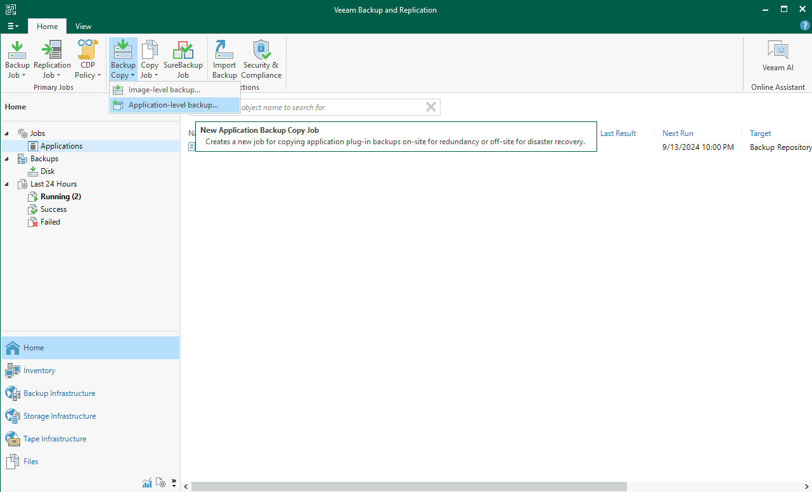
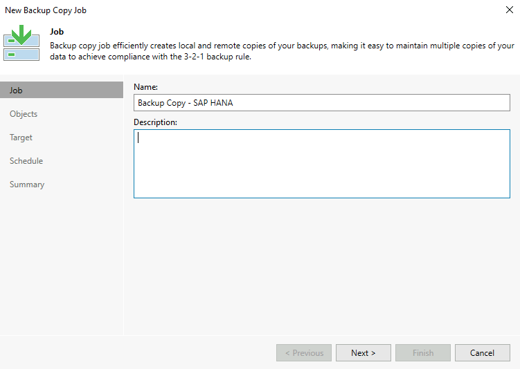
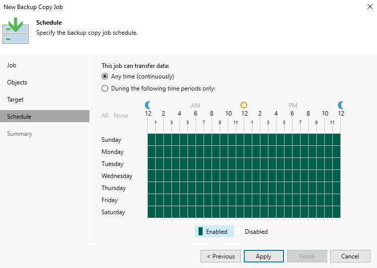
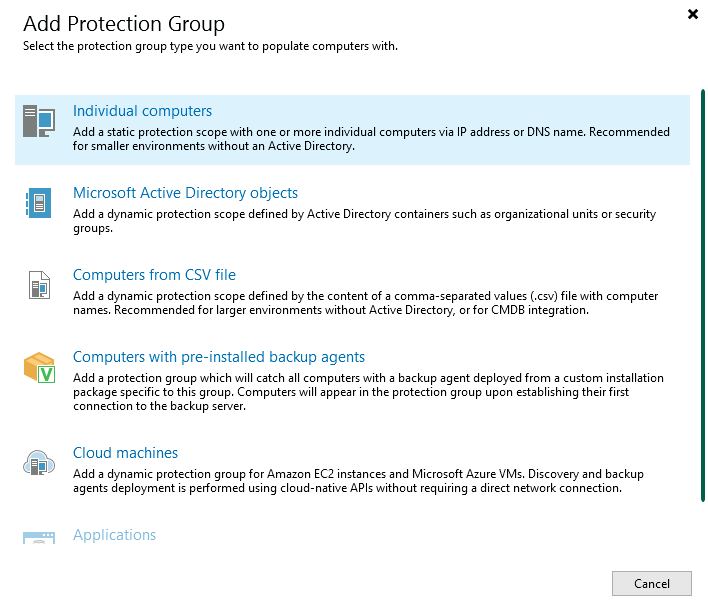
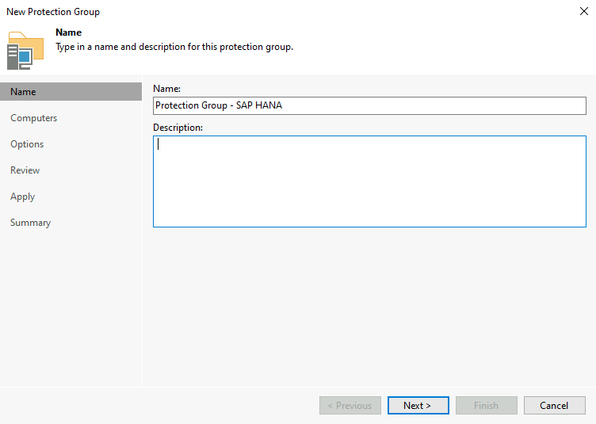
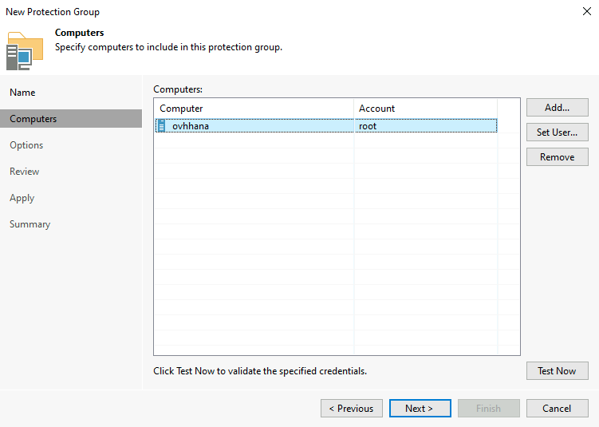
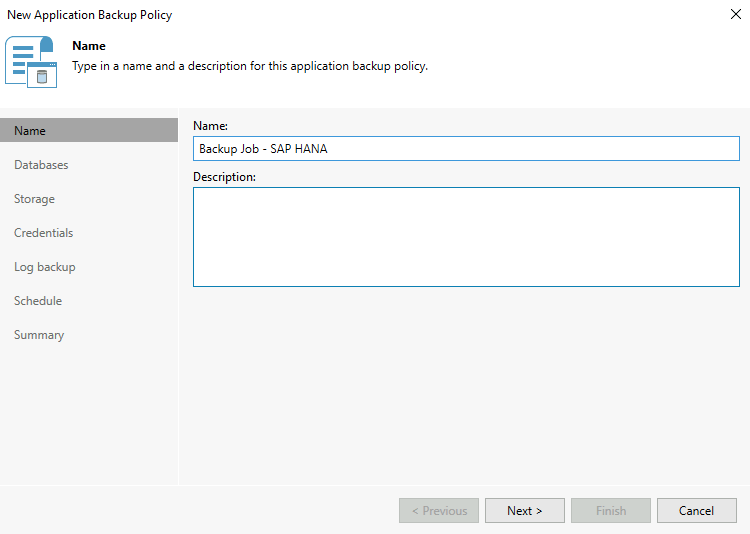
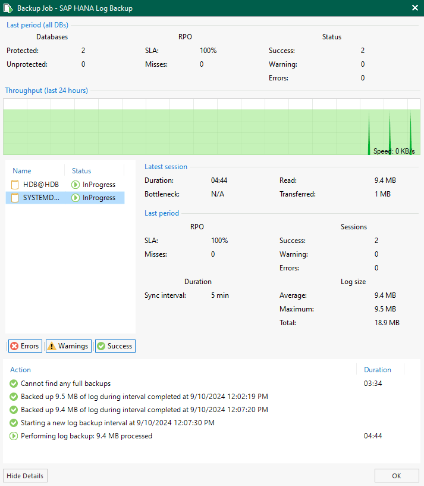
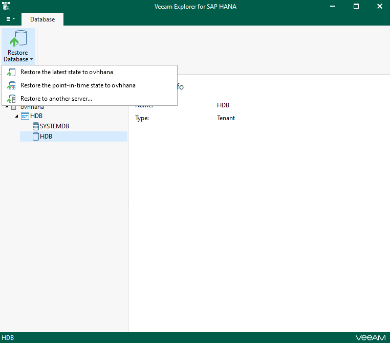

## Objectif

Ce guide fournit des instructions générales pour sauvegarder des bases de données SAP HANA avec Veeam Backup and Replication 12.2 et Veeam Plug-in for SAP HANA.

[Veeam Enterprise Plus avec OVHcloud](https://www.ovhcloud.com/fr/storage-solutions/veeam-enterprise/) vous permet d’utiliser Veeam Backup and Replication 12 au sein de votre infrastructure OVHcloud en bénéficiant d'un niveau de licence Veeam Enterprise Plus.

## Prérequis

- Une base de données SAP HANA installée.
- Un serveur Windows qui hébergera la solution [Veeam Backup and Replication](https://www.ovhcloud.com/fr/storage-solutions/veeam-enterprise/).
- Un espace de stockage qui hébergera les sauvegardes.
- Les [ouvertures firewall](https://helpcenter.veeam.com/docs/backup/plugins/ports_vpsh.html?ver=120) réalisées autorisant les communications entre vos serveurs.

## En pratique

### 1 - Installation de Veeam Backup and Replication

Si vous souhaitez être guidé sur l'installation de Veeam Backup and Replication sur votre serveur Windows, [notre guide](/pages/storage_and_backup/backup_and_disaster_recovery_solutions/veeam/veeam_veeam_backup_replication) vous détaille l'ensemble des étapes.

### 2 - Configuration du Backup Repository

Après l'installation de Veeam Backup and Replication sur votre serveur Windows, vous devez réaliser la configuration du Backup Repository.

Un Backup Repository est un espace de stockage où Veeam Backup and Replication héberge les sauvegardes.

À cette étape, deux cas de figure se présentent :

- [Votre infrastructure n'est pas une infrastructure qualifiée SecNumCloud](#nonsecnumcloud).
- [Votre infrastructure est une infrastructure qualifiée SecNumCloud](#secnumcloud).

#### 2.1 - Configuration d'un Backup Repository pour un besoin non-SecNumCloud 

Dans cette configuration, vous pouvez utiliser un espace de stockage, ainsi qu'un Object Storage S3 pour sécuriser les sauvegardes sur une autre région OVHcloud.

##### 2.1.1 - Création du Backup Repository

> [!tabs]
> **Étape 1**
>>
>> Ouvrez la console Veeam Backup and Replication, sélectionnez `Backup Infrastructure`{.action}, puis `Backup Repositories`{.action}.
>>
>> Cliquez sur `Add Repository`{.action} pour démarrer l'assistant de configuration.
>>
>> {.thumbnail}
>>
> **Étape 2**
>>
>> Sélectionnez `Direct attached storage`{.action} ou `Network attached storage`{.action}, en fonction de votre situation.
>>
>> - `Direct attached storage`{.action} permet d'ajouter un serveur physique ou virtuel comme espace de stockage sans protocole NFS ou SMB.
>> - `Network attached storage`{.action} permet d'ajouter un partage de fichiers via les protocoles NFS ou SMB (CIFS).
>>
>> {.thumbnail}
>>
> **Étape 3**
>>
>> Vous serez guidé dans les étapes de configuration de la connexion à l'espace de stockage, telles que l'adresse IP ou le nom complet (FQDN) de votre serveur, ou encore le chemin où vous souhaitez stocker vos sauvegardes SAP HANA.
>>
>> Retrouvez les étapes détaillées dans le guide d'utilisation de Veeam Backup and Replication 12.
>>
>> - [Direct attached storage with Windows](https://helpcenter.veeam.com/docs/backup/vsphere/repo_add.html?ver=120)
>> - [Direct attached storage with Linux](https://helpcenter.veeam.com/docs/backup/vsphere/linux_repository_add.html?ver=120)
>> - [Direct attached storage with Linux Hardened](https://helpcenter.veeam.com/docs/backup/vsphere/hardened_repository.html?ver=120)
>> - [Network attached storage with SMB (CIFS) Share](https://helpcenter.veeam.com/docs/backup/vsphere/smb_share.html?ver=120)
>> - [Network attached storage with NFS Share](https://helpcenter.veeam.com/docs/backup/vsphere/nfs_share.html?ver=120)
>>
> **Étape 4**
>>
>> Votre Backup Repository est maintenant visible dans la console Veeam Backup and Replication et utilisable par les configurations de sauvegarde.
>>
>> Vous pouvez aller plus loin dans la configuration de ce Backup Repository en configurant des permissions d'accès à un utilisateur ou à un groupe d'utilisateurs spécifiques et en chiffrant les sauvegardes qui seront hébergées dans ce Backup Repository. Retrouvez plus d'informations à ce sujet dans le [guide d'utilisation de Veeam Backup and Replication 12](https://helpcenter.veeam.com/docs/backup/vsphere/access_permissions.html?ver=120).
>>
>> Si vous ne souhaitez pas procéder à la création d'un Backup Repository Object Storage, veillez à configurer les permissions d'accès pour ce Backup Repository. Vous pouvez ensuite continuer avec le chapitre [Installation de Veeam Plug-in for SAP HANA](#veeampluginhana).
>>
>> {.thumbnail}
>>

##### 2.1.2 - Création du Backup Repository Object Storage (facultatif)

Ce Backup Repository servira à sécuriser vos sauvegardes sur un second espace de stockage, pouvant être hébergé sur une seconde région OVHcloud.

Pour découvrir les étapes de création d'un bucket Object Storage S3, veuillez prendre connaissance des étapes détaillées dans [notre guide](/pages/storage_and_backup/object_storage/s3_create_bucket).

> [!tabs]
> **Étape 1**
>>
>> Ouvrez la console Veeam Backup and Replication, sélectionnez `Backup Infrastructure`{.action}, puis `Backup Repositories`{.action}.
>>
>> Cliquez à présent sur `Add Repository`{.action} pour démarrer l'assistant de configuration.
>>
>> {.thumbnail}
>>
> **Étape 2**
>>
>> Sélectionnez `Object storage`{.action}.
>>
>> {.thumbnail}
>>
> **Étape 3**
>>
>> Sélectionnez `S3 Compatible`{.action}.
>>
>> {.thumbnail}
>>
> **Étape 4**
>>
>> Indiquez un nom à votre Object Storage Repository.
>>
>> {.thumbnail}
>>
> **Étape 5**
>>
>> Entrez le `Service point`{.action} qui correspond à l'endpoint du bucket Object Storage S3, ainsi que la région (en minuscule) de votre bucket Object Storage S3.
>>
>> Ajoutez les identifiants de l'utilisateur S3 qui possède le rôle `Administrator`{.action} sur ce bucket Object Storage S3. Il s'agit de la clé d'accès et de la clé secrète de l'utilisateur S3 associée au bucket Object Storage S3. Retrouvez plus d'informations sur l'utilisateur S3 dans [notre guide](/pages/storage_and_backup/object_storage/s3_identity_and_access_management).
>>
>> {.thumbnail}
>>
> **Étape 6**
>>
>> Indiquez le nom du bucket Object Storage S3 dans lequel vous souhaitez stocker vos sauvegardes SAP HANA.
>>
>> Vous devez également indiquer ou créer un répertoire dans ce bucket Object Storage S3.
>>
>> {.thumbnail}
>>
> **Étape 7**
>>
>> Votre Backup Repository de type S3-compatible est maintenant visible dans la console Veeam Backup and Replication et utilisable par les configurations de sauvegarde.
>>
>> {.thumbnail}
>>

##### 2.1.3 - Création du Scale-out Backup Repository (facultatif)

La création d'un Scale-out Backup Repository permettra de sécuriser vos sauvegardes déposées sur votre premier Backup Repository en les copiant sur votre second Backup Repository sans action de votre part.

> [!tabs]
> **Étape 1**
>>
>> Ouvrez la console Veeam Backup and Replication, sélectionnez `Backup Infrastructure`{.action}, puis `Scale-out Repositories`{.action}.
>>
>> Cliquez à présent sur `Add Scale-out Repository`{.action} pour démarrer l'assistant de configuration.
>>
>> {.thumbnail}
>>
> **Étape 2**
>>
>> Donnez un nom à votre Scale-out Backup Repository.
>>
>> {.thumbnail}
>>
> **Étape 3**
>>
>> Cliquez sur `Add`{.action} et sélectionnez votre Backup Repository précédemment créé.
>>
>> {.thumbnail}
>>
> **Étape 4**
>>
>> Sélectionnez la politique de localisation souhaitée. Nous conseillons la politique `Data locality`{.action}.
>>
>> {.thumbnail}
>>
> **Étape 5**
>>
>> Cochez `Extend scale-out backup repository capacity with object storage`{.action}, puis sélectionnez le Backup Repository Object Storage précédemment créé.
>>
>> Cochez l'option `Copy backups to object storage as soon as they are created`{.action} afin de répliquer les sauvegardes du premier Backup Repository sur le second Backup Repository immédiatement après leur création. Cette configuration permet une protection rapide de vos sauvegardes.
>>
>> {.thumbnail}
>>
> **Étape 6**
>>
>> Par défaut, aucun accès n'est autorisé à ce Scale-out Repository.
>>
>> Sélectionnez votre Scale-out Repository et cliquez sur `Set Access Permissions`{.action}.
>>
>> {.thumbnail}
>>
> **Étape 7**
>>
>> Vous avez la possibilité d'autoriser tous les comptes utilisateurs à utiliser ce Scale-out Repository ou de limiter à une liste définie. Nous vous recommandons de n'autoriser que les comptes nécessaires.
>>
>> {.thumbnail}
>>
> **Étape 8**
>>
>> Sur votre bucket Object Storage S3, une structure hiérarchique a été générée et configurée par Veeam Backup and Replication.
>>
>> {.thumbnail}
>>

Une fois ces étapes réalisées, vous pouvez continuer ce guide avec le chapitre [Installation de Veeam Plug-in for SAP HANA](#veeampluginhana).

#### 2.2 - Configuration d'un Backup Repository pour un besoin SecNumCloud 

Dans cette configuration, l'espace de stockage doit également être hébergé sur une infrastructure qualifiée SecNumCloud.

##### 2.2.1 - Création du Backup Repository

> [!tabs]
> **Étape 1**
>>
>> Ouvrez la console Veeam Backup and Replication, sélectionnez `Backup Infrastructure`{.action}, puis `Backup Repositories`{.action}.
>>
>> Cliquez sur `Add Repository`{.action} pour démarrer l'assistant de configuration.
>>
>> {.thumbnail}
>>
> **Étape 2**
>>
>> Sélectionnez `Direct attached storage`{.action} ou `Network attached storage`{.action}, en fonction de votre situation.
>>
>> - `Direct attached storage`{.action} permet d'ajouter un serveur physique ou virtuel comme espace de stockage sans protocole NFS ou SMB.
>> - `Network attached storage`{.action} permet d'ajouter un partage de fichiers via les protocoles NFS ou SMB (CIFS).
>>
>> {.thumbnail}
>>
> **Étape 3**
>>
>> Vous serez guidé dans les étapes de configuration de la connexion à l'espace de stockage, telles que l'adresse IP ou le nom complet (FQDN) de votre serveur, ou encore le chemin où vous souhaitez stocker vos sauvegardes SAP HANA.
>>
>> Retrouvez les étapes détaillées dans le guide d'utilisation de Veeam Backup and Replication 12.
>>
>> - [Direct attached storage with Windows](https://helpcenter.veeam.com/docs/backup/vsphere/repo_add.html?ver=120)
>> - [Direct attached storage with Linux](https://helpcenter.veeam.com/docs/backup/vsphere/linux_repository_add.html?ver=120)
>> - [Direct attached storage with Linux Hardened](https://helpcenter.veeam.com/docs/backup/vsphere/hardened_repository.html?ver=120)
>> - [Network attached storage with SMB (CIFS) Share](https://helpcenter.veeam.com/docs/backup/vsphere/smb_share.html?ver=120)
>> - [Network attached storage with NFS Share](https://helpcenter.veeam.com/docs/backup/vsphere/nfs_share.html?ver=120)
>>
> **Étape 4**
>>
>> Votre Backup Repository est maintenant visible dans la console Veeam Backup and Replication et utilisable par les configurations de sauvegarde.
>>
>> Vous pouvez aller plus loin dans la configuration de ce Backup Repository en configurant des permissions d'accès à un utilisateur ou à un groupe d'utilisateurs spécifiques et en chiffrant les sauvegardes qui seront hébergées dans ce Backup Repository. Retrouvez plus d'informations à ce sujet dans le [guide d'utilisation de Veeam Backup and Replication 12](https://helpcenter.veeam.com/docs/backup/vsphere/access_permissions.html?ver=120).
>>
>> {.thumbnail}
>>

Pour plus d'informations sur les configurations des Backup Repositories, nous vous invitons à consulter la [documentation de Veeam Backup and Replication](https://helpcenter.veeam.com/docs/backup/vsphere/backup_repository.html?ver=120).

La solution Object Storage S3 n'est pour le moment pas qualifiée SecNumCloud. Elle ne peut donc être utilisée pour héberger vos sauvegardes dans un contexte SecNumCloud.

Si vous souhaitez sécuriser vos sauvegardes sur un second Backup Repository, veuillez répéter cette étape. Continuez ce guide avec l'étape [Installation de Veeam Plug-in for SAP HANA](#veeampluginhana), puis suivez le chapitre [Création du Backup Copy job](#backupcopyjob).

##### 2.2.2 - Création du Backup Copy job (optionnel) 

Un Backup Copy job permet de dupliquer les sauvegardes d'un Backup Repository vers un autre, assurant ainsi la sécurité de ces sauvegardes sur un emplacement de stockage distinct. Cette opération est utile pour protéger les données critiques contre la perte ou la corruption, en les conservant sur un site de sauvegarde éloigné géographiquement. Grâce à cette fonctionnalité, vous pouvez configurer des stratégies de sauvegarde avancées pour garantir la résilience et la disponibilité de vos données en cas de sinistre.

> [!primary]
>
> Les ports tcp/2500-3300 doivent être ouverts entre vos Backup Repositories.
>

> [!tabs]
> **Étape 1**
>>
>> Ouvrez la console Veeam Backup and Replication, sélectionnez le menu `Home`{.action}, `Backup Copy`{.action}, puis `Application-level backup...`{.action}.
>>
>> 
>>
> **Étape 2**
>>
>> Indiquez un nom à votre Backup Copy job.
>>
>> 
>>
> **Étape 3**
>>
>> Ajoutez soit les Backup jobs qui gèrent vos sauvegardes de base de données SAP HANA, soit le Backup Repository où ces dernières sont stockées.
>>
>> Dans ce guide, nous avons fait le choix d'utiliser le Backup job.
>>
>> 
>>
> **Étape 4**
>>
>> Sélectionnez votre second Backup Repository qui accueillera les copies des sauvegardes.
>>
>> Prenez connaissance des paramètres disponibles dans le menu `Advanced`{.action}.
>>
>> 
>>
> **Étape 5**
>>
>> Paramétrez les créneaux de réplication si vous le désirez. Par défaut, dès qu'une sauvegarde est réalisée, la copie est enclenchée.
>>
>> 
>>
> **Étape 6**
>>
>> Votre Backup Copy job est à présent opérationnel.
>>
>> 
>>

### 3 - Installation de Veeam Plug-in for SAP HANA 

L'installation de Veeam Plug-in for SAP HANA peut être réalisée par deux méthodes :

- La méthode « Standalone Mode » est une installation manuelle via le binaire extrait de l'ISO de Veeam Backup and Replication sur le serveur hébergeant la base de données SAP HANA. Cette méthode offre des fonctionnalités limitées à travers la console Veeam Backup and Replication.
- La méthode « Managed Mode » est une installation automatisée effectuée via la console Veeam Backup and Replication et permet d'utiliser de nombreuses fonctionnalités telles que la planification d'un job de sauvegarde.

Dans le cadre de cette documentation, nous utiliserons la méthode « Managed Mode » afin d'utiliser l'ensemble des fonctionnalités proposées par Veeam.

#### 3.1 - Création du groupe de protection

La création d'un groupe de protection est un pré-requis de l'installation de Veeam Plug-in for SAP HANA en Managed Mode.

> [!tabs]
> **Étape 1**
>>
>> Ouvrez la console Veeam Backup and Replication, sélectionnez `Inventory`{.action}, puis `Physical Infrastructure`{.action}.
>>
>> Cliquez sur `Create Protection Group`{.action}.
>>
>> {.thumbnail}
>>
> **Étape 2**
>>
>> Cliquez sur `Individual computers`{.action}.
>>
>> {.thumbnail}
>>
> **Étape 3**
>>
>> Donnez un nom à votre groupe de protection. Puis cliquez sur `Next`{.action}.
>>
>> {.thumbnail}
>>
> **Étape 4**
>>
>> Ajoutez le ou les bases de données SAP HANA que vous souhaitez ajouter à ce groupe de protection. Vous pouvez par exemple regrouper vos bases de données de production. Puis cliquez sur `Next`{.action}.
>>
>> *Pour des raisons de sécurité, il est conseillé de créer un compte Linux dédié à la connexion de Veeam sur votre serveur afin de ne pas utiliser le compte root.*
>>
>> {.thumbnail}
>>
> **Étape 5**
>>
>> Configurez la fréquence du scan du groupe de protection.
>>
>> Cochez `Install application plug-ins`{.action}. Cliquez sur `Configure`{.action}, puis cochez `SAP HANA`{.action}.
>>
>> Cliquez sur `Next`{.action} pour continuer.
>>
>> {.thumbnail}
>>
> **Étape 6**
>>
>> La création du groupe de protection s'initialise, un premier scan est lancé sur la ou les bases de données SAP HANA que vous avez précédemment ajoutée(s) et l'installation de Veeam Plug-in for SAP HANA ainsi que ses dépendances est lancée.
>>
>> {.thumbnail}
>>

#### 3.2 - Création du job de sauvegarde

Suite à l'installation de Veeam Plug-in for SAP HANA en Managed mode, nous sommes à présent en capacité de créer un job de sauvegarde et de gérer sa planification via la console Veeam Backup and Replication.

> [!tabs]
> **Étape 1**
>>
>> Ouvrez la console Veeam Backup and Replication, sélectionnez le menu `Home`{.action}, `Backup job`{.action}, `Application`{.action}, puis `SAP HANA`{.action}.
>>
>> {.thumbnail}
>>
> **Étape 2**
>>
>> Donnez un nom à votre job de sauvegarde SAP HANA. Puis cliquez sur `Next`{.action}.
>>
>> {.thumbnail}
>>
> **Étape 3**
>>
>> Sélectionnez votre ou vos bases de données SAP HANA, ainsi que les TENANT associés (SYSTEMDB et/ou TENANTDB) que vous souhaitez gérer avec ce job de sauvegarde. Puis cliquez sur `Next`{.action}.
>>
>> {.thumbnail}
>>
> **Étape 4**
>>
>> Sélectionnez le `Backup repository`{.action} dans lequel vous souhaitez déposer vos sauvegardes SAP HANA. Vous avez également la possibilité de gérer la rétention des sauvegardes dans ce `Backup repository`{.action}. La rétention ne supprime cependant pas les sauvegardes dans le catalogue des sauvegardes SAP HANA.
>>
>> Cliquez sur `Advanced...`{.action} afin de planifier les sauvegardes complètes, sélectionnez le type de sauvegardes incrémentales ou différentielles. Dans l'onglet `SAP HANA`{.action}, vous avez la possibilité de paramétrer le nombre de canaux pour optimiser la vitesse de sauvegarde SAP HANA. 
>>
>> Cliquez sur `Next`{.action} pour continuer.
>>
>> {.thumbnail}
>>
> **Étape 5**
>>
>> Configurez les identifiants OS et de la base de données SAP HANA. Puis cliquez sur `Next`{.action}.
>>
>> *Pour des raisons de sécurité, il est conseillé de créer un compte Linux dédié à la connexion de Veeam sur votre serveur afin de ne pas utiliser le compte root. Il en va de même pour le compte permettant la connexion à la base de données SAP HANA, le compte n'ayant besoin que des privilèges de sauvegarde.*
>>
>> {.thumbnail}
>>
> **Étape 6**
>>
>> Vous avez la possibilité de gérer les log backups soit par le mécanisme SAP HANA, soit par Veeam. En choisissant la gestion des log backups via Veeam, vous obtenez des informations détaillées sur les log backups dans la console Veeam Backup and Replication.
>>
>> Dans ce guide, nous avons fait le choix d'utiliser la gestion via Veeam afin de vous présenter la fonctionnalité.
>>
>> Cliquez sur `Next`{.action} pour continuer.
>>
>> {.thumbnail}
>>
> **Étape 7**
>>
>> Configurez la planification de l'exécution du Backup job. Puis cliquez sur `Apply`{.action}.
>>
>> {.thumbnail}
>>
> **Étape 8**
>>
>> Veillez à cocher `Enable the backup policy when I click Finish`{.action} afin d'activer le Backup job. Cliquez sur `Finish`{.action} pour terminer la configuration du Backup job.
>>
>> {.thumbnail}
>>
> **Étape 9**
>>
>> Nous vous recommandons d'appliquer les paramètres suivants sur votre base de données SAP HANA :
>>
>> - Appliquez le paramètre [catalog_backup_using_backint](https://help.sap.com/docs/SAP_HANA_PLATFORM/009e68bc5f3c440cb31823a3ec4bb95b/514ab38a2e574c85a70ebba80ff16d99.html?locale=en-US&version=2.0.05#loio514ab38a2e574c85a70ebba80ff16d99__configSPS05_id_723) à `true` pour sauvegarder le catalogue de sauvegardes en dehors de votre base de données SAP HANA.
>> - Appliquez le paramètre [data_backup_buffer_size](https://help.sap.com/docs/SAP_HANA_PLATFORM/009e68bc5f3c440cb31823a3ec4bb95b/514ab38a2e574c85a70ebba80ff16d99.html?locale=en-US&version=2.0.05#loio514ab38a2e574c85a70ebba80ff16d99__configSPS05_id_726) en suivant la méthode suivante : 512 MB * [le nombre de canaux](#canaux) (MAX: 4096 MB)
>>

Vous pouvez à présent lancer une sauvegarde de votre base de données SAP HANA afin de vous assurer que votre configuration fonctionne comme vous le désirez.

Pour cela, il suffit de vous rendre dans le menu `Home`{.action}, de sélectionner `Jobs`{.action} puis `Applications`{.action}, puis de sélectionner votre Backup job et de cliquer sur `Full`{.action}. Cela aura pour effet de lancer une sauvegarde complète sur la ou les bases de données SAP HANA configurées dans ce Backup job.

Vous pouvez suivre la progression du Backup job.

{.thumbnail}

Lors de l'exécution des log backups, vous avez la possibilité d'accéder à des informations détaillées.

{.thumbnail}

Si vous avez configuré un Scale-out Repository avec un bucket Object Storage S3, vous pouvez observer vos sauvegardes sur votre bucket Object Storage S3.

{.thumbnail}

Si vous êtes dans un contexte SecNumCloud et que vous souhaitez sécuriser vos sauvegardes sur un second Backup Repository, configurez un [Backup Copy job](#backupcopyjob).

Si vous souhaitez découvrir toutes les possibilités avec Veeam Plug-in for SAP HANA, nous vous conseillons de prendre connaissance de la documentation [Veeam](https://helpcenter.veeam.com/docs/backup/plugins/sap_hana_plugin.html?ver=120).

### 4 - Restauration

Pour restaurer votre base de données SAP HANA depuis une sauvegarde réalisée avec Veeam Backup and Replication, vous pouvez réaliser les étapes suivantes depuis la console Veeam Backup and Replication et Veeam Explorer for SAP HANA.

> [!primary]
>
> Les ports suivants doivent être ouverts entre votre serveur Veeam Backup and Replication et votre base de données SAP HANA :
>
> - SAP Host Agent HTTP – tcp/1128
> - SOAP HTTP - tcp/5<NN\>13
>
> Si vous désirez effectuer la communication via le protocole HTTPS, les ports sont :
>
> - SAP Host Agent HTTPS - tcp/1129
> - SOAP HTTPS - tcp/5<NN\>14
>

> [!tabs]
> **Étape 1**
>>
>> Ouvrez la console Veeam Backup and Replication, sélectionnez `Home`{.action}, `Backups`{.action}, `Disk`{.action}, puis cliquez sur `Restore from SAP HANA backups...`{.action} en faisant un clic droit sur la sauvegarde de votre base de données SAP HANA.
>>
>> 
>>
> **Étape 2**
>>
>> L'application Veeam Explorer for SAP HANA s'ouvre et vous permet de restaurer soit le SYSTEMDB, soit le TENANTDB de votre base de données SAP HANA. L'ensemble des modes de restauration sont disponibles :
>>
>> - [Restauration avec les sauvegardes les plus récentes](https://helpcenter.veeam.com/docs/backup/explorers/vehana_restore_single_latest.html?ver=120).
>> - [Restauration à une date et heure précise (Point-in-Time Recovery)](https://helpcenter.veeam.com/docs/backup/explorers/vehana_restore_single_pit.html?ver=120).
>> - [Restauration vers une autre base de données SAP HANA](https://helpcenter.veeam.com/docs/backup/explorers/vehana_restore_single_tas.html?ver=120).
>>
>> Vous serez guidé dans les étapes pour la restauration en fonction du mode sélectionné.
>>
>> 
>>
> **Étape 3**
>>
>> La restauration de votre base de données SAP HANA s'exécute. Vous avez la possibilité de suivre la progression de la restauration via Veeam Explorer for SAP HANA.
>>
>> Une fois la restauration effectuée avec succès, votre base de données est démarrée.
>>
>> 
>>

## Aller plus loin

Si vous avez besoin d'une formation ou d'une assistance technique pour la mise en oeuvre de nos solutions, contactez votre commercial ou cliquez sur [ce lien](https://www.ovhcloud.com/fr/professional-services/) pour obtenir un devis et demander une analyse personnalisée de votre projet à nos experts de l’équipe Professional Services.

Échangez avec notre [communauté d'utilisateurs](/links/community).
