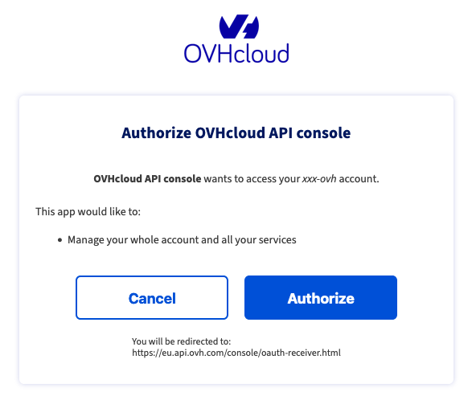
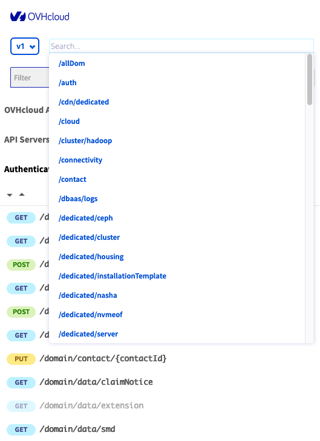
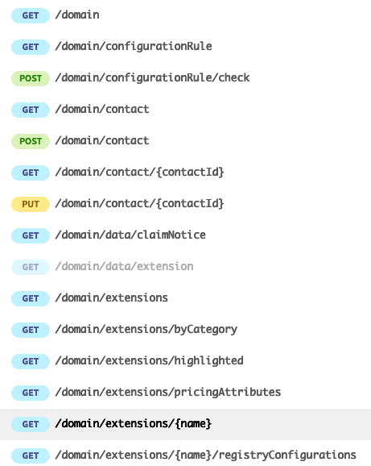
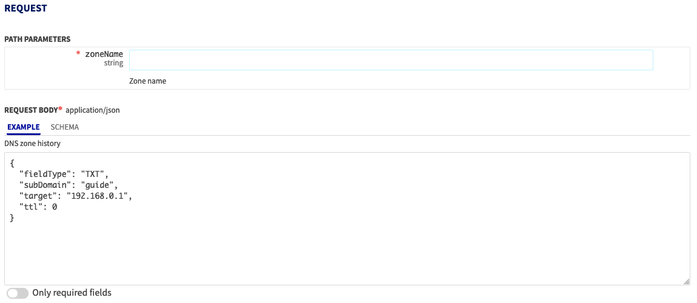

## Objective

The APIs available on [https://ca.api.ovh.com/](https://ca.api.ovh.com/){.external} allow you to purchase, manage, update and configure OVHcloud products without using a graphical interface such as the Control Panel.

**Learn how to use OVHcloud APIs and how to pair them with your applications.**

## Requirements

- You have an active OVHcloud account and know its credentials.
- You are on the [OVHcloud API](https://ca.api.ovh.com/){.external} web page.

## Instructions

> [!warning]
>OVHcloud is providing you with services for which you are responsible, with regard to their configuration and management. You are therefore responsible for ensuring they function correctly.
>
>This guide is designed to assist you in common tasks as much as possible. Nevertheless, we recommend contacting a specialised provider and/or the software publisher for the service if you encounter any difficulties. We will not be able to assist you ourselves. You can find more information in the [“Go further”](#gofurther) section of this guide.
>

### Simple Use

#### Sign in to OVHcloud APIs

On the [OVHcloud API](https://ca.api.ovh.com/) page, click `Explore the OVH API`{.action} to view the list of APIs.

To use the APIs on your products, you must sign in to this site using your OVHcloud credentials.

- Click `Authentication`{.action} in the upper left.
- Select `Login with OVHcloud SSO`{.action}.
- Enter your OVHcloud credentials.
- Click `Authorize`{.action} to allow performing API calls through the console.

{.thumbnail}

> [!primary]
>
> If your OVHcloud account is protected by [two-factor authentication](/pages/account_and_service_management/account_information/secure-ovhcloud-account-with-2fa), you will also need to enter the code generated by SMS or OTP mobile application or U2F key.
>

#### Explore available products on APIs

You can see the list of OVHcloud products that can be managed with APIs on the left menu. This list is sorted alphabetically.

{.thumbnail}

For example, to view the domain name APIs, click **/domain** in the list.

After you click the product, a list of the product's APIs appears below.

{.thumbnail}

You can also use the selector on the left of the list of products to switch between the **/v1** and **/v2** branches of the API.
If you're not familiar with the API branches, you can read the following [documentation about the API v2](/pages/manage_and_operate/api/apiv2).

#### Run API

There are 4 types of APIs available that use what are called HTTP methods: 

**GET** 

The GET method is used to retrieve data from a resource.

For example, to retrieve a list of your domain names, use the following API:
 
> [!api]
>
> @api {v1} /domain GET /domain
>

**POST**

The POST method is used to send additional data to the resource. 

For example, to add a record to your DNS zone, use the following API:

> [!api]
>
> @api {v1} /domain POST /domain/zone/{zoneName}/record
>

**PUT**

The PUT method is used to replace the current data in the resource with the data in the query.

For example, if you have mistakenly set a record in your DNS zone, use the following API:

> [!api]
>
> @api {v1} /domain PUT /domain/zone/{zoneName}/record/{id}
>

**DELETE**

The DELETE method is used to delete the called resource.

For example, if you do not want to keep the DNS record that you added to your DNS zone, use the following API:

> [!api]
>
> @api {v1} /domain DELETE /domain/zone/{zoneName}/record/{id}
>

##### **API parameters**

After you click the API you want, the **Request** section allows you to assign variables for its application.
 
For example, when adding a TXT record to your DNS zone, you will optimise the following settings:
 	
{.thumbnail} 
 
Once you have set the parameters, you can launch the API by clicking `TRY`{.action}.

The `Response` tab displayed will give you the API execution report.

{.thumbnail}

The `PHP` and `Python` tabs contain the elements to be added to your script according to the language used.

### Advanced usage: pair OVHcloud APIs with an application

#### Create your app keys

Any application that wants to communicate with the OVHcloud API must be declared in advance.

To do this, click the following link: [https://ca.api.ovh.com/createToken/](https://ca.api.ovh.com/createToken/){.external}.

Fill in your OVHcloud customer ID, password, and application name. The name will be useful later if you want to allow others to use it.

You can also add a description of the application and a validity period. 

The `Rights` field allows you to restrict the use of the application to certain APIs. 
<br> In order to allow all OVHcloud APIs for an HTTP method, put an asterisk (`*`) into the field, as in the following example where the GET method is allowed for all APIs:

{.thumbnail}

After you click `Create keys`{.action}, you will be issued three keys:

- the application key, called **AK**. For example:

```console
7kbG7Bk7S9Nt7ZSV
```

- your secret application key, not to be disclosed, called **AS**. For example:

```console
EXEgWIz07P0HYwtQDs7cNIqCiQaWSuHF
```

- a secret "**consumer key**", not to be disclosed, called **CK**. For example:

```console
MtSwSrPpNjqfVSmJhLbPyr2i45lSwPU1
```

In this case, the **CK** key is attached to your account.

The **CK** token can be used for rights delegation. See the following guide for more information: [How to manage a customer’s account via OVHcloud API](/pages/manage_and_operate/api/api_right_delegation)

#### First API Usage

Once you have obtained your three keys (**AK**, **AS**, **CK**), you can sign API requests. The signature is calculated as follows:

```console
"$1$" + SHA1_HEX(AS+"+"+CK+"+"+METHOD+"+"+QUERY+"+"+BODY+"+"+TSTAMP)
```

To simplify the development of your applications, OVHcloud provides API wrappers in multiple languages.
Using them will help you to avoid worrying about signing requests, so that you can focus on developing your application.

- *Go* : <https://github.com/ovh/go-ovh>
- *Perl* : <https://github.com/ovh/perl-ovh>
- *Python* : <https://github.com/ovh/python-ovh>
- *PHP* : <https://github.com/ovh/php-ovh>
- *Node.js* : <https://github.com/ovh/node-ovh>
- *C#* : <https://github.com/ovh/csharp-ovh>

Here is an example of how to use the `/me` section to manage your OVHcloud account:

```python
import ovh

# Instantiate. Visit https://ca.api.ovh.com/createToken/?GET=/me
# to get your credentials
client = ovh.Client(
    endpoint='ovh-eu',
    application_key='<application key>',
    application_secret='<application secret>',
    consumer_key='<consumer key>',
)

# Print nice welcome message
print("Welcome", client.get('/me')['firstname'])
```

#### List and revoke your keys

There is currently no Control Panel option to list and revoke your keys. The API portal can be used to do that :

- List the keys IDs with the following call:

> [!api]
>
> @api {v1} /me GET /me/api/application
>

- Get key details with the following call:

> [!api]
>
> @api {v1} /me GET /me/api/application/{applicationId}
>

- Revoke a key with the following call:

> [!api]
>
> @api {v1} /me DELETE /me/api/application/{applicationId}
>

## Go further <a name="gofurther"></a>

[Managing a Domain Name with the OVHcloud API](/pages/web_cloud/domains/api_domain_intro)

[How to manage a customer’s account via OVHcloud API](/pages/manage_and_operate/api/api_right_delegation)

Join our community of users on <https://community.ovh.com/en/>.
