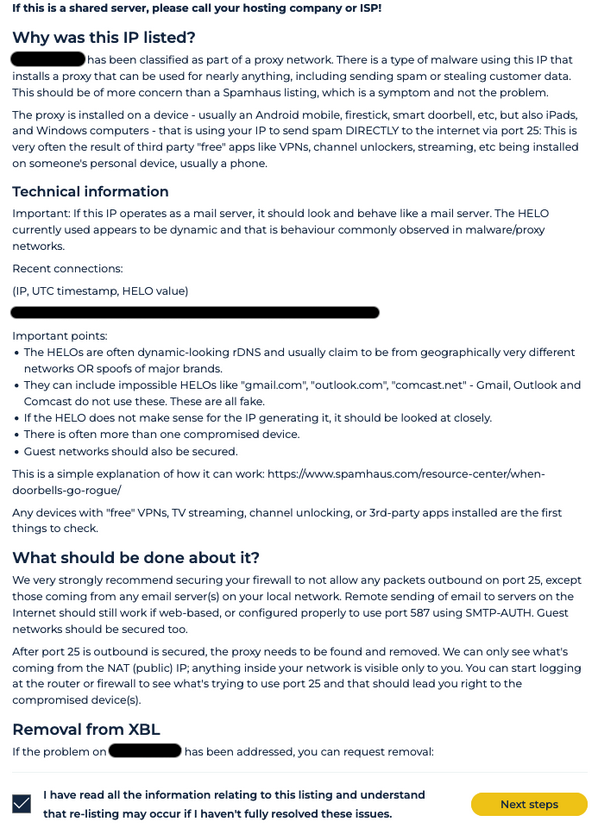

<style>
details>summary {
    color:rgb(33, 153, 232) !important;
    cursor: pointer;
}
details>summary::before {
    content:'\25B6';
    padding-right:1ch;
}
details[open]>summary::before {
    content:'\25BC';
}
</style>

## Objective

Blocklisting, also known as blacklisting, is a spam-fighting tool used on IPs (or IP ranges) to block email that is considered spam or may contain malware. If an email domain or IP address is blocklisted, emails from that domain name or IP address may not reach their client - impacting deliverability and sender reputation. Emails that do go through may go to the recipient's spam folder rather than their inbox.

It is important to note that blocklists can include domain names and IP addresses that are not threats to users and that some spam filtering services take reverse DNS into account when evaluating IP addresses, such as SpamRATS.

> [!primary]
> Please see our guide on [how to prevent your emails from being marked as spam](/pages/bare_metal_cloud/dedicated_servers/mail_sending_optimization) to see the best practices for running an email server.
>

**This guide explains actions you can take to delist your OVHcloud IP addresses if they are on a blocklist.**

> [!warning]
> The information in this guide is subject to change and applies to newly purchased IP addresses. OVHcloud cannot be held responsible for the actions of third-party providers.
>
> We recommend that you contact a [specialist service provider](/links/partner) or reach out to [our community](/links/community) if you face difficulties or doubts concerning the administration, usage or implementation of services on a server.
>

## Requirements

- You have no open abuse cases involving your services.

## Instructions

### Supported providers

- [Spamhaus](https://check.spamhaus.org/)

    - [Spamhaus Block List (SBL)](https://www.spamhaus.org/blocklists/spamhaus-blocklist/)  
    If the [IP is listed under the Spamhaus Blocklist (SBL)](https://check.spamhaus.org/sbl/listings/ovh.net/), you will need to submit a support ticket in the [OVHcloud Help Centre](https://help.ovhcloud.com/csm?id=csm_get_help). Support will relay your case to our Abuse Team, who will then contact the Blocklist Provider.
    - [Exploits Block List (XBL)](https://www.spamhaus.org/blocklists/exploits-blocklist/) or [Combined Spam Sources (CSS)](https://www.spamhaus.org/blocklists/combined-spam-sources/)  
    If your IP is listed under Exploits Block List and/or Combined Spam Sources, this is due to configuration issues. Please follow the steps mentioned on the Spamhaus website to delist the IP (see the example below). Once you have followed the steps, you can delist it yourself.  
    /// details | Example
    
    {.thumbnail}  
    {.thumbnail}

    ///

- [SpamCop](https://www.spamcop.net/bl.shtml)

- [Barracuda](https://www.barracudacentral.org/lookups)

- [SpamRATS](https://spamrats.com/lookup.php)  
    If you are running your own email server, you will need to configure the domain name in the PTR record, where the contact information for the responsible party can be found. Only properly configured email servers are removed from this list.  
    You will also need to [configure the reverse DNS resolution](/pages/bare_metal_cloud/virtual_private_servers/configuring-reverse-dns).
    
    > [!primary]
    > **Best practices:**
    > 
    > IP addresses used to send email should resolve to the responsible party domain name. You can also use subdomains for the reverse DNS resolution, such as `mail.domain_name.com` or `gateway.domain_name.com`.


### Unsupported providers

#### s5h.net

/// details | More information...

To request removal, visit [this web page](http://www.usenix.org.uk/content/rblremove) from the IP address that has been blocklisted. You should be delisted immediately.

You can also do this with the tools *telnet*, *curl* or *wget*.

To delist your IPv4 address via *curl*, log in to the listed mail server and run:

```bash
curl -4 http://www.usenix.org.uk/content/rblremove
```

To do the same using *telnet* from a Windows/Linux host, enter the *GET* and *Host* lines after the *telnet* command as shown below.

```bash
telnet www.usenix.org.uk 80
```

```bash
GET /content/rblremove HTTP/1.1
```

```bash
Host: www.usenix.org.uk
```

A detailed explanation is mentioned on the site <http://www.usenix.org.uk/content/rbl.html>.

///

#### UCEprotect


/// details | More information...

Recently, UCE Protect has placed over a thousand new ASNs on their blacklist. Unfortunately, our ASN (AS16276) has been affected by this. To view the list of other affected ASNs and the number of new ASNs added, please check the following links:

- http://www.uceprotect.net/en/l3charts.php
- http://stats.uceprotect.net/?page=su

Our Abuse team has reached out to UCE Protect to remove our ASN from the blacklist. Ultimately, UCE Protect wants network operators of the newly blocked ASNs to pay for express delisting. Like all major providers, OVHcloud does not pay for blacklist delisting as it is a service outside of our control. Paying for delisting on blacklists only leads to an increase in blacklisting overall and ultimately hurts the industry.

UCE Protect claims to automatically delist ASNs after one week, which we hope will happen but as it is outside of our control, we cannot provide any guarantees regarding this.

If you are currently affected by this, we recommend the following:

1. Use IPv6 addresses to send emails. UCE Protect does not blacklist email sent via IPv6. All of our OVHcloud services come with at least a single IPv6 address which you can configure. All major email providers now support IPv6.
2. Ask the receiving party to contact their mail provider and request to stop using UCE Protect blacklist for the time being.


///

#### Fabel Spamsources

/// details | More information...

To delist an IP from Fabel Spamsources, navigate to their [delisting page](https://www.spamsources.fabel.dk/delist).

Click `Please login to continue`{.action}, enter your email address, and check your email inbox. Use the verification code to finish logging in.

Enter your IP address, provide a reason for the removal request, and click `Submit Query`{.action}.

{.thumbnail}

Delisting should take between 20 and 30 minutes to complete.

///


#### MIPSpace

/// details | More information...

To [delist an IP from MIPSpace](https://www.mipspace.com/removal.php), first log in to the [OVHcloud Control Panel](/links/manager) and ensure that the following information is up-to-date:

- [The reverse DNS resolution](/pages/bare_metal_cloud/virtual_private_servers/configuring-reverse-dns) (PTR record).
- The details of your organization (*RWhois*) in the section `Network`{.action}: Open `IP`{.action} and then click the `Cogwheel button`{.action} on the right. Select `Manage my organisation`{.action} from the drop-down menu.

///

## Go further

For specialized services (SEO, development, etc.), contact [OVHcloud partners](/links/partner).

Join our [community of users](/links/community).