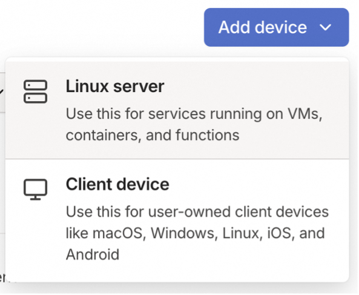
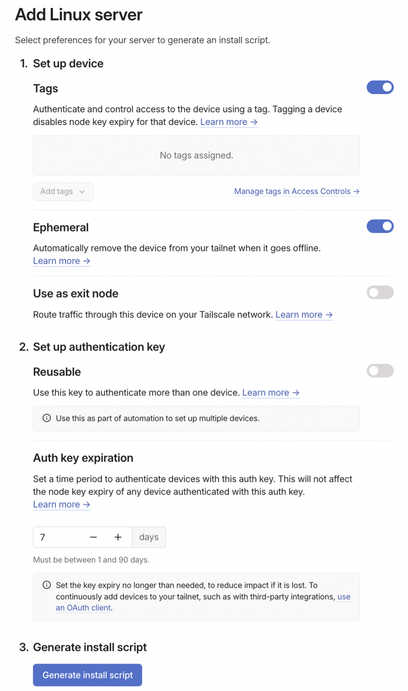

## Objectif

Supposons que vous ayez des instances Public Clous dans différentes zones locales OVHcloud, comme Prague et Madrid, et que vous ayez besoin de les connecter en toute sécurité. Au lieu de mettre en place une infrastructure VPN complexe, vous pouvez utiliser Tailscale, qui s'appuie sur WireGuard, pour créer facilement un réseau maillé crypté entre vos instances. Ceci est particulièrement utile pour les développeurs, les systèmes distribués ou les communications sécurisées entre les régions.

Cette fonctionnalité vous permet de :

- Mettre en place un réseau maillé VPN pour des connexions sécurisées entre des instances Public Cloud dans différentes Local Zones OVHcloud.
- Connecter et gérer facilement vos instances via Tailscale.
- Activer les nœuds éphémères afin que les instances temporaires soient automatiquement supprimées du réseau Tailscale lorsqu'elles sont supprimées.
- Utiliser les listes de contrôle d'accès (ACL) de Tailscale pour gérer les permissions du réseau.

**Ce tutoriel vous détaille comment intégrer Tailscale dans vos instances OVHcloud Local Zone Public Cloud, fournissant une solution VPN-as-a-Service (VPNaaS). Tailscale vous permet de créer un réseau maillé peer-to-peer sécurisé entre vos serveurs situés dans des zones géographiques différentes.**

## Prérequis

- Un [compte OVHcloud](/pages/account_and_service_management/account_information/ovhcloud-account-creation).
- [Deux instances Public Cloud](/pages/public_cloud/compute/public-cloud-first-steps) déployées dans différentes [Local Zones OVHcloud](/links/public-cloud/local-zones) (nous utiliserons Prague et Madrid pour cet exemple).
- Un [accès SSH à vos instances Public Cloud OVHcloud Local Zones](/pages/public_cloud/compute/creating-ssh-keys-pci).
- Un compte [Tailscale](https://tailscale.com/) avec accès administrateur.
- Une clé [Tailscale Auth Key](https://tailscale.com/kb/1085/auth-keys) (que vous pourrez générer depuis l'interface d’administration Tailscale).
- Des connaissance du protocole SSH et des commandes de base du terminal. Pour plus d'informations sur le SSH, consultez notre guide sur [comment créer et utiliser des clés SSH pour les instances Public Cloud](/pages/public_cloud/compute/creating-ssh-keys-pci).

## En pratique

### Étape 1 - Créer deux instances dans les Local Zones OVHcloud

[Créez deux instances](/pages/public_cloud/compute/public-cloud-first-steps) dans différentes Local Zones OVHcloud, comme Prague et Madrid.

Assurez-vous que le réseau public est activé pour les deux instances.

### Étape 2 - Se connecter à Tailscale

1\. Connectez-vous à votre [compte Tailscale](https://login.tailscale.com/).<br>
2\. Allez dans l'onglet `Devices`{.action} et cliquez sur `Add Device`{.action}.<br>
3\. Sélectionnez `Linux server` comme type de périphérique.

{.thumbnail}

4\. Activez l'option `ephemeral nodes` pour vous assurer que les nœuds sont automatiquement supprimés du réseau lorsque leur serveur correspondant est supprimé.

{.thumbnail width="600"}

5\. Copiez le script d'installation fourni pour une utilisation ultérieure.

### Étape 3 - Installer Tailscale sur l'instance de Prague

Connectez-vous en SSH à l'instance de Prague :

```bash
ssh root@$PRAGUE_IP -i ~/.ssh/tailscale-test
```

1\. Installez Tailscale sur l’instance en exécutant la commande suivante :

```bash
curl -fsSL https://tailscale.com/install.sh | sh && sudo tailscale up --auth-key=$TAILSCALE-KEY
```

2\. Connectez-vous à l'interface d'administration Tailscale pour approuver le nouveau nœud en visitant <https://login.tailscale.com/admin>.

3\. Approuvez le nœud en utilisant le menu de droite (via le bouton `...`{.action}).

{.thumbnail width="600"}

4\. Une fois approuvé, un message de réussite s'affichera dans le terminal :

```bash
Installation complete! Log in to start using Tailscale by running:
tailscale up
```

### Étape 4 - Installer Tailscale sur l'instance de Madrid

1\. Connectez-vous en SSH à l'instance de Madrid :

```bash
ssh root@$MADRID_IP -i ~/.ssh/tailscale-test
```

2\. Répétez le processus d'installation Tailscale sur l'instance de Madrid :

```bash
curl -fsSL https://tailscale.com/install.sh | sh && sudo tailscale up --auth-key=$TAILSCALE-KEY
```

3\. Approuvez le nœud dans l'interface d'administration :

Comme pour l'instance de Prague, une invite apparaît vous demandant d'approuver le nœud Madrid. L'installation reste en attente jusqu'à son approbation.
Rendez-vous sur <https://login.tailscale.com/admin> et approuvez le nouveau nœud.

4\. Après approbation, l'installation se terminera et vous verrez le message de réussite suivant dans le terminal :

```bash
Installation complete! Log in to start using Tailscale by running:
tailscale up
```

### Étape 5 - Vérifier le réseau Tailscale

Pour vérifier l'état du réseau Tailscale, connectez-vous à l'une de vos instances (par exemple, l'instance de Prague) et exécutez la commande suivante :

```bash
tailscale status
```

La sortie devrait ressembler à ceci, montrant la connexion entre les deux nœuds :

```bash
100.X.X.X   tailscale-node-prague john.doe@ linux   -
100.X.X.X   tailscale-node-madrid john.doe@ linux   -
```

### Étape 6 - Tester la connexion entre les nœuds

Maintenant, testez la connexion entre les deux nœuds à l'aide de la commande ping de Tailscale.

Sur l'instance de Prague, lancez :

```bash
tailscale ping tailscale-node-madrid
```

Sur l'instance de Madrid, lancez :

```bash
tailscale ping tailscale-node-prague
```

Une réponse pong indiquant une communication réussie entre les deux instances devrait s'afficher, comme celle-ci :

```bash
pong from tailscale-node-madrid (100.X.X.X) via [X:X:X:X:X:X:X]:41641 in 34ms
```

### Étape 7 - Gérer l'expiration de la clé

Les nœuds Tailscale se voient attribuer des clés, qui peuvent expirer. Si vos nœuds sont censés rester plus longtemps sur le réseau, vous pouvez désactiver l'expiration de la clé. Cette manipulation s’effectue depuis l'interface d’administration Tailscale en fonction de vos besoins en matière de sécurité et d’accès.

{.thumbnail width="600"}

### Étape 8 - Contrôle d'accès

Tailscale crée un réseau maillé, ce qui signifie que tous les nœuds peuvent communiquer entre eux par défaut. Si vous avez besoin d'un contrôle plus granulaire, utilisez les listes de contrôle d'accès (ACL) de Tailscale pour spécifier quels périphériques peuvent communiquer avec d'autres.

Vous pouvez en savoir plus sur les ACL ici : [Documentation ACL Tailscale](https://tailscale.com/kb/1393/access-control).

## Aller plus loin

N’hésitez pas à nous faire part de vos questions, retours et suggestions pour améliorer le service :

- Sur le [serveur Discord OVHcloud](https://discord.gg/ovhcloud)

Si vous avez besoin d'une formation ou d'une assistance technique pour la mise en oeuvre de nos solutions, contactez votre commercial ou cliquez sur [ce lien](/links/professional-services) pour obtenir un devis et demander une analyse personnalisée de votre projet à nos experts de l’équipe Professional Services.

Rejoignez notre [communauté d'utilisateurs](/links/community).
