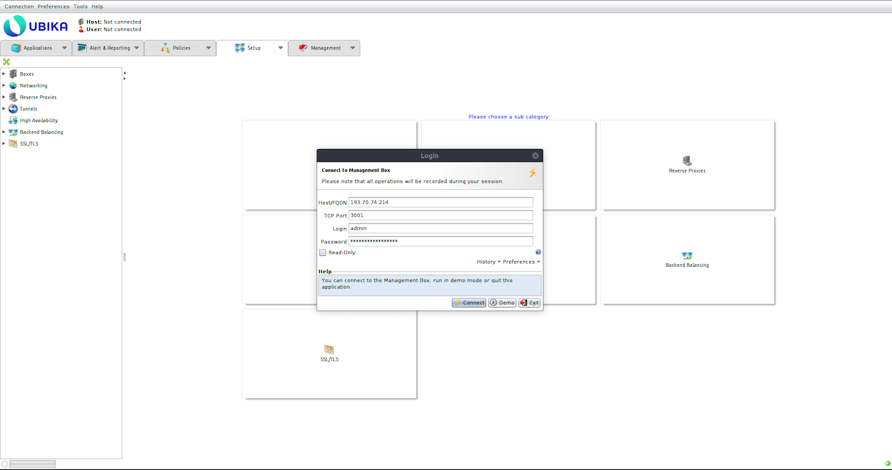
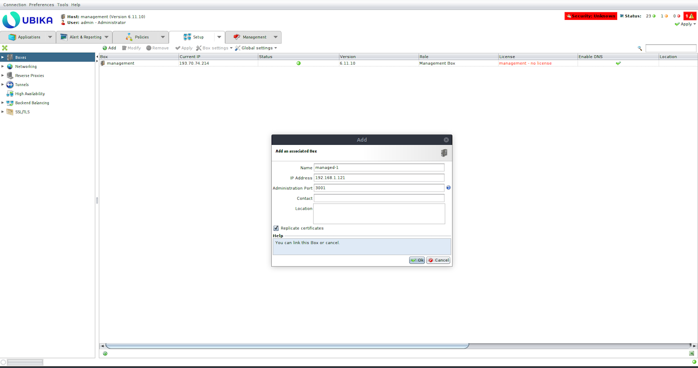
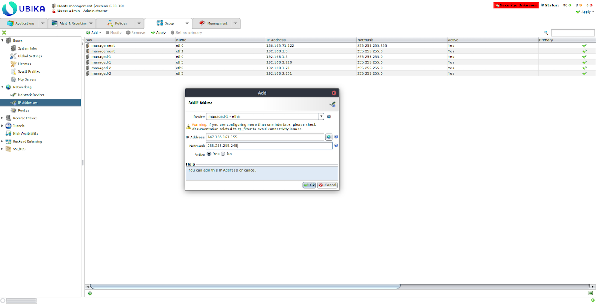
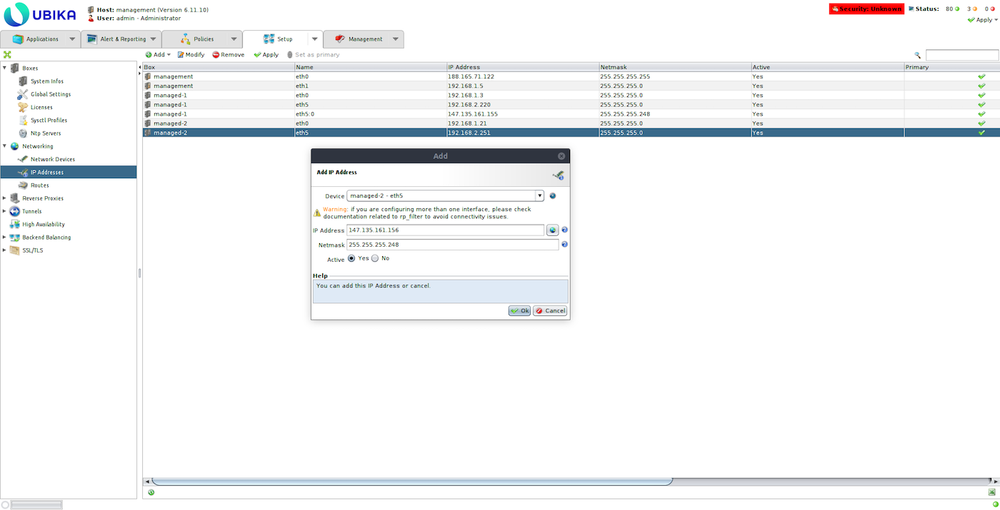
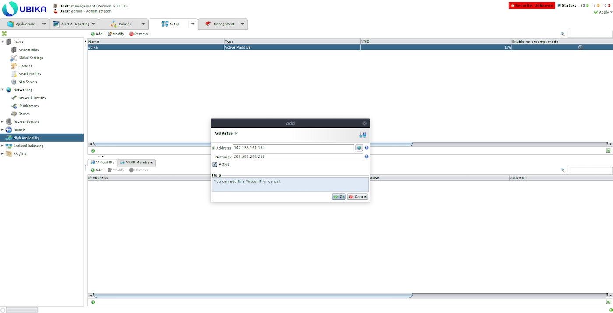
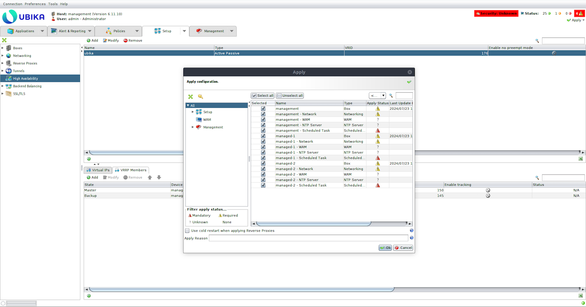
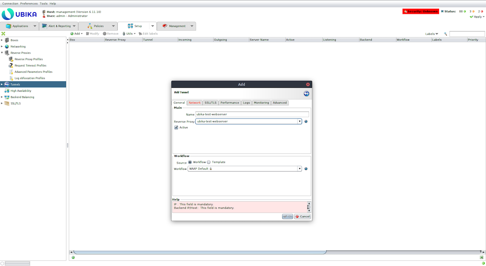
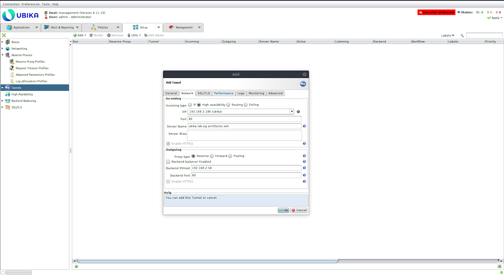

## Objectif

À l'ère numérique actuelle, la sécurité des applications web est essentielle pour protéger une infrastructure cloud contre les cybermenaces sophistiquées. Alors que les entreprises adoptent de plus en plus des solutions cloud, il est essentiel de garantir la sécurité des applications web et des API pour maintenir l'intégrité des données et prévenir les violations.
**U**bika **W**AAP **G**ateway (UWG) offre des fonctionnalités avancées de protection des applications web et des API (WAAP), y compris des outils puissants tels que les pare-feux d'applications web (WAF), la protection des API, la gestion des bots et la mitigation des attaques DDoS. Ces outils vous aident à protéger votre environnement cloud contre un large éventail de menaces au niveau des applications.

Ce guide fournit des instructions détaillées sur le déploiement et la configuration d'Ubika WAAP Gateway sur le Public Cloud OVHcloud. En suivant ce guide, vous apprendrez à configurer des réseaux privés pour la gestion et la charge de travail, à déployer des instances Ubika WAAP Gateway, à mettre en place une haute disponibilité (HA) en utilisant Additional IP, le vRack et le routage des IP publiques, et à assurer une architecture sécurisée et fiable pour votre infrastructure cloud.

**Ce guide explique comment sécuriser votre infrastructure OVHcloud avec Ubika WAAP Gateway déployé sur Public Cloud.**

> [!warning]
> Ce tutoriel vous explique comment utiliser une ou plusieurs solutions OVHcloud avec des outils externes et décrit les actions à effectuer dans un contexte spécifique. Vous devrez peut-être adapter les instructions en fonction de votre situation.
>
> Si vous éprouvez des difficultés à appliquer ces instructions, nous vous recommandons de faire appel à un [prestataire spécialisé](/links/partner) et/ou discuter du problème avec notre communauté. Pour plus d'informations, consultez la section [Aller plus loin](#gofurther) de ce tutoriel.
>

## Prérequis

- Un [projet Public Cloud](/pages/public_cloud/compute/create_a_public_cloud_project) dans votre compte OVHcloud.
- Être connecté à l'[espace client OVHcloud](/links/manager).
- Un [utilisateur OpenStack](/pages/public_cloud/compute/create_and_delete_a_user) (facultatif).
- Des connaissances de base en réseau.
- Un compte Ubika créé via le [site web d'Ubika](https://my.ubikasec.com/){.external}.
- S'assurer qu'un bloc approprié d'addresses Additional IP est disponible.
- S'assurer que le vRack est activé et configuré pour permettre une communication sécurisée entre les composants de l'infrastructure.
- Une adresse [Additional IP](/links/network/additional-ip) pour permettre le failover et la configuration de la haute disponibilité.
- Une licence Ubika WAAP Gateway BYOL (**B**ring **Y**our **O**wn **L**icence), obtenue directement auprès d'Ubika via le [site officiel Ubika](https://my.ubikasec.com/){.external}. Vous devrez la fournir lors de l'installation et de la configuration.

## En pratique

En plus de l'installation et de la configuration d'UWG, ce tutoriel propose un cas d'usage où vous testerez UWG en déployant et en exécutant une application web sur votre infrastructure Public Cloud :

- [Configurer votre vRack](#step1)
- [Installer et configurer Ubika WAAP Gateway sur votre environnement Public Cloud](#step2)
- [Configurer les licences](#step3)
- [Créer votre environnement de serveur web](#step4)

### Configurez votre vRack <a name="step1"></a>

Dans cette étape, nous configurons le vRack, un réseau virtuel privé fourni par OVHcloud. Le vRack vous permet d'interconnecter plusieurs instances ou serveurs au sein d'un environnement Public Cloud, assurant ainsi l'isolation du réseau tout en maintenant une communication sécurisée. En ajoutant votre projet Public Cloud et votre bloc Additional IP au même vRack, ainsi que le routage des adresses IP publiques, vous permettez à vos instances UWG de communiquer de manière sécurisée, tout en gardant le contrôle total de la gestion des adresses IP. Le réseau privé vRack vous permet également de sécuriser des serveurs Bare Metal Cloud ou des VM Private Cloud avec des appliances de sécurité déployées sur le Public Cloud.

**Ajoutez votre projet public cloud et votre bloc Additional IP au même vRack**

Reportez-vous au guide « [Configurer un bloc IP dans un vRack](/pages/bare_metal_cloud/dedicated_servers/configuring-an-ip-block-in-a-vrack) » pour plus d'informations.

Voici l'architecture que nous allons mettre en place :

{.thumbnail}

### Installer et configurer Ubika WAAP Gateway sur votre environnement Public Cloud <a name="step2"></a>

> [!primary]
> Dans ce tutoriel, l'installation et la configuration d'UWG s'effectuent principalement via la ligne de commande. Ouvrez un terminal pour exécuter les instructions.
>
> Veuillez noter que toutes les rubriques relatives à la « Haute disponibilité » sont facultatives ainsi que l'utilisation du réseau vRack avec Additional IP. Ces rubriques sont fournies pour montrer comment mettre en place le système avec deux instances en mode actif/passif pour une haute disponibilité. Dans une version minimale, il peut également fonctionner avec une seule instance si cela suffit à vos besoins.

#### Configurer le réseau de gestion Ubika WAAP Gateway

> [!primary]
> Dans ce scénario, nous utiliserons deux machines virtuelles configurées pour l'appliance de sécurité afin d'atteindre la haute disponibilité (HA) et une machine virtuelle supplémentaire pour la gestion. Cette configuration assure une protection du failover et une disponibilité continue du service. Pour plus d'exemples et de conseils détaillés sur les options d'évolutivité, veuillez vous référer à la [documentation Ubika](https://www.ubikasec.com/ressources/){.external}.

Créez un réseau privé pour la gestion de l'infrastructure :

```bash
openstack network create --provider-network-type vrack --provider-segment 1000 ubika-management
```

Cette commande crée un réseau privé pour gérer les instances UWG, en utilisant le réseau privé virtuel (vRack) fourni par OVHcloud. Ce réseau isolé est destiné à la communication interne entre les composants d'Ubika.

```bash
openstack subnet create --network ubika-management --subnet-range 192.168.1.0/24 --dhcp --gateway none --dns-nameserver 213.186.33.99 ubika-management
```

Configurez ici un sous-réseau pour le réseau de gestion, en spécifiant une plage d'adresses IP et un serveur DNS pour les communications internes.

#### Configurer le réseau de charge de travail Ubika WAAP Gateway

Créez un réseau privé pour la charge de travail :

```bash
openstack network create --provider-network-type vrack --provider-segment 0 --disable-port-security ubika-workload
```

Cette commande crée un réseau privé pour la charge de travail, conçu pour héberger des applications sécurisées par UWG.

```bash
openstack subnet create --network ubika-workload --subnet-range 192.168.2.0/24 --dhcp --dns-nameserver 213.186.33.99 ubika-workload
```

Définissez ici un sous-réseau pour le réseau de charge de travail, ce qui permet une gestion efficace du trafic réseau.

Créez une passerelle :

> [!primary]
> Une passerelle peut être nécessaire pour accéder à Internet à partir de serveurs web, notamment pour des tâches telles que l'installation de logiciels (Nginx par exemple) ou la gestion à distance. Toutefois, pour le trafic client entrant, ce composant n'est pas utilisé.

```bash
openstack router create --external-gateway Ext-Net ubika-workload
```

```bash
openstack router add subnet 2481bcaf-efa2-419a-ad92-d6d27737dfd1 ubika-workload
```

#### Déployer les instances Ubika WAAP Gateway

Téléversez l'image UWG image vers OpenStack:

Rendez-vous dans la section `download`{.action} du [site officiel d'Ubika](https://my.ubikasec.com/){.external}. Connectez-vous à votre compte Ubika et suivez les instructions pour télécharger l'image UWG OpenStack.

Rendez-vous dans le dossier où vous avez téléchargé votre image UWG OpenStack et téléversez l'image UWG OpenStack (pour ce tutoriel, nous utilisons l'image `UBIKA_WAAP_Gateway-generic-cloud-6.11.10+51a56f6201.b56855.qcow2`) :

```bash
openstack image create --disk-format raw --container-format bare --file ~/Downloads/UBIKA_WAAP_Gateway-generic-cloud-6.11.10+51a56f6201.b56855.qcow2 Ubika-WAAP-Gateway-6.11.10
```

[Importez votre clé publique SSH](https://docs.openstack.org/python-openstackclient/pike/cli/command-objects/keypair.html){.external} :

```bash
openstack keypair create --public-key ~/.ssh/id_rsa.pub <username>
```

Créez un groupe de sécurité pour l'instance UWG de gestion :

```bash
openstack security group create ubika-management
```

```bash
openstack security group rule create --ingress --remote-ip 192.168.1.0/24 ubika-management
```

```bash
openstack security group rule create --ingress --remote-ip 109.190.254.24/32 --dst-port 22 --protocol tcp ubika-management
```

```bash
openstack security group rule create --ingress --remote-ip 109.190.254.24/32 --dst-port 3001 --protocol tcp ubika-management
```

Créez l'instance de gestion UWG :

Avant d'exécuter la commande OpenStack suivante, créez d'abord un fichier `management.json` et ajoutez le contenu suivant, en adaptant les paramètres à votre environnement :

```console
{
    "instance_name": "management",
    "admin_user": "admin",
    "admin_password": "adminpassword"
}
```

Une fois le fichier `management.json` créé, exécutez la commande suivante :

```bash
openstack server create --flavor r3-64 --image Ubika-WAAP-Gateway-6.11.10 --network Ext-Net --network ubika-management ubika-management --key-name <username> --security-group ubika-management --user-data ./management.json
```

Créez les instances gérées UWG :

Avant d'exécuter la commande OpenStack suivante, créez d'abord un fichier `managed-1.json` et ajoutez le contenu suivant, en adaptant les paramètres à votre environnement.

```console
{
    "instance_role": "managed",
    "instance_name": "managed-1"
}
```

Une fois le fichier `managed-1.json` créé, exécutez la commande suivante :

```bash
openstack server create --flavor c3-16 --image Ubika-WAAP-Gateway-6.11.10 --network ubika-management --network ubika-workload ubika-managed-1 --key-name <utilisateur> --user-data ./managed-1.json
```

Répétez ces étapes pour créer une seconde instance gérée UWG, mais utilisez le fichier `managed-2.json`. Créez et ajoutez le contenu suivant au fichier `managed-2.json` :

```console
{
    "instance_role": "managed",
    "instance_name": "managed-2"
}
```

#### Configurer le HA sur les instances gérées par UWG

Récupérez l'IP publique de l'instance de gestion :

```bash
openstack port list --server ubika-management --network Ext-Net
```

Connectez-vous à l'interface utilisateur graphique Java Ubika et ajoutez les deux instances UWG managées :

{.thumbnail}

Obtenez l'IP de gestion des instances managées :

```bash
openstack port list --server ubika-managed-1 --network ubika-management
```

```bash
openstack port list --server ubika-managed-2 --network ubika-management
```

Ajoutez la première instance UWG gérée à la gestion UWG (`Setup` > `Boxes` > `Add`) :

{.thumbnail}

Ajoutez la seconde instance :

{.thumbnail}

Ajoutez une interface virtuelle à l'interface `eth1` de chaque instance UWG managée et configurez-la avec une IP de votre bloc IP au lieu de l'IP privée (`Setup` > `Networking` > `IP Addresses`).

UWG managed-1 :

{.thumbnail}

UWG managed-2 :

{.thumbnail}

Supprimez la passerelle par défaut et ajoutez la passerelle vRack pour chaque Ubika managé (`Setup` > `Networking` > `Routes`).

UWG managed-1 :

{.thumbnail}

UWG managed-2 :

{.thumbnail}

Créez une configuration active/passive haute disponibilité (`Setup` > `High Availability` > `Add`) :

{.thumbnail}

Ajoutez une addresse IP du bloc d'IP en tant qu'IP Virtuelle :

{.thumbnail}

Ajoutez les deux instances UWG managées en tant que membres VRRP à l'aide des interfaces de charge de travail (eth1) :

{.thumbnail}

Appliquez la configuration (bouton en haut à droite de l'interface) :

{.thumbnail}

### Configurer les licences <a name="step3"></a>

Les licences Ubika WAAP Gateway sont disponibles directement auprès d'Ubika via le [site officiel d'Ubika](https://my.ubikasec.com/){.external}. En fonction de vos besoins de déploiement, vous pouvez choisir entre une licence de machine virtuelle unique ou une licence en mode Haute disponibilité, qui prend en charge une configuration Active-Backup avec deux instances de data-plane et une ou plusieurs instances de control-plane. Les licences varient également en fonction du SSL TPS (Transactions Par Seconde), prenant en charge plusieurs certificats SSL ou des capacités de failover.

Il est fortement recommandé d'utiliser les dernières générations d'instances compute pour les déploiements d'appliances, par exemple :

- C3-8 pour les besoins de base et les licences VMcloud.
- C3-16, C3-32, C3-64 et C3-128 respectivement pour les licences Ubika Enterprise Edition 1500, 2450, 4450, 5450 et 6450.
- C3-16 pour la petite console MGMT, ou C3-128 pour la grande console MGMT (en fonction des options d'observabilité activées).

Pour appliquer les licences, vous devrez fournir les informations suivantes à UWG :

- Type de déploiement UWG (instance unique ou HA)
- Numéro de série de l'instance UWG
- Le nombre de vCPU et la quantité de RAM allouée à chaque instance

Une fois que vous avez reçu les licences d'Ubika, appliquez-les aux instances correspondantes pour terminer l'installation.

### Créez votre environnement de serveur web <a name="step4"></a>

Dans cette section, nous allons créer un environnement de serveur web et mettre en place un load balancer pour répartir le trafic entre plusieurs serveurs web. Cette étape est cruciale pour valider le bon fonctionnement du réseau, la sécurité et les paramètres de haute disponibilité de votre configuration UWG. En mettant en œuvre un load balancer, nous assurons l'équilibre du trafic sur vos serveurs web. Cela permet une protection et une redondance en cas de failover, ce qui est essentiel pour maintenir la disponibilité du service.

Créez deux serveurs web sur le réseau de charge de travail.

Avant d'exécuter la commande OpenStack suivante, créez d'abord un fichier `webserver.cloud-init` et ajoutez le contenu suivant, en adaptant les paramètres à votre environnement :

```console
{
    #cloud-config
    users:
    - default

    package_update: true

    packages:
    - nginx

    runcmd:
    - hostname > /var/www/html/index.html
    - systemctl enable nginx
    - systemctl start nginx
}
```

Une fois le fichier `webserver.cloud-init` créé, exécutez les commandes suivantes :

```bash
openstack server create --flavor b3-8 --image "Ubuntu 22.04" --network ubika-workload ubika-test-webserver-1 --key-name <utilisateur> --user-data ./webserver.cloud-init
```

```console
openstack server create --flavor b3-8 --image "Ubuntu 22.04" --network ubika-workload ubika-test-webserver-2 --key-name <username> --user-data ./webserver.cloud-init
```

Créez un load balancer Octavia privé :

```bash
openstack loadbalancer create --name ubika-test-webserver --vip-subnet-id ubika-workload
```

Vérifiez l'état du load balancer, il doit être `ACTIF` :

```bash
openstack loadbalancer show 367ecaef-28f6-4866-9af2-7ce519ba688f
```

Créez un listener HTTP pour le load balancer :

```bash
openstack loadbalancer listener create --name ubika-test-webserver --protocol HTTP --protocol-port 80 29590860-2852-44c3-9514-dfb271bd9371
```

```bash
openstack loadbalancer pool create --name ubika-test-webserver --listener 3e77b59f-0abb-4861-b0a5-7de442ee6d1b --protocol HTTP --lb-algorithm ROUND_ROBIN
```

Créez un contrôle d'intégrité (*health check*) pour le pool de backends du load balancer :

```bash
openstack loadbalancer healthmonitor create --type HTTP --delay 5 --timeout 5 --max-retries 3 212ff492-6935-4810-973f-83b7346e72ac
```

Obtenez l'adresse IP des deux serveurs web :

```bash
openstack port list --server ubika-test-webserver-1 --network ubika-workload
```

```bash
openstack port list --server ubika-test-webserver-2 --network ubika-workload
```

Ajoutez les serveurs web au pool backends du load balancer :

```bash
openstack loadbalancer member create --address 192.168.2.164 --protocol-port 80 212ff492-6935-4810-973f-83b7346e72ac
```

```bash
openstack loadbalancer member create --address 192.168.2.237 --protocol-port 80 212ff492-6935-4810-973f-83b7346e72ac
```

Créez un Reverse Proxy (`Setup` -> `Reverse Proxy` -> `Add`) sur l'un des boîtiers gérés par Ubika :

{.thumbnail}

Créez un enregistrement DNS A pour le serveur web pointant vers l'IP virtuelle du déploiement Ubika :

{.thumbnail}

Obtenez l'adresse IP virtuelle du load balancer :

```bash
openstack loadbalancer show 29590860-2852-44c3-9514-dfb271bd9371
```

Créez un tunnel (`Setup` > `Tunnels` > `Add`) :

{.thumbnail}

{.thumbnail}

Appliquez la configuration :

{.thumbnail}

Essayez d'accéder au serveur web :

```bash
curl http://ubika.lab-sg.architects.ovh

ubika-test-webserver-1
```

## Aller plus loin <a name="gofurther"></a>

Si vous avez besoin d'une formation ou d'une assistance technique pour la mise en oeuvre de nos solutions, contactez votre commercial ou cliquez sur [ce lien](/links/professional-services) pour obtenir un devis et demander une analyse personnalisée de votre projet à nos experts de l'équipe Professional Services.

Échangez avec notre [communauté d'utilisateurs](/links/community).