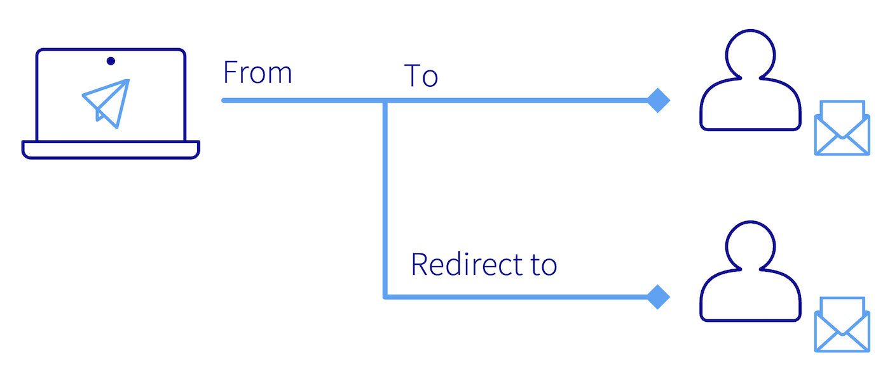
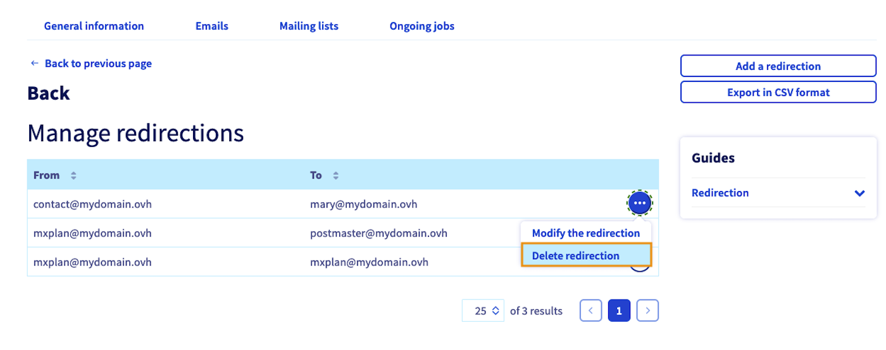

> [!primary]
> Esta tradução foi automaticamente gerada pelo nosso parceiro SYSTRAN. Em certos casos, poderão ocorrer formulações imprecisas, como por exemplo nomes de botões ou detalhes técnicos. Recomendamos que consulte a versão inglesa ou francesa do manual, caso tenha alguma dúvida. Se nos quiser ajudar a melhorar esta tradução, clique em "Contribuir" nesta página.
>

## Objetivo

Encontre neste guia diferentes informações e dicas relativas à configuração dos seus **reencaminhamentos** e **alias** emails, por exemplo para reenviar e-mails recebidos num endereço A para um endereço B.

{.thumbnail}

**Saiba como gerir os seus alias e reencaminhamentos de e-mail.**

### O que é um reencaminhamento de e-mail?

Um reencaminhamento permite modificar o trajeto inicial de um e-mail para um ou vários outros endereços de e-mail.

Por exemplo, ao enviar um e-mail para **contact@mydomain.ovh**, este deverá ser igualmente enviado para **john.smith@otherdomain.ovh**. Isto permite transmitir automaticamente um e-mail destinado a **contact@mydomain.ovh** para **john.smith@otherdomain.ovh**.

### O que é um alias de e-mail?

Contrariamente ao reencaminhamento, o endereço de e-mail associado ao alias não é um endereço que se possa consultar, trata-se de uma "máscara".

Criar um alias para o seu endereço de e-mail permite-lhe comunicar um endereço "máscara" aos seus contactos, sem ter de comunicar o seu endereço de e-mail pessoal ao remetente. Um endereço de e-mail pode ter vários alias.

Por exemplo, o seu endereço de e-mail é **john.smith@mydomain.ovh** e o seu alias **information@mydomain.ovh**. Pode então comunicar aos seus contactos o endereço **information@mydomain.ovh** e receber os seus e-mails em **john.smith@mydomain.ovh**, sem que o remetente tenha conhecimento de **john.smith@mydomain.ovh**.

### Reencaminhamento e alias em imagem 

Clique nos separadores seguintes para obter explicações ilustradas sobre o funcionamento dos alias e reencaminhamentos.

- `From` designa o endereço do remetente
- `To` designa o endereço do destinatário
- `Redirect to` designa o endereço de e-mail de reencaminhamento que foi configurado.

> [!tabs]
> **1. O reencaminhamento simples**
>>
>> O e-mail é reencaminhado para o endereço de reencaminhamento e o destinatário original não recebe o e-mail.  
>> {.thumbnail}
>>
> **2. O reencaminhamento com cópia local**
>>
>> O e-mail é enviado para o destinatário original e para o endereço de reencaminhamento.  
>> {.thumbnail}
>>
> **3. O alias e-mail**
>>
>> O email é endereçado ao alias que o reencaminha para o destinatário no qual o alias foi configurado. A menção `Received by` designa o endereço de e-mail que recebe o e-mail.  
>> {.thumbnail}
>>

> [!primary]
>
> Tenha em atenção que é possível configurar um reencaminhamento para vários endereços de e-mail. No entanto, isto implica criar um de cada vez os reencaminhamentos para cada destinatário.

## Requisitos

- Ter acesso à [Área de Cliente OVHcloud](/links/manager).
- Dispor de uma solução de e-mail OVHcloud previamente configurada (**MX Plan**, proposta entre as nossas [ofertas de alojamento web](/links/web/hosting), incluída num [Alojamento gratuito 100M](/links/web/domains-free-hosting) ou encomendada separadamente como solução autónoma, como o [Hosted Exchange](/links/web/emails-hosted-exchange) ou o [Email Pro](/links/web/email-pro)).

## Instruções

> [!warning]
>
> Os capítulos "[criar um reencaminhamento](#redirect)" e "[criar um alias](#alias)" abrangem todas as nossas ofertas de e-mail OVHcloud, **exceto se**:
>
> - Se possui a versão histórica da oferta MXplan (para o verificar, pode consultar o quadro abaixo).
> - possui um domínio registado na OVHcloud sem uma oferta de e-mail associada.
>
> Para estas duas exceções, só é possível o reencaminhamento. Sugerimos que consulte diretamente o capítulo "[Criar um reencaminhamento ou um alias numa oferta MX Plan histórica ou num domínio sem oferta de e-mail](#mxplanlegacy)".
>

>
> Consoante a data de ativação da sua oferta MXplan ou se esta foi migrada recentemente, é possível que disponha da versão histórica ou da nova versão da oferta. Antes de prosseguir, deve identificar esta última.  
>
>
> Para isso, aceda à [Área de Cliente OVHcloud](/links/manager), na parte `Web Cloud`{.action}. Clique em `Emails`{.action} e escolha o nome do serviço MX Plan em causa. Continue a ler em função da versão que possui: 
>
> |Versão antiga da oferta MX Plan|Nova versão da oferta MX Plan|
> |---|---|
> |{.thumbnail}  Consulte o tipo de oferta na secção «Subscrição».|{.thumbnail} Consulte a `Referência do servidor` na secção «Resumo».|
> |Consulte a secção "[Versão antiga da oferta MX Plan](#mxplanlegacy)".|Continue a ler a [Criar um reencaminhamento](#redirect) ou [Criar um alias](#alias)|

### Criar um reencaminhamento 

A gestão dos reencaminhamentos faz-se não através da Área de Cliente, mas diretamente através do webmail do endereço de e-mail em questão.

Aceda ao [webmail](/links/web/email) . Introduza **o endereço de correio eletrónico** e **a palavra-passe** para iniciar sessão.

{.thumbnail}

Neste exemplo, trata-se de um **reencaminhamento com cópia local** (ver o [esquema 2](#diagram) no início deste guia). Se é o que deseja, clique em `OK`{.action} (ícone de disquete em cima, à esquerda) para a regra ser aplicada. Caso contrário, siga as instruções seguintes.

Siga os passos descritos clicando sucessivamente em cada separador abaixo:

> [!tabs]
> **Etapa 1**
>>
>> Uma vez ligado ao seu endereço de e-mail através de [webmail](/links/web/email), clique na roda dentada no canto superior direito e, a seguir, em `Opções`{.action}.  
>> {.thumbnail} 
>>
> **Etapa 2**
>> Na janela **Opções**, na coluna da esquerda, selecione a categoria **Tratamento automático** da secção **Correio** e clique em `Regras da caixa de receção e de arrumação`{.action}.   
>> {.thumbnail}  
>> Esta janela permite gerir os seus reencaminhamentos, mas também aplicar filtros ao conjunto dos e-mails recebidos. 
>>
> **Etapa 3**
>>
>> Na janela de gestão das **Regras da caixa de receção**, clique no ícone `+`{.action}, em cima, à esquerda.  
>> {.thumbnail}  
>>
> **Etapa 4**
>>
>> **Nome**: defina o nome do seu reencaminhamento.  
>> **Quando a mensagem chega e preenche todas estas condições**: se o reencaminhamento se aplicar a todas as mensagens, selecione `[Aplicar a todas as mensagens]`{.action}.  
>> {.thumbnail .w-640}  
>>
> **Etapa 5**
>>
>> **Efetuar todas as seguintes** operações: é aqui que aplica o reencaminhamento, selecione `Transferir, reencaminhar ou enviar`{.action} e, a seguir, `Reencaminhar o e-mail para...`{.action}.  
>> {.thumbnail .w-640}  
>>
> **Etapa 6**
>>
>> De seguida, introduza o endereço para o qual deseja reencaminhar o e-mail para "**Reencaminhar o e-mail para...**" e clique em `Guardar`{.action}. Finalmente, clique em `OK`{.action} (ícone de disquete) para finalizar o seu reencaminhamento.  
>> {.thumbnail .w-640}  
>>

> [!primary]
> Para aplicar um **reencaminhamento simples** (ver [esquema 1](#diagram) no início deste manual), adicione uma regra suplementar ao seu **reencaminhamento com cópia local** a partir desta janela. Clique em `Adicionar uma ação`{.action} (quadro 1), depois em `Migrar, copiar ou suprimir`{.action} e, por fim, clique em `suprimir a mensagem`{.action}. Esta regra envia os e-mails diretamente para o lixo depois de ter reencaminhado as mensagens para o endereço final.  
> {.thumbnail .w-640}

### Eliminar um reencaminhamento

Siga os passos descritos, clicando sucessivamente em cada separador abaixo:

> [!tabs]
> **Etapa 1**
>>
>> Depois de aceder ao endereço de e-mail através do [webmail](https://www.ovhcloud.com/fr/mail/), clique na roda dentada no canto superior direito e, a seguir, em Opções`{.action}.  >
>> {.thumbnail} 
>>
> **Etapa 2**
>> Na janela **Options**, na coluna da esquerda, aceda à categoria **Tratamento automático** na secção **Mail** e clique em `Regras da caixa de entrada e de arrumação`{.action}.   
>> {.thumbnail}  
>> Encontrará a janela que lhe permite gerir os seus reencaminhamentos e filtros. 
>>
> **Etapa 3**
>>
>> Na janela de gestão das **Regras da caixa de entrada**, clique no reencaminhamento que pretende eliminar e este deverá ser realçado. De seguida, clique no ícone da lixeira  
>> {.thumbnail}  
>>

### Criar um alias 

Aceda à [Área de Cliente OVHcloud](/links/manager) e dirija-se à secção `Web Cloud`{.action}. De seguida, selecione o menu em função da sua oferta de e-mail:

- **Exchange**: na `Microsoft`{.action}, depois em `Exchange`{.action} e selecione a plataforma em causa. Clique no separador `Contas de e-mail`{.action}.

- **E-mail Pro**: No `E-mail Pro`{.action}, selecione a plataforma em causa e clique no separador `Contas de e-mail`{.action}.

- **E-mails** (MXplan): em `E-mails`{.action}, selecione a plataforma em causa e clique no separador `Contas de e-mail`{.action}.

Para adicionar um alias à sua conta de e-mail, siga os passos descritos clicando sucessivamente em cada separador abaixo:

> [!tabs]
> **Etapa 1**
>>
>> Na tabela que aparece, encontrará uma coluna `Alias`.  
>> {.thumbnail} 
>>
> **Etapa 2**
>>
>> Clique no botão `...`{.action} e em `Configurar os alias`{.action} (ou `Gerir os alias`{.action}).  
>>
>> > [!primary]
>> >
>> > Para modificar ou eliminar um reencaminhamento, clique em `...`{.action}, à direita do reencaminhamento em causa.
>>
>> {.thumbnail} 
>>
> **Etapa 3**
>>
>> Clique em `Adicionar um alias`{.action} e introduza o endereço que escolheu para o seu alias e valide a sua escolha.  
>> {.thumbnail} 

### Eliminar um alias

No separador `Contas de e-mail`{.action}, clique no botão `...`{.action} à direita do endereço de e-mail em questão. De seguida, clique em `Configurar os alias`{.action} (ou `Gerir os alias`{.action}).

Clique no botão `...`{.action} à direita do alias em causa, no menu de gestão dos alias. Finalmente, clique em `Eliminar o alias`{.action}

{.thumbnail}

### Criar um reencaminhamento ou um alias numa oferta MX Plan histórica ou num nome de domínio sem oferta de e-mail 

Aceda à Área de [Cliente OVHcloud](/links/manager) e dirija-se à secção `Web Cloud`. Dirija-se à secção `Emails`{.action}:

> [!warning]
>
> - O método para criar um alias ou criar um reencaminhamento é rigorosamente o mesmo.
> - É possível criar um máximo de 2000 alias e reencaminhamentos, incluindo cópias locais.
>

Siga os passos descritos clicando sucessivamente em cada separador abaixo:

> [!tabs]
> **Etapa 1**
>> Por defeito, aparecerá o separador `Informações gerais`{.action} do seu MX Plan. Clique no separador `E-mails`{.action} e, a seguir, no botão `Gestão dos reencaminhamentos`{.action}, à direita.  
>> {.thumbnail} 
>>
> **Etapa 2**
>>
>> Aparecerá o quadro dos reencaminhamentos ativos. À direita, clique no botão `Adicionar um reencaminhamento`{.action}.  
>> {.thumbnail} 
>>
> **Etapa 3**
>>
>> **Do endereço**: indique aqui o endereço de e-mail que pretende reencaminhar.  
>> **Para o endereço**: indique aqui o endereço de destino do seu reencaminhamento. Pode ser um dos seus endereços de e-mail OVHcloud ou um endereço de e-mail externo.  
>> **Escolha um modo de cópia**: escolha se deseja:   - **Conservar uma cópia do e-mail na OVHcloud** (receber o e-mail no seu endereço principal bem como o endereço de reencaminhamento)  *cf. o [esquema 2](#diagram) no início deste guia.*   - **Não conservar uma cópia do e-mail** (reencaminhar diretamente para o endereço de reencaminhamento sem que o endereço principal o receba)   *cf. o [esquema 1](#diagram) no início deste guia.*  
>> De seguida, clique em `Validar`{.action} para confirmar o novo reencaminhamento. 
>>
>> {.thumbnail}

> [!primary]
> Quando escolhe o modo de cópia "**Conservar uma cópia do e-mail na OVHcloud**", um reencaminhamento do endereço de e-mail para si próprio é automaticamente criado na lista dos reencaminhamentos, materializa esta cópia local.
> 

### Eliminar um reencaminhamento ou um alias numa oferta MX Plan histórica ou um domínio sem um serviço de e-mail 

No separador `E-mails`{.action}, clique em `Gestão dos reencaminhamentos`{.action} à direita da janela.

Clique no botão `...`{.action} à direita do reencaminhamento em causa e, a seguir, clique em `Eliminar o reencaminhamento {.action}

> [!warning]
>
> Não é possível modificar um reencaminhamento ou um alias. Deve eliminá-la e recriá-la.

{.thumbnail}

## Quer saber mais? 

Para serviços especializados (referenciamento, desenvolvimento, etc), contacte os [parceiros OVHcloud](/links/partner).

Se pretender usufruir de uma assistência na utilização e na configuração das suas soluções OVHcloud, consulte as nossas diferentes [ofertas de suporte](/links/support).

Fale com nossa [comunidade de utilizadores](https://community.ovh.com/en/).