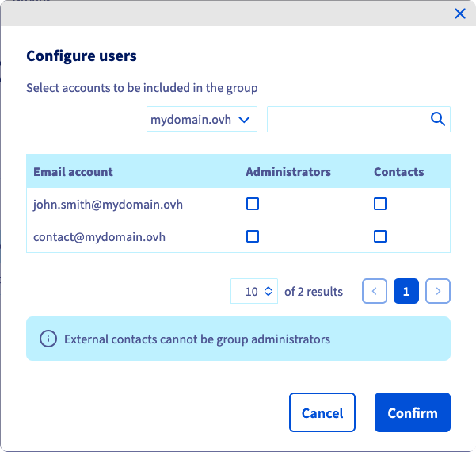

## Ziel

Mit Exchange Gruppen können mehrere Benutzer durch Senden von E-Mails an eine Gruppenadresse untereinander kommunizieren. Mit dieser kollaborativen Funktion können Sie Mailinglisten erstellen und verwalten, die sowohl Exchange Benutzer als auch externe Kontakte enthalten können.

**In dieser Anleitung wird erläutert, wie Sie Exchange Gruppen über das OVHcloud Kundencenter und die Outlook Web App (OWA) verwenden.**

## Voraussetzungen

- Sie haben Zugriff auf das [OVHcloud-Kundencenter](/links/manager).
- Sie haben eine [OVHcloud Exchange Lösung](/links/web/emails-hosted-exchange), die bereits eingerichtet ist.

## In der praktischen Anwendung

### Eine neue Gruppe erstellen

Loggen Sie sich in Ihrem [OVHcloud Kundencenter](/links/manager) ein und wählen Sie unter `Microsoft`{.action} und `Exchange`{.action} Ihren Exchange Dienst aus. Gehen Sie dann auf den Tab `Gruppen`{.action}.

{.thumbnail .w-600 .h-600}

Wenn Sie auf `Kontaktgruppe erstellen`{.action} klicken, öffnet sich ein neues Fenster, in dem Sie die Gruppeneinstellungen definieren können:

{.thumbnail .w-600 .h-600}

- **E-Mail-Adresse**: Die neue Adresse, von der aus Nachrichten an die Mailingliste gesendet werden. Beachten Sie, dass Sie keine existierende E-Mail-Adresse eingeben können.
- **Name der Gruppe**: Der Anzeigename, der in Ihrem [OVHcloud Kundencenter](/links/manager) und in [OVHcloud Webmail](/links/web/email) (OWA) erscheint.
- **Maximale Größe eingehend/ausgehend**: Sie können die maximale Größe eingehender und ausgehender E-Mails angeben.
- **Adresse in Outlook verbergen**: Wenn diese Option aktiviert ist, wird die Gruppenadresse nicht in der Adressliste des Exchange Dienstes angezeigt.
- **Authentifizierung erforderlich**: Wenn diese Option aktiviert ist, können nur Benutzer auf derselben Plattform eine Nachricht mit der Gruppenadresse senden.

Klicken Sie auf `Weiter`{.action}, um fortzufahren.

Wählen Sie auf der zweiten Seite die **Kontakte** der Gruppe aus, und definieren Sie die **Administratoren**. Die Auswahl umfasst nur E-Mail-Adressen und externe Kontakte, die bereits für den Exchange Dienst angelegt wurden.

- **Administratoren**: E-Mail-Accounts, die E-Mails an alle Gruppenkontakte senden dürfen.
- **Kontakte**: E-Mail-Accounts, die von Administratoren an die Gruppe gesendete E-Mails empfangen.

> [!primary]
>
> Bitte beachten Sie, dass Administratoren als **Kontakte** konfiguriert sein müssen, um Gruppen-E-Mails zu erhalten.

{.thumbnail .w-600 .h-600}

Klicken Sie auf `Weiter`{.action}, um fortzufahren, und klicken Sie auf `Bestätigen`{.action}, um Ihre Auswahl abzuschließen.

### Gruppen verwalten

Nachdem die Gruppe erstellt wurde, können Sie die die oben beschriebenen Einstellungen anpassen, indem Sie auf `...`{.action} rechts der Gruppe in der Tabelle klicken.

{.thumbnail .w-600 .h-600}

#### Benutzer in einer Gruppe verwalten

Um `Kontakte` zu Ihrer Gruppe hinzuzufügen oder `Administratoren` zu definieren, klicken Sie auf den Button `...`{.action} und dann auf `Benutzer konfigurieren`{.action}. Markieren Sie die Attribute, die Sie den E-Mail-Adressen in der Spalte `E-Mail-Account` zuordnen möchten.

> [!primary]
>
> Eine Gruppe kann bis zu 10.000 Kontakte enthalten.

{.thumbnail .w-600 .h-600}

#### Delegierungen einer Gruppe verwalten

Die Menüoption `Berechtigungen konfigurieren`{.action} erlaubt es, den Zugriff auf dieselbe Weise wie für einen Exchange Account übertragen. Weitere Details finden Sie in [dieser Anleitung](/pages/web_cloud/email_and_collaborative_solutions/microsoft_exchange/feature_delegation).

{.thumbnail .w-600 .h-600}

> [!primary]
>
> Beachten Sie, dass es einige Minuten dauern kann, bis alle Änderungen an diesem Dienst wirksam werden. Sie können den Status der meisten Operationen überprüfen, indem Sie im horizontalen Menü die Optionen `Mehr`{.action} und `Aktuelle Tasks`{.action} auswählen.

### Nachricht an eine Gruppe mit OWA senden

Sie können jetzt Ihre Mailingliste über [OVHcloud Webmail](/links/web/email) (OWA) testen: Senden Sie einfach eine E-Mail an die Gruppenadresse.

{.thumbnail}

## Weiterführende Informationen

[Berechtigungen eines Exchange Accounts übertragen](/pages/web_cloud/email_and_collaborative_solutions/microsoft_exchange/feature_delegation)

[OWA mit einem Exchange Account verwenden](/pages/web_cloud/email_and_collaborative_solutions/using_the_outlook_web_app_webmail/email_owa)

[Kalender in OWA freigeben](/pages/web_cloud/email_and_collaborative_solutions/using_the_outlook_web_app_webmail/owa_calendar_sharing)

Kontaktieren Sie für spezialisierte Dienstleistungen (SEO, Web-Entwicklung etc.) die [OVHcloud Partner](/links/partner).

Wenn Sie Hilfe bei der Nutzung und Konfiguration Ihrer OVHcloud Lösungen benötigen, beachten Sie unsere [Support-Angebote](/links/support).

Treten Sie unserer [User Community](/links/community) bei.
