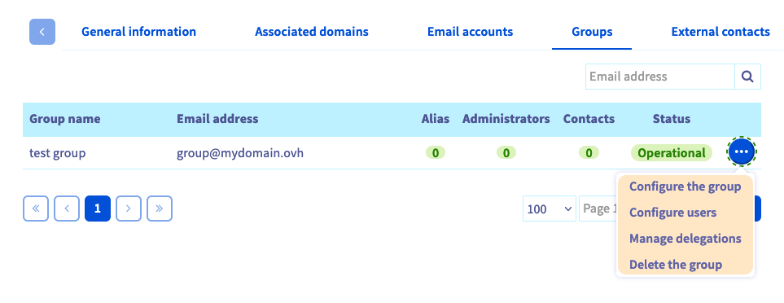

## Obiettivo

I gruppi Exchange consentono agli utenti di comunicare inviando email a un unico indirizzo di gruppo. Grazie a questa funzionalità di collaborazione, è possibile creare e gestire mailing list che includono utenti Exchange o utenti esterni.

**Questa guida ti mostra come utilizzare i gruppi Exchange tramite lo Spazio Cliente OVHcloud e Outlook Web App (OWA).**

## Prerequisiti

- Avere accesso allo [Spazio Cliente OVHcloud](/links/manager)
- Disporre di una [soluzione Exchange OVHcloud](/links/web/emails-hosted-exchange) attiva

## Procedura

### Step 1: crea un nuovo gruppo

Per prima cosa, accedi al tuo [Spazio Cliente OVHcloud](/links/manager), sezione `Webcloud`{.action}, e seleziona il tuo servizio cliccando su `Microsoft`{.action} > `Exchange`{.action}. Clicca sulla scheda `Gruppi`{.action} nel menu orizzontale.

{.thumbnail .w-600 .h-600}

Quindi clicca su `Crea un gruppo di contatti`{.action}. A questo punto, si apre una nuova finestra in cui è possibile definire le impostazioni del gruppo:

{.thumbnail .w-600 .h-600}

- **Indirizzo email**: definisci un nuovo indirizzo per inviare messaggi alla mailing list. Non utilizzare un indirizzo già funzionante.
- **Nome del gruppo**: utilizza il nome che compare nel tuo [Spazio Cliente OVHcloud](/links/manager) e nel tuo [servizio di posta Web OVHcloud](/links/web/email) (OWA).
- **Dimensione massima in entrata o in uscita**: è possibile specificare la dimensione massima delle email in entrata e in uscita.
- **Nascondi in Outlook**: se questa casella di controllo è selezionata, l'indirizzo del gruppo non verrà visualizzato nell'elenco degli indirizzi del servizio Exchange.
- **Autenticazione richiesta**: se questa casella di controllo è selezionata, solo gli utenti della stessa piattaforma potranno inviare messaggi con l'indirizzo del gruppo.

Clicca su `Avanti`{.action} per continuare.

Nella seconda pagina, selezionare i **Contatti** del gruppo e indicare gli **Amministratori**. Queste scelte saranno effettuate esclusivamente tra gli indirizzi email e i contatti esterni già elencati nel servizio.

- **Amministratori**: Account email autorizzati ad inviare email a tutti i contatti del gruppo.
- **Contatti**: Account email che riceveranno le email inviate al gruppo dagli amministratori.

> [!primary]
>
> Ti ricordiamo che gli amministratori devono essere configurati come **Contatti** per ricevere le email del gruppo.

{.thumbnail .w-600 .h-600}

Clicca su `Seguente`{.action} per continuare e clicca su `Conferma`{.action} per completare le tue scelte.

### Gestisci i gruppi

Dopo aver creato il gruppo, è possibile modificarne le impostazioni. clicca su`...`{.action} a destra del gruppo nella tabella.

{.thumbnail .w-600 .h-600}

#### Gestisci gli utenti di un gruppo

Per aggiungere `Contatti` al tuo gruppo o definire gli `Amministratori`, clicca sul pulsante `...`{.action} e poi su `Configura gli utenti`{.action}. Seleziona gli attributi che vuoi associare agli indirizzi email della colonna `Account email`.

> [!primary]
>
> Un gruppo può contenere un massimo di 10.000 contatti.

{.thumbnail .w-600 .h-600}

#### Gestisci le deleghe di un gruppo

Compare l’opzione `Configura le deleghe`{.action} del menu. Questa opzione permette di delegare l’accesso come si fa per un account Exchange. Trovi tutti i dettagli in [questa guida](/pages/web_cloud/email_and_collaborative_solutions/microsoft_exchange/feature_delegation).

{.thumbnail .w-600 .h-600}

> [!primary]
>
> Ti ricordiamo che l’applicazione di qualsiasi modifica a questo servizio potrebbe richiedere alcuni minuti. Per verificare lo stato della maggior parte delle operazioni, seleziona le opzioni `Plus`{.action} e `Attività recenti`{.action} dal menu orizzontale.

### Invia messaggi a un gruppo con la Webmail OWA

Per verificare la tua Mailing List tramite [OVHcloud Webmail](/links/web/email)(OWA) invia un’email all’indirizzo del gruppo.

{.thumbnail}

## Per saperne di più 

[Delegare i diritti su un account Exchange](/pages/web_cloud/email_and_collaborative_solutions/microsoft_exchange/feature_delegation)

[Guida all’utilizzo di Outlook Web App](/pages/web_cloud/email_and_collaborative_solutions/using_the_outlook_web_app_webmail/email_owa)

[Condividi un calendario con la Webmail OWA](/pages/web_cloud/email_and_collaborative_solutions/using_the_outlook_web_app_webmail/owa_calendar_sharing)

Per prestazioni specializzate (referenziamento, sviluppo, ecc...), contatta i [partner OVHcloud](/links/partner).

Per usufruire di un supporto per l'utilizzo e la configurazione delle soluzioni OVHcloud, è possibile consultare le nostre soluzioni [offerte di supporto](/links/support).

Contatta la nostra [Community di utenti](/links/community).