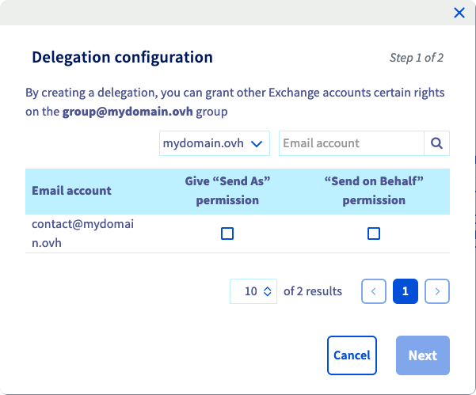

## Wprowadzenie

Grupy w programie Exchange umożliwiają komunikację wielu uczestników naraz przez wysyłanie e-maili na unikatowy adres grupy. Dzięki tej funkcji współpracy można tworzyć listy wysyłkowe obejmujące nie tylko użytkowników programu Exchange, ale też kontakty zewnętrzne, a także zarządzać nimi.

**Dowiedz się, jak korzystać z grup programu Exchange za pośrednictwem Panelu klienta OVHcloud oraz interfejsu OWA (Outlook Web App).**

## Wymagania początkowe

- dostęp do [Panelu klienta OVHcloud](/links/manager)
- skonfigurowane [rozwiązanie OVHcloud Exchange](/links/web/emails-hosted-exchange)

## W praktyce

### Krok 1: utworzenie nowej grupy

Najpierw zaloguj się do [Panelu klienta OVHcloud](/links/manager), przejdź do sekcji `Webcloud`{.action} i wybierz usługę Exchange z kolumny znajdującej się w obszarze `Microsoft`{.action} `Exchange`{.action}. Kliknij kartę `Grupy`{.action} w menu poziomym.

{.thumbnail .w-600 .h-600}

Kliknięcie przycisku `Utwórz grupę kontaktów`{.action} spowoduje otwarcie nowego okna, w którym możesz zdefiniować ustawienia grupy:

{.thumbnail .w-600 .h-600}

- **Adres e-mail**: Ustaw nowy adres do wysyłania wiadomości na listę mailingową. Uwaga: nie można podać istniejącego adresu e-mail.
- **Nazwa Grupy** : Użyj nazwy wyświetlanej w [Panelu klienta OVHcloud](/links/manager) i w [Web Mail OVHcloud](/links/web/email) (OWA).
- **Maksymalny rozmiar otrzymywanych i wychodzących wiadomości e-mail**: Możesz określić maksymalny rozmiar przychodzących i wychodzących wiadomości e-mail.
- **Maskuj w programie Outlook** : Po zaznaczeniu tego pola wyboru adres grupy nie będzie widoczny na liście adresów usługi Exchange.
- **Wymagane uwierzytelnianie**: Po zaznaczeniu tego pola wyboru tylko użytkownicy tej samej platformy będą mogli wysyłać wiadomości przy użyciu adresu grupy.

Kliknij przycisk `Dalej`{.action}, aby kontynuować.

Na drugiej stronie wybierz **Kontakty** grupy i określ **Administratorów**. Do wyboru będą tylko adresy e-mail i kontakty zewnętrzne, które już zostały utworzone w usłudze.

- **Administratorzy** : Konta e-mail z uprawnieniami do wysyłania wiadomości do wszystkich kontaktów w grupie.
- **Kontakty** : Konta e-mail, na które administratorzy będą otrzymywać wiadomości e-mail wysłane do grupy.

> [!primary]
>
> Pamiętaj, że administratorzy muszą zostać skonfigurowani jako **Kontakty**, aby móc odbierać e-maile grupy.

{.thumbnail .w-600 .h-600}

Kliknij na `Dalej`{.action}, aby kontynuować i kliknij na `Potwierdź`{.action}, aby sfinalizować wybory.

### Zarządzanie grupami

Po utworzeniu grupy możesz zmodyfikować ustawienia, które zdefiniowałeś. Kliknij `...`{.action} po prawej stronie grupy w tabeli.

{.thumbnail .w-600 .h-600}

#### Zarządzanie użytkownikami w grupie

Aby dodać `Kontakty` do swojej grupy lub ustawić `Administratorzy`, kliknij przycisk `...`{.action}, a następnie `Skonfiguruj użytkowników`{.action}. Zaznacz atrybuty, które chcesz przypisać do adresów e-mail w kolumnie `Konto e-mail`.

> [!primary]
>
> Grupa może zawierać maksymalnie 10 000 kontaktów.

{.thumbnail .w-600 .h-600}

#### Zarządzanie delegowaniem grupy

Zostanie wyświetlona opcja `Skonfiguruj delegowanie`{.action} w menu. Opcja ta umożliwia delegowanie uprawnień dostępu w taki sam sposób, jak w przypadku konta Exchange. [ten przewodnik](/pages/web_cloud/email_and_collaborative_solutions/microsoft_exchange/feature_delegation) zawiera szczegółowe informacje.

{.thumbnail .w-600 .h-600}

> [!primary]
>
> Zastosowanie zmian wprowadzonych w usłudze może zająć kilka minut. Status większości operacji możesz sprawdzić, wybierając opcje `Plus`{.action} i `Ostatnie zadania`{.action} z menu poziomego.

### Wysyłanie wiadomości do grupy w interfejsie OWA

Listę wysyłkową można przetestować za pośrednictwem interfejsu [OVHcloud webmail](/links/web/email) (OWA): wystarczy wysłać e-mail na adres grupy.

{.thumbnail}

## Sprawdź również

[Delegowanie uprawnień do konta Exchange](/pages/web_cloud/email_and_collaborative_solutions/microsoft_exchange/feature_delegation)

[Przewodnik dotyczący korzystania z Outlook Web App (OWA)](/pages/web_cloud/email_and_collaborative_solutions/using_the_outlook_web_app_webmail/email_owa)

[Exchange 2016: współdzielenie kalendarza w interfejsie OWA](/pages/web_cloud/email_and_collaborative_solutions/using_the_outlook_web_app_webmail/owa_calendar_sharing)

W przypadku wyspecjalizowanych usług (pozycjonowanie, rozwój, etc.) skontaktuj się z [partnerami OVHcloud](/links/partner).

Jeśli chcesz otrzymywać wsparcie w zakresie konfiguracji i użytkowania Twoich rozwiązań OVHcloud, zapoznaj się z naszymi [ofertami pomocy](/links/support).

Dołącz do [grona naszych użytkowników](/links/community).