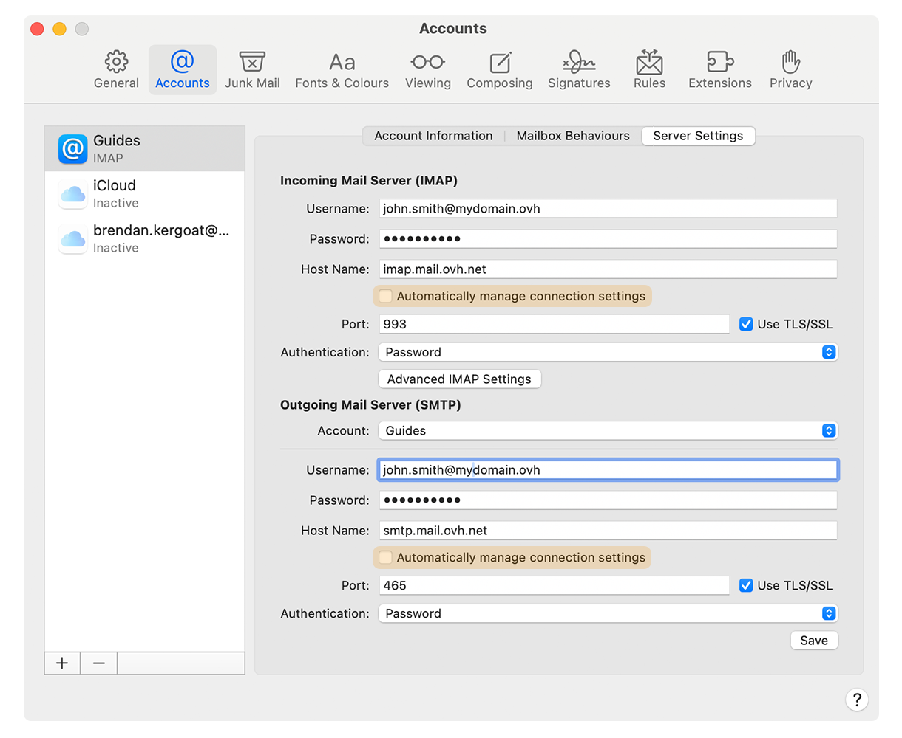

## Wprowadzenie

Konta MX Plan mogą być skonfigurowane w jednym z kompatybilnych programów pocztowych. Dzięki temu możesz używać Twojego konta e-mail, korzystając z wybranej przez Ciebie aplikacji. Aplikacja Mail na macOS jest dostępna bezpłatnie dla wszystkich komputerów Mac.

**Dowiedz się, jak skonfigurować Twoje konto e-mail MX Plan w aplikacji Mail na urządzeniach z systemem macOS.**

> [!warning]
>
> OVHcloud udostępnia różnorodne usługi, jednak to Ty odpowiadasz za ich konfigurację i zarządzanie nimi. Ponosisz więc odpowiedzialność za ich prawidłowe funkcjonowanie.
>
> Oddajemy w Twoje ręce niniejszy przewodnik, którego celem jest pomoc w wykonywaniu bieżących zadań. W przypadku trudności zalecamy skorzystanie z pomocy wyspecjalizowanego webmastera lub kontakt z producentem oprogramowania. Niestety firma OVHcloud nie będzie mogła udzielić wsparcia w tym zakresie. Więcej informacji znajduje się w sekcji "Sprawdź również".

## Wymagania początkowe

- Posiadanie konta e-mail MX Plan (zawartego w usłudze MX Plan lub w usłudze [hostingu OVHcloud](/links/web/hosting))
- Instalacja programu Mail na Twoim urządzeniu Mac
- Dane do logowania do konta e-mail, które chcesz skonfigurować
 
## W praktyce

### Dodaj konto

- **Podczas pierwszego uruchomienia aplikacji**: wyświetli się asystent konfiguracji i poprosi o wybór typu konta.

- **Jeśli konto zostało wcześniej skonfigurowane**: kliknij `Mail`{.action} na pasku menu na górze ekranu, a następnie kliknij `Konta`{.action}.

Postępuj zgodnie z kolejnymi instrukcjami, klikając poniższe zakładki:

> [!tabs]
> **Etap 1**
>>
>> Wybierz `Inne konto Mail`{.action}, następnie kliknij `Konto Mail`{.action}.  
>> {.thumbnail .w-400 .h-600}
>>
> **Etap 2**
>>
>> W oknie "**Dodaj konto Mail**" wpisz następujące informacje:   
>> - **Nazwa** dla twojego konta e-mail
>> - Twój **Adres e-mail**
>> - **Hasło** Twojego konta e-mail 
>> {.thumbnail .w-400 .h-600}
>>
> **Etap 3**
>>
>> W kolejnym oknie uzupełnij informacje:
>>
>> - **Adres e-mail**
>> - **Nazwa użytkownika** : Wpisz pełny adres e-mail
>> - **Hasło**
>> - **Typ konta** : Wybierz `IMAP` (zalecane) lub `POP`
>> - **Serwer poczty przychodzącej** : - **EUROPE** : Wpisz `imap.mail.ovh.net` lub `ssl0.ovh.net` - **AMERYKA/AZJA** : Wpisz `imap.mail.ovh.ca`
>> - **Serwer poczty wychodzącej** : - **EUROPE** : Wpisz `smtp.mail.ovh.net` lub `ssl0.ovh.net` - **AMERYKA/AZJA** : Wpisz `smtp.mail.ovh.ca`
>>
>> Aby dokończyć konfigurację, kliknij przycisk `Zaloguj`{.action}
>>
>> > [!warning]
>> >
>> > Wiadomość jest wyświetlana na czerwono "**Nie można sprawdzić nazwy konta ani hasła**", gdy po raz pierwszy zostanie wyświetlone okno. Jeśli jednak ten komunikat będzie się powtarzać po zatwierdzeniu, wprowadzone informacje będą błędne.  
>>
>> {.thumbnail .w-400 .h-600}

> [!warning]
>
> Jeśli po wykonaniu poniższych kroków konfiguracji wystąpił błąd wysyłania lub odbierania, zobacz [Modyfikuj istniejące ustawienia](#modify-settings)

### Użyj konta e-mail

Po zakończeniu konfiguracji konto jest gotowe do użytku. Możesz teraz zacząć wysyłać i odbierać wiadomości.

OVHcloud oferuje również aplikację internetową umożliwiającą korzystanie z Twojego konta e-mail przy użyciu przeglądarki internetowej. Jest ona dostępna pod adresem [Webmail](/links/web/email). Możesz się do niej zalogować, używając tych samych danych, których używasz do logowania się do konta e-mail. W przypadku pytań dotyczących korzystania z tego konta, skorzystaj z naszego przewodnika [Sprawdź konto w interfejsie OWA](/pages/web_cloud/email_and_collaborative_solutions/using_the_outlook_web_app_webmail/email_owa) lub [Korzystaj z konta e-mail w interfejsie Webmail RoundCube](/pages/web_cloud/email_and_collaborative_solutions/mx_plan/email_roundcube).

### Pobierz kopię zapasową Twojego konta e-mail

Jeśli musisz wykonać operację, która może spowodować utratę danych przypisanych do Twojego konta e-mail, zalecamy wykonanie kopii zapasowej odpowiedniego konta e-mail. W tym celu sprawdź sekcję "**Eksport**" w części "**Mail na Mac OS**" w naszym przewodniku [Ręczna migracja Twojego konta e-mail](/pages/web_cloud/email_and_collaborative_solutions/migrating/manual_email_migration#eksport).

### Zmień istniejące ustawienia 

Jeśli Twoje konto e-mail zostało już skonfigurowane, musisz przejść do ustawień konta, aby je zmienić:

- Kliknij na `Mail`{.action} na pasku menu na górze Twojego ekranu, a następnie na `Preferencje`{.action}.
- Wybierz dane konto w kolumnie z lewej strony i kliknij `Ustawienia serwera`{.action}.
- W sekcji `Serwer poczty przychodzącej (POP)` lub `Serwer poczty przychodzącej (IMAP)`, wpisz pełny adres e-mail w polu `Nazwa użytkownika`{.action} oraz `Hasło`{.action} powiązane' w odpowiednim polu.
- W sekcji `Serwer poczty wychodzącej (SMTP)` wpisz pełny adres e-mail w polu `Nazwa użytkownika`{.action} oraz `Hasło`{.action} powiązane z tym adresem w odpowiednim polu.
- Usuń zaznaczenie z pól wyboru `Automatycznie zarządzaj ustawieniami połączenia`{.action}, aby wyświetlić parametry `Port`{.action} i `Uwierzytelnianie`{.action}.
- Upewnij się, że pola `Użycie TLS/SSL`{.action} są zaznaczone.
- W menu rozwijanym `Uwierzytelnienie`{.action} sprawdź, czy zaznaczono `Hasło`.
- W polach `Nazwa hosta`{.action} i `Port`{.action} sprawdź wartości z rubryki "[Przypomnienie parametrów POP, IMAP i SMTP](#popimap-settings)". **Sprawdź, czy typ serwera (IMAP, POP i SMTP) pasuje do Twojego regionu (Europa lub Azja-Pacyfik)**.

Aby zakończyć konfigurację, kliknij przycisk `Zapisz`{.action}.

{.thumbnail .w-400 .h-600}

> [!primary]
>
> **Zmień konfigurację**
>
> Jeśli Twój adres e-mail został skonfigurowany jako **IMAP**, a chcesz zmienić tę konfigurację na **POP**, musisz usunąć konto w aplikacji Mail na MacOS i utworzyć je ponownie jako **POP**.

### Przypomnienie parametrów POP, IMAP i SMTP 

Jeśli chcesz otrzymywać e-maile, wybierz rodzaj konta. Zalecamy użycie **IMAP**. Możesz jednak wybrać **POP**.

> [!warning]
>
> Należy wyraźnie podnieść wartość odnoszącą się do Twojej lokalizacji (**EUROPE** lub **AMERYKA / AZJA-PACYFIK**)

- **Konfiguracja POP**

|Informacje|Opis|
|---|---|
|Nazwa użytkownika|Wpisz pełny adres e-mail **complete**|
|Hasło|Wpisz hasło wybrane dla tego konta e-mail|
|Serwer **EUROPE** (ruch przychodzący)|pop.mail.ovh.net **ou** ssl0.ovh.net|
|Serwer **AMERYKA / AZJA-PACYFIK** (ruch przychodzący)|pop.mail.ovh.ca|
|Port|995|
|Typ zabezpieczeń|SSL/TLS|

- **Konfiguracja IMAP**

|Informacje|Opis|
|---|---|
|Nazwa użytkownika|Wpisz pełny adres e-mail **complete**|
|Hasło|Wpisz hasło wybrane dla tego konta e-mail|
|Serwer **EUROPE** (ruch przychodzący)|imap.mail.ovh.net **ou** ssl0.ovh.net|
|Serwer **AMERYKA / AZJA-PACYFIK** (ruch przychodzący)|imap.mail.ovh.ca|
|Port|993|
|Typ zabezpieczeń|SSL/TLS|

Jeśli chcesz wysyłać wiadomości e-mail, wprowadź ręcznie ustawienia **SMTP** w ustawieniach konta poniżej znajdź parametry, których chcesz użyć:

- **Konfiguracja SMTP**

|Informacje|Opis|
|---|---|
|Nazwa użytkownika|Wpisz pełny adres e-mail **complete**|
|Hasło|Wpisz hasło wybrane dla tego konta e-mail|
|Serwer **EUROPE** (ruch wychodzący)|smtp.mail.ovh.net **ou** ssl0.ovh.net|
|Serwer **AMERYKA / AZJA-PACYFIK** (ruch wychodzący)|smtp.mail.ovh.ca|
|Port|465|
|Typ zabezpieczeń|SSL/TLS|

> [!primary]
>
> **Zmień konfigurację**
>
> Jeśli Twój adres e-mail został skonfigurowany jako **IMAP**, a chcesz zmienić tę konfigurację na **POP**, musisz usunąć konto w aplikacji Mail na MacOS i utworzyć je ponownie jako **POP**.

### Co zrobić, jeśli nie mogę odebrać/wysłać e-maili?

- Jeśli zobaczysz ikonę widoczną na poniższym zrzucie, nastąpi rozłączenie sieci. Sprawdź, czy połączenie z Internetem działa poprawnie.

{.thumbnail .w-400 .h-600}

- Jeśli zauważysz widoczną ikonę na poniższym zrzucie, jest to błąd synchronizacji. Sprawdź ustawienia konfiguracji konta e-mail, przechodząc do sekcji [Zmień istniejące ustawienia](#modify-settings).

{.thumbnail .w-400 .h-600}

## Sprawdź również 

> [!primary]
>
> Aby uzyskać więcej informacji na temat konfigurowania konta e-mail z poziomu aplikacji Mail na macOS, skorzystaj z [Centrum pomocy Apple](https://support.apple.com/pl/pomoc/mail35803/mac).

[MX Plan - Konfiguracja konta e-mail w aplikacji Mail na urządzeniach iPhone i iPad](/pages/web_cloud/email_and_collaborative_solutions/mx_plan/how_to_configure_ios)

[E-mail Pro - Konfiguracja konta e-mail w aplikacji Mail na urządzeniach z systemem macOS](/pages/web_cloud/email_and_collaborative_solutions/email_pro/how_to_configure_mail_macos) 
[E-mail Pro - Konfiguracja konta e-mail w aplikacji Mail na urządzeniach iPhone i iPad](/pages/web_cloud/email_and_collaborative_solutions/email_pro/how_to_configure_ios)

[Exchange - Konfiguracja konta e-mail w aplikacji Mail na urządzeniach z systemem macOS](/pages/web_cloud/email_and_collaborative_solutions/microsoft_exchange/how_to_configure_ios) 
[Exchange - Konfiguracja konta e-mail w aplikacji Mail na urządzeniach iPhone i iPad](strony/web_cloud/email_and_collaborative_solutions/microsoft_exchange/how_to_configure_mail_macos/guide.fr-en.md)

W przypadku wyspecjalizowanych usług (pozycjonowanie, rozwój, etc.) skontaktuj się z [partnerami OVHcloud](/links/partner).

Jeśli chcesz otrzymywać wsparcie w zakresie konfiguracji i użytkowania Twoich rozwiązań OVHcloud, zapoznaj się z naszymi [ofertami pomocy](/links/support).

Dołącz do [grona naszych użytkowników](/links/community).