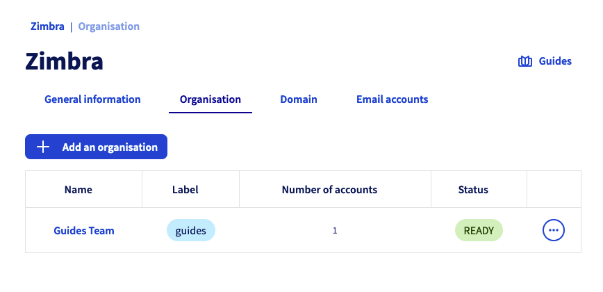
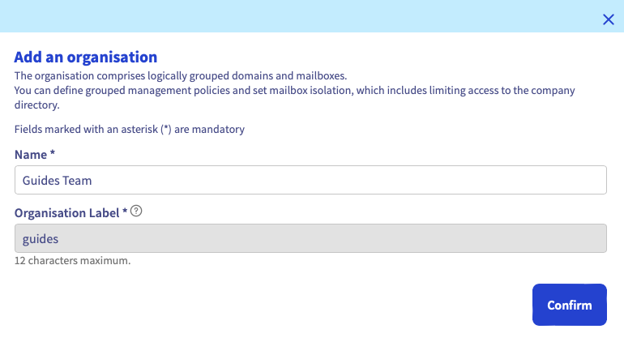

> [!warning]
> Diese Übersetzung wurde durch unseren Partner SYSTRAN automatisch erstellt. In manchen Fällen können ungenaue Formulierungen verwendet worden sein, z.B. bei der Beschriftung von Schaltflächen oder technischen Details. Bitte ziehen Sie im Zweifelsfall die englische oder französische Fassung der Anleitung zu Rate. Möchten Sie mithelfen, diese Übersetzung zu verbessern? Dann nutzen Sie dazu bitte den Button "Beitragen" auf dieser Seite.
>

> [!warning]
>
> **Wichtig**
>
> Das Zimbra Angebot befindet sich in der Beta-Phase.
>
> Es ist derzeit für Anwender verfügbar, die das [Beta-Anmeldeformular ausgefüllt haben](https://labs.ovhcloud.com/en/zimbra-beta/).
>
> Einige der in dieser Anleitung aufgeführten Funktionen oder Einschränkungen können sich nach der Markteinführung des Produkts ändern.

## Ziel

Mit dem Zimbra Dienst bietet Ihnen OVHcloud eine kollaborative Open Source Messaging Plattform mit allen für eine professionelle Nutzung notwendigen Funktionen. In dieser Anleitung erfahren Sie, wie Sie mit der Konfiguration Ihrer Zimbra E-Mail-Accounts beginnen.

**Diese Anleitung erklärt, wie Sie Zimbra E-Mail im OVHcloud Kundencenter konfigurieren.**

## Voraussetzungen

- Sie haben einen E-Mail-Account auf der OVHcloud Zimbra E-Mail-Lösung abonniert.
- Sie verwalten einen [OVHcloud Domainnamen](/links/web/domains).
- Sie haben Zugriff auf Ihr [OVHcloud Kundencenter](/links/manager).

## In der praktischen Anwendung

### Auf die Verwaltung Ihrer Dienstleistung zugreifen

Um auf Ihren Zimbra-Dienst zuzugreifen, loggen Sie sich in Ihr [OVHcloud Kundencenter](/links/manager) ein und klicken Sie auf den Tab `Web Cloud`{.action}. Klicken Sie im Bereich `E-Mails`{.action} auf `Zimbra`{.action}.

{.thumbnail .w-400}

### Ihren Zimbra Dienst konfigurieren

Bevor Sie mit der Konfiguration Ihrer Zimbra E-Mail-Accounts beginnen, beachten Sie die drei Elemente, die Ihre Zimbra Dienstleistung hierarchisch strukturieren:

- [**Organisation**](#organizations): Gruppierung von Domainnamen zur Verwendung mit E-Mails.
- [**Domainname**](#domains): Notwendig zur Erstellung eines E-Mail-Accounts; mindestens ein Domainname in Ihrem OVHcloud Kundencenter ist erforderlich, um ihn dem Zimbra-Dienst hinzufügen zu können.
- [**E-Mail-Accounts**](#emails): Mit den zu Ihrem Zimbra Dienst hinzugefügten Domainnamen können Sie E-Mail-Adressen erstellen.

> [!primary]
>
> Die *Organisation* dient zur Darstellung einer Entität (Unternehmen, Verein, persönliches Projekt usw.). Sie erlaubt die Trennung von E-Mail-Accounts, die Anwendung spezifischer Sicherheitsrichtlinien (zukünftige Funktion) und die Übertragung von Rechten an eine Organisation (zukünftige Funktion). Die Verwendung von Organisationen vereinfacht die Navigation und Verwaltung Ihrer Zimbra-Plattform.

Die folgende Abbildung zeigt die hierarchische Beziehung zwischen den oben genannten Elementen.

{.thumbnail .w-400}

### Organisationen 

Wenn Sie eine große Anzahl von Domainnamen zu Ihrem Zimbra Dienst hinzufügen, kann es nützlich sein, diese zu einer "Organisation" zusammenzufassen. Klicken Sie in Ihrem Zimbra Dienst auf `Organisation`{.action}.

{.thumbnail .w-400}

#### Organisation erstellen

Um eine Organisation zu erstellen, klicken Sie auf `Organisation hinzufügen`{.action}. Legen Sie den `Namen` der Organisation und das `Label der Organisation` fest. Dabei handelt es sich um eine kurze Beschreibung der Organisation, anhand derer Sie die Anzeige der Domainnamen und E-Mail-Accounts Ihrer Zimbra Dienstleistung filtern können.

{.thumbnail .w-400}

### Nach Organisation filtern

In den Tabs `Organisation`{.action}, `Domain`{.action} und `E-Mail-Accounts`{.action} erstellen Sie einen Filter, der nur die Elemente anzeigt, die mit dieser Organisation verknüpft sind. 
Sie sehen, dass der Filter angewendet wird, wenn das Label neben dem Namen Ihres Zimbra Dienstes angezeigt wird. 
Um den Filter zu entfernen, klicken Sie auf das Filterkreuz.

{.thumbnail .w-400}

### Domains 

> [!warning]
>
> Für einen optimalen Betrieb, wenn Sie den gleichen Domainnamen zwischen den Angeboten OVHcloud [Exchange](/links/web/emails-hosted-exchange), [E-Mail Pro](/links/web/email-pro) und Zimbra verwenden, muss der Domainname als `nicht-authoritativ` konfiguriert werden. Weitere Informationen zum Konfigurieren eines nicht-autoritativen Domainnamens auf einer Exchange- oder E-Mail Pro-Plattform finden Sie in unserer Anleitung [Einen Domainnamen auf einer E-Mail-Plattform hinzufügen](/pages/web_cloud/email_and_collaborative_solutions/microsoft_exchange/exchange_adding_domain).

In diesem Tab finden Sie alle Domainnamen, die zu Ihrer Zimbra Dienstleistung hinzugefügt wurden. Sie müssen über Ihr OVHcloud Kundencenter verwaltet werden, um sie verwenden zu können.

Die Tabelle der Domainnamen enthält zwei Informationen:

- **Organisation**: Diese wird festgelegt, wenn Sie Ihren Domainnamen hinzufügen. Dessen Label wird automatisch in dieser Spalte angezeigt.
- **Anzahl der Accounts**: Hier finden Sie alle Accounts, die unter dem betreffenden Domainnamen erstellt wurden.

{.thumbnail .w-400}

#### Einen Domainnamen hinzufügen

Um einen Domainnamen zu Ihrer Zimbra Dienstleistung hinzuzufügen, klicken Sie auf `Domain`{.action} und dann auf `Domain hinzufügen`{.action}.

Wählen Sie im Dropdown-Menü eine Organisation aus, und wählen Sie einen Domänennamen aus der Liste aus (die in Ihrem OVHcloud Kundencenter verwaltet werden). Klicken Sie anschließend auf `Bestätigen`{.action}, um das Hinzufügen des Domainnamens abzuschließen.

{.thumbnail .w-400 .h400}

### E-Mail-Accounts 

Die Verwaltung der E-Mail-Accounts Ihrer Zimbra Dienstleistung erfolgt über den Tab `E-Mail-Accounts`{.action}. Die Tabelle enthält eine Liste der auf Ihrem Dienst vorhandenen E-Mail-Accounts sowie 3 Informationen zu jedem Account:

- **Organisation**: Wenn der Domainname Ihres E-Mail-Accounts mit einer Organisation verbunden ist, finden Sie das zugehörige Label automatisch in dieser Spalte.
- **Angebot**: Da Ihre Zimbra Dienstleistung mehrere Zimbra Angebote enthalten kann, finden Sie das Ihrem E-Mail-Account zugeordnete Angebot in dieser Spalte.
- **Größe**: Diese Spalte zeigt die Gesamtkapazität und den aktuellen Speicherplatz Ihres E-Mail-Accounts an.

Außerdem finden Sie oben auf dieser Seite einen Link zum [Webmail](/links/web/email), um die Inhalte des E-Mail-Accounts im Webbrowser anzuzeigen.

{.thumbnail .w-400}

#### Einen E-Mail-Account erstellen

Um einen E-Mail-Account auf Ihrer Zimbra Dienstleistung zu erstellen, klicken Sie auf den Tab `E-Mail-Accounts`{.action} und dann auf `Einen Account erstellen`{.action}.

Geben Sie die angezeigten Informationen ein.

- **E-Mail-Account**: Geben Sie den *Namen des Accounts* ein, den Ihre E-Mail-Adresse erhalten soll (zum Beispiel Vorname.Name) und *wählen Sie einen Domainnamen* aus dem Drop-down-Menü aus.

> [!warning]
>
> Die Wahl des Namens Ihrer E-Mail-Adresse muss folgende Bedingungen erfüllen:
>
> - Mindestens 2 Zeichen
> - Maximal 32 Zeichen
> - Keine Zeichen mit Akzent
> - Keine Sonderzeichen außer `.`, `,`, `-` und `_`

- **Vorname**: Geben Sie einen Vornamen ein.
- **Name**: Geben Sie einen Namen ein.
- **Anzeigename**: Geben Sie den Namen ein, der als Absender angezeigt wird, wenn E-Mails von dieser Adresse aus versendet werden.
- **Passwort**: Legen Sie ein sicheres Passwort fest, das aus (mindestens) 9 Zeichen, einem Großbuchstaben, einem Kleinbuchstaben und einer Ziffer besteht. Verwenden Sie aus Sicherheitsgründen nicht dasselbe Kennwort zweimal. Wählen Sie einen Namen aus, der in keinem Zusammenhang mit Ihren persönlichen Daten steht (vermeiden Sie z. B. Ihren Namen, Vornamen und Ihr Geburtsdatum). Ändern Sie es regelmäßig.

> [!warning]
>
> Die Wahl des Passworts muss folgende Bedingungen erfüllen:
>
> - Mindestens 10 Zeichen
> - Maximal 64 Zeichen
> - Mindestens 1 Großbuchstabe
> - Mindestens 1 Sonderzeichen
> - Keine Zeichen mit Akzent

Klicken Sie auf `Bestätigen`{.action}, um die Erstellung des Accounts zu starten.

{.thumbnail .w-400}

## Weiterführende Informationen 

[Zimbra-E-Mail-Adresse auf einem E-Mail-Client konfigurieren](/pages/web_cloud/email_and_collaborative_solutions/zimbra/zimbra_mail_apps)

[Zimbra Webmail verwenden](/pages/web_cloud/email_and_collaborative_solutions/mx_plan/email_zimbra)

[OVHcloud Zimbra FAQ](/pages/web_cloud/email_and_collaborative_solutions/mx_plan/faq-zimbra)

Kontaktieren Sie für spezialisierte Dienstleistungen (SEO, Web-Entwicklung etc.) die [OVHcloud Partner](/links/partner).

Wenn Sie Hilfe bei der Nutzung und Konfiguration Ihrer OVHcloud Lösungen benötigen, beachten Sie unsere [Support-Angebote](/links/support).

Treten Sie unserer [User Community](/links/community) bei.