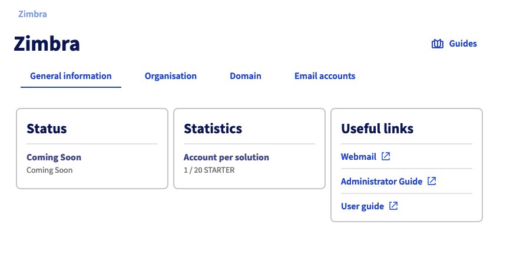
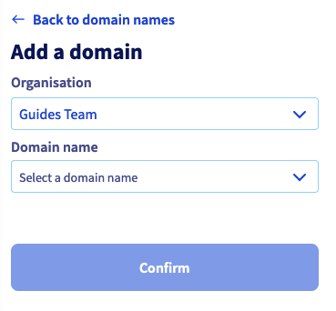
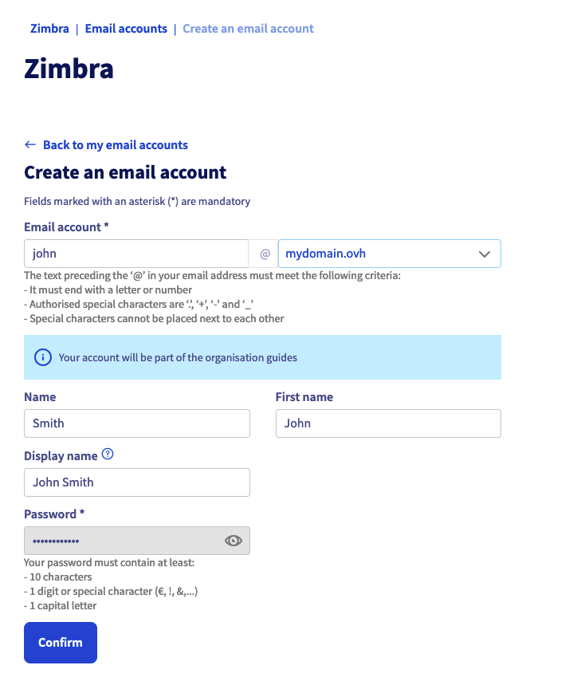

> [!primary]
> Esta traducción ha sido generada de forma automática por nuestro partner SYSTRAN. En algunos casos puede contener términos imprecisos, como en las etiquetas de los botones o los detalles técnicos. En caso de duda, le recomendamos que consulte la versión inglesa o francesa de la guía. Si quiere ayudarnos a mejorar esta traducción, por favor, utilice el botón "Contribuir" de esta página.
>

> [!warning]
>
> **Importante**
>
> El producto Zimbra es un producto en fase beta.
>
> Solo está disponible para las personas que hayan completado el [formulario de inscripción en la beta](https://labs.ovhcloud.com/en/zimbra-beta/).
>
> Algunas de las funciones o limitaciones descritas en esta guía pueden cambiar cuando el producto salga al mercado.

## Objetivo

Con el servicio Zimbra, OVHcloud le ofrece una plataforma de mensajería en colaboración open source que ofrece todas las funcionalidades necesarias para un uso profesional. Esta guía explica los pasos necesarios para configurar una cuenta de correo electrónico de Zimbra.

**Descubra cómo empezar con la solución de correo electrónico Zimbra**

## Requisitos

- Tener una cuenta de correo en nuestra solución de correo Zimbra OVHcloud.
- Tener un [dominio de OVHcloud](/links/web/domains).
- Estar conectado a su [área de cliente de OVHcloud](/links/manager).

## Procedimiento

### Acceder a la gestión de su servicio

Para acceder a su servicio Zimbra , conéctese a su [área de cliente de OVHcloud](/links/manager) y haga clic en la pestaña `Web Cloud`{.action}. {.action} En la sección `Direcciones de correo`{.action} de la columna izquierda, haga clic en `Zimbra`{.action}.

{.thumbnail .w-400}

### Configurar su servicio Zimbra

Antes de empezar a configurar las cuentas de correo de Zimbra, deberá analizar los tres elementos que estructuran jerárquicamente el servicio Zimbra :

- [**Organización**](#organizations) : permite agrupar los nombres de dominio para asociarlos.
- [**Nombre de dominio**](#domains) : es indispensable para crear una cuenta de correo. Debe gestionar al menos uno desde el área de cliente de OVHcloud y añadirlo a su servicio Zimbra.
- [**Cuentas de correo electrónico**](#emails) : Utilizando los nombres de dominio añadidos a su servicio Zimbra, podrá crear una dirección de correo electrónico.

> [!primary]
>
> La *organización* se utiliza para representar una entidad (empresa, asociación, proyecto personal, etc.). Permite el aislamiento de las cuentas de correo, la aplicación de políticas de seguridad específicas (funcionalidad futura) y la delegación de los permisos a una organización (funcionalidad futura). El uso de organizaciones facilita la navegación y la gestión de la plataforma Zimbra.

El diagrama siguiente resume la relación jerárquica entre los elementos mencionados anteriormente.

{.thumbnail .w-400}

### Organizaciones 

Si añade un gran número de dominios a su servicio Zimbra, puede ser útil reagruparlos asociándolos a una "organización". Desde su servicio Zimbra, haga clic en `Organización`{.action}.

{.thumbnail .w-400}

#### Crear una organización

Para crear una organización, haga clic en `Agregar organización`{.action}. Establezca el `Nombre` de la organización y el `Label de la organización`, que es una breve descripción de la organización que le permite identificarse al filtrar la visualización de los nombres de dominio y cuentas de correo de su servicio Zimbra.

{.thumbnail .w-400}

#### Filtrar por organización

Desde las fichas `Organización`{.action}, `Dominio`{.action} y `Cuentas de correo`{.action}, al hacer clic en el label de una organización, se crea un filtro que muestra únicamente los elementos asociados a esa organización. 
Observe que el filtro se aplica cuando aparece el label junto al nombre del servicio Zimbra. 
Para retirar el filtro, simplemente haga clic en la cruz del filtro.

{.thumbnail .w-400}

### Dominios 

> [!warning]
>
> Para un funcionamiento óptimo cuando utilice el mismo nombre de dominio entre los productos OVHcloud [Exchange](/links/web/emails-hosted-exchange), [E-mail Pro](/links/web/email-pro) y Zimbra, es necesario configurar el dominio en « no autoritativo ». Para más información sobre cómo configurar un dominio sin autorización en una plataforma Exchange o Email Pro, consulte nuestra guía [Añadir un dominio a una plataforma de correo](/pages/web_cloud/email_and_colaborative_solutions/microsoft_exchange/exchange_adding_domain).

En esta pestaña podrá consultar todos los dominios añadidos al servicio Zimbra. Es necesario gestionarlos desde el área de cliente de OVHcloud para poder añadirlos.

En la tabla de dominios encontrará dos datos :

- **Organización** : esta se determina al añadir el dominio. En esta columna encontrará automáticamente la etiqueta.
- **Número de cuentas** : Aquí encontrará todas las cuentas creadas con el dominio correspondiente.

{.thumbnail .w-400}

#### Añadir un dominio

Para añadir un dominio a su servicio Zimbra, haga clic en la pestaña `Dominio`{.action} y luego en `Añadir un dominio`{.action}.

Seleccione una organización en el menú desplegable y, a continuación, seleccione un dominio de la lista (es necesario que los dominios estén gestionados en el área de cliente de OVHcloud). A continuación, haga clic en `Confirmar`{.action} para añadir el dominio.

{.thumbnail .w-400 .h400}

### Cuentas de correo 

La gestión de las direcciones de correo de su servicio Zimbra se realiza desde la pestaña `Cuentas de correo`{.action}. La tabla muestra las cuentas de correo que tiene en el servicio, así como 3 datos para cada una de ellas :

- **Organización** : si el nombre de dominio de su cuenta de correo está asociado a una organización, su etiqueta aparecerá automáticamente en esta columna.
- **Oferta** : como su servicio Zimbra puede alojar varios productos Zimbra en su interior, encontrará la oferta asociada a su cuenta de correo en esta columna.
- **Tamaño** : esta columna muestra la capacidad total de su cuenta de correo y el espacio que ocupa actualmente.

En la parte superior de esta página también encontrará un enlace al [Webmail](/links/web/email) para poder conectarse directamente al contenido de su cuenta de correo desde su navegador de internet.

{.thumbnail .w-400}

#### Crear una cuenta de correo

Para crear una cuenta de correo en su servicio Zimbra, haga clic en la pestaña `Cuentas de correo`{.action} y seleccione `Crear una cuenta`{.action}.

Complete la información que se muestra.

- **Cuenta de correo** : introduzca el *nombre de la cuenta* que llevará su dirección de correo (por ejemplo, su nombre.apellido) y *seleccione un nombre de dominio* en el menú desplegable.

> [!warning]
>
> La elección del nombre de su dirección de correo electrónico debe respetar las siguientes condiciones :
>
> - Mínimo 2 caracteres
> - Máximo 32 caracteres
> - Sin caracteres acentuados
> - Sin caracteres especiales, excepto los siguientes : `.`, `,`, `-` y `_`

- **Nombre** : introduzca un nombre.
- **Nombre** : introduzca un nombre.
- **Nombre a mostrar**  : Introduzca el nombre que quiera que figure como remitente cuando envíe mensajes desde esta dirección.
- **Contraseña** : Establezca una contraseña segura que incluya (como mínimo) 9 caracteres, una mayúscula, una minúscula y una cifra. Por motivos de seguridad, no utilice la misma contraseña dos veces. Elija un nombre que no guarde relación con sus datos personales (por ejemplo, no incluya su nombre, apellidos ni fecha de nacimiento). Cámbielo regularmente.

> [!warning]
>
> La elección de la contraseña debe respetar las siguientes condiciones :
>
>: mínimo 10 caracteres
> - Máximo 64 caracteres
> - Mínimo 1 mayúscula
> - Mínimo 1 carácter especial
> - Sin caracteres acentuados

Haga clic en `Confirmar`{.action} para crear la cuenta.

{.thumbnail .w-400}

### Consultar su cuenta de correo 

Para consultar su cuenta de correo:

- Conéctese al [webmail](/links/web/email) desde un navegador de internet e introduzca su dirección de correo y contraseña. Para más información, consulte nuestra página «[Utilizar el webmail Zimbra](/pages/web_cloud/email_and_collaborative_solutions/mx_plan/email_zimbra) ».
- Configure un programa de mensajería en su ordenador, smartphone o tablet. Consulte nuestra página «[Configurar una dirección de correo electrónico de Zimbra en un cliente de correo](/pages/web_cloud/email_and_collaborative_solutions/zimbra/zimbra_mail_apps) ».

## Más información 

[Configurar una dirección de correo electrónico de Zimbra en un cliente de correo](/pages/web_cloud/email_and_collaborative_solutions/zimbra/zimbra_mail_apps)

[Utilizar el webmail Zimbra](/pages/web_cloud/email_and_collaborative_solutions/mx_plan/email_zimbra)

[FAQ sobre la solución Zimbra OVHcloud](/pages/web_cloud/email_and_collaborative_solutions/mx_plan/faq-zimbra)

Para servicios especializados (posicionamiento, desarrollo, etc.), contacte con [partners de OVHcloud](/links/partner).

Si quiere disfrutar de ayuda para utilizar y configurar sus soluciones de OVHcloud, puede consultar nuestras distintas soluciones [pestañas de soporte](/links/support).

Interactúe con nuestra [comunidad de usuarios](/links/community).