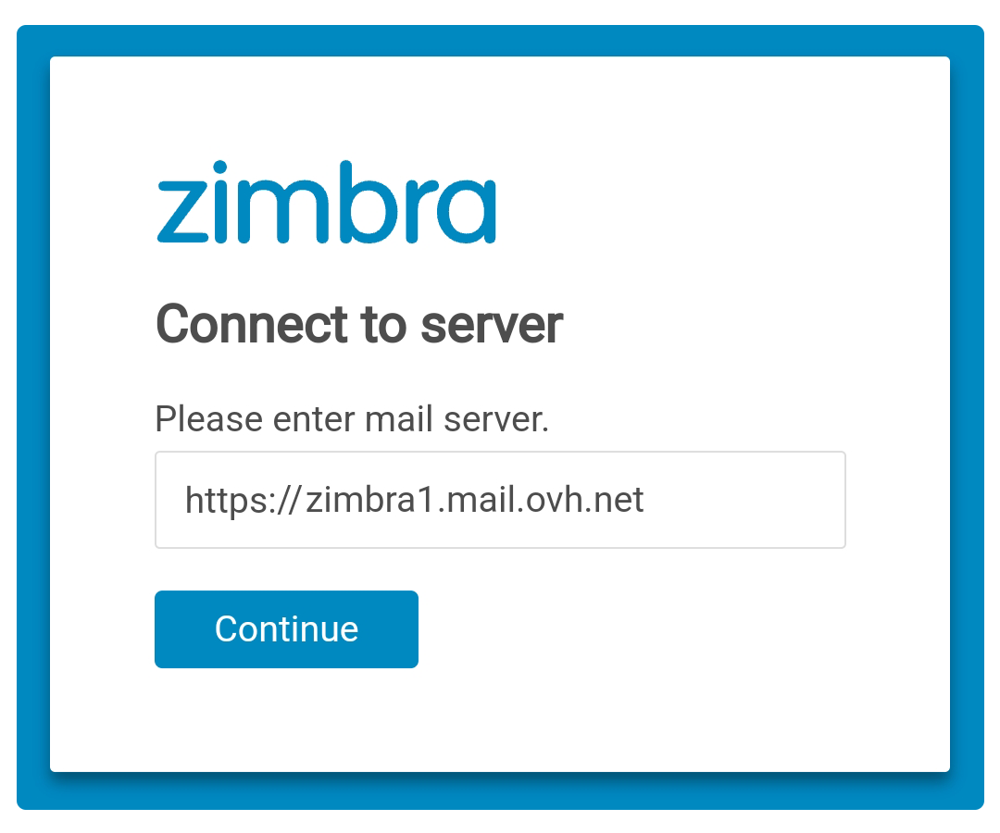

> [!warning]
>
> **Wichtig**
>
> Das Zimbra Angebot befindet sich in der Beta-Phase.
>
> Es ist derzeit für Anwender verfügbar, die das [Beta-Anmeldeformular ausgefüllt haben](https://labs.ovhcloud.com/en/zimbra-beta/).
>
> Einige der in dieser Anleitung aufgeführten Funktionen oder Einschränkungen können sich nach der Markteinführung des Produkts ändern.

## Ziel

Zimbra E-Mail-Accounts können auf verschiedenen kompatiblen E-Mail-Clients eingerichtet werden. So können Sie Ihre E-Mail-Adresse von dem Gerät Ihrer Wahl aus verwenden. Die Zimbra App ist kostenlos für Android und iOS verfügbar

**So konfigurieren Sie Ihre Zimbra-E-Mail-Adresse in der Zimbra-App.**

> [!warning]
>
> OVHcloud stellt Ihnen Dienste zur Verfügung, für deren Konfiguration, Verwaltung und Verwaltung Sie die alleinige Verantwortung tragen. Es liegt somit in Ihrer Verantwortung, sicherzustellen, dass diese ordnungsgemäß funktionieren.
>
> Wir stellen Ihnen diese Anleitung zur Verfügung, um Sie bei gängigen Aufgaben bestmöglich zu begleiten. Dennoch empfehlen wir Ihnen, falls Sie Hilfe brauchen, einen [spezialisierten Partner](https://marketplace.ovhcloud.com/c/support-collaboration) und/oder den Herausgeber des Dienstes zu kontaktieren. Für externe Dienstleistungen bieten wir leider keine Unterstützung. Weitere Informationen finden Sie im Abschnitt „Weiterführende Informationen“ dieser Anleitung.

## Voraussetzungen

- Sie besitzen eine Zimbra-E-Mail-Adresse.
- Sie haben die Zimbra-App auf Ihrem Gerät [Android](https://play.google.com/store/apps/details?id=com.zimbra.modernapp&hl=de) oder [iOS](https://apps.apple.com/cm/app/zimbra-email-collaboration/id1554848550) installiert.
- Sie haben die Login-Daten der E-Mail-Adresse, die Sie einrichten möchten.

## In der praktischen Anwendung

### E-Mail-Adresse konfigurieren

Folgen Sie den Installationsschritten, indem Sie unten auf die Registerkarten klicken:

> [!tabs]
> **Schritt 1**
>>
>> Beim ersten Starten der Anwendung wird das folgende Fenster angezeigt. Geben Sie die URL des OVHcloud Zimbra-Servers `https://zimbra1.mail.ovh.net` ein, drücken Sie `Continue`{.action}, um den Vorgang zu bestätigen.
>>
>> {.thumbnail .w-600 .h-600}
>>
> **Schritt 2**
>>
>> Geben Sie Ihre **Zimbra E-Mail-Adresse** und das zugehörige **Passwort** ein und tippen Sie anschließend auf `Anmelden`{.action}.
>>
>> {.thumbnail .w-600 .h-600}
>>
> **Schritt 3**
>>
>> Sie haben nun Zugriff auf den Inhalt Ihres E-Mail-Accounts. Standardmäßig erscheint Ihr Posteingang   
>>
>> {.thumbnail .w-600 .h-600}

> [!success]
>
> Das Interface der Zimbra App ist ähnlich wie Webmail. Weitere Informationen zu den Funktionen und Einstellungen finden Sie in unserer Anleitung „[Zimbra Webmail verwenden](/pages/web_cloud/email_and_collaborative_solutions/mx_plan/email_zimbra)“.

### E-Mail-Adresse verwenden

Nach der Konfiguration der E-Mail-Adresse können Sie diese verwenden! Sie können ab sofort Nachrichten senden und empfangen.

OVHcloud bietet auch eine Web-App, mit der Sie über einen Webbrowser auf Ihre E-Mail-Adresse zugreifen können. Diese ist über [diesen Link](/links/web/email) verfügbar. Sie können sich mit den Login-Daten Ihrer E-Mail-Adresse anmelden. Wenn Sie Fragen zur Verwendung haben, lesen Sie unsere Anleitung „[Zimbra Webmail verwenden](/pages/web_cloud/email_and_collaborative_solutions/)“.

### Eine andere Zimbra E-Mail-Adresse aufrufen 

Mit der Zimbra App kann immer nur eine E-Mail-Adresse konfiguriert werden. Um einen anderen Zimbra E-Mail-Account zu verwenden, müssen Sie sich daher von Ihrem E-Mail-Account abmelden.

Gehen Sie in das Menü `☰`{.action} in der oberen linken Ecke Ihres Bildschirms und wählen Sie das Profilsymbol in der oberen Ecke Ihres Bildschirms. Tippen Sie abschließend auf `Abmelden`.

{.thumbnail .w-600 .h-600}

### Was kann ich tun, wenn beim Starten der Anwendung ein leerer Bildschirm angezeigt wird?

Dies ist ein Fehler beim Laden, der mit der Netzwerkverbindung zusammenhängt. Warten Sie einen Moment, bis die Anwendung die Anmeldung abgeschlossen hat.

Wenn nichts passiert, überprüfen Sie, ob die Netzwerkverbindung Ihres Mobiltelefons korrekt ist, schließen Sie dann die App vollständig und starten Sie sie erneut. Wiederholen Sie den Vorgang so oft wie nötig.

Wenn das Problem weiterhin besteht, installieren Sie die Anwendung erneut. Dadurch werden die Einstellungen zurückgesetzt und mögliche Beschädigungen der Konfigurationsdatei der Anwendung beseitigt.

## Weiterführende Informationen 

[Erste Schritte mit Zimbra](/pages/web_cloud/email_and_collaborative_solutions/zimbra/getting_started_zimbra)

[Zimbra-E-Mail-Adresse auf einem E-Mail-Client konfigurieren](/pages/web_cloud/email_and_collaborative_solutions/zimbra/zimbra_mail_apps)

[Zimbra Webmail verwenden](/pages/web_cloud/email_and_collaborative_solutions/mx_plan/email_zimbra)

[OVHcloud Zimbra FAQ](/pages/web_cloud/email_and_collaborative_solutions/mx_plan/faq-zimbra)

Kontaktieren Sie für spezialisierte Dienstleistungen (SEO, Web-Entwicklung etc.) die [OVHcloud Partner](/links/partner).

Wenn Sie Hilfe bei der Nutzung und Konfiguration Ihrer OVHcloud Lösungen benötigen, beachten Sie unsere [Support-Angebote](/links/support).

Treten Sie unserer [User Community](/links/community) bei.