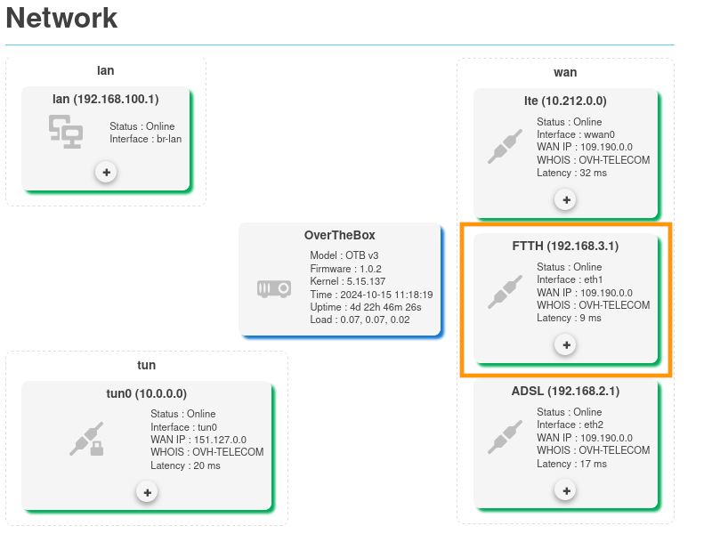
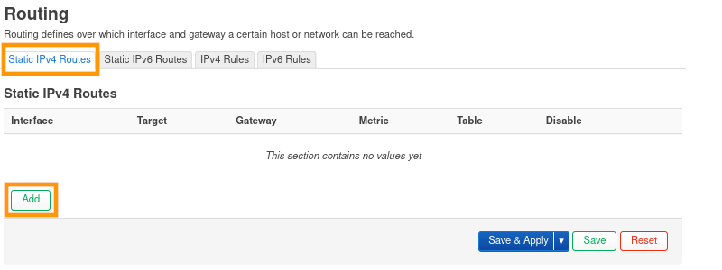
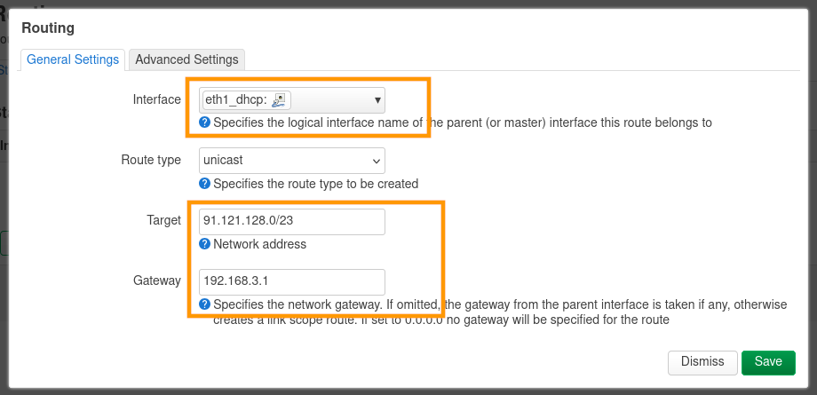
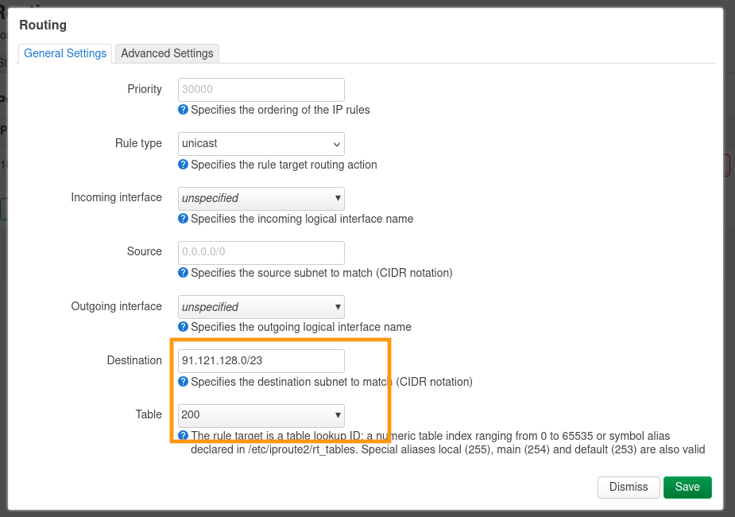
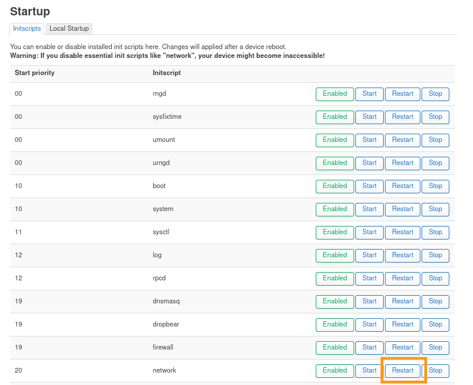

## Objectif

Découvrez comment ajouter une route statique sur votre équipement OverTheBox, afin qu'un flux réseau ne passe pas par le tunnel chiffré mais par une interface WAN précise.

## Prérequis

- Une **OverTheBox** fournie par OVHcloud ou une installation depuis [le projet Open Source](/pages/web_cloud/internet/overthebox/advanced_installer_limage_overthebox_sur_votre_materiel).
- Être connecté à l'interface web de l'**OverTheBox** depuis [overthebox.ovh](http://overthebox.ovh) ou [192.168.100.1](https://192.168.100.1).

## En pratique

### Étape 1 : préparation

Dans notre cas, notre OverTheBox possède trois interfaces WAN:

- Une interface **LTE** avec comme IP de gateway `10.212.0.0`.
- Une interface **FTTH** avec comme IP de gateway `192.168.3.1`.
- Une interface **ADSL** avec comme IP de gateway `192.168.2.1`.

Pour l'exemple de ce guide, nous souhaitons que notre service de [VoIP OVHcloud](https://www.ovhtelecom.fr/telephonie/) accessible sur la plage d'IP `91.121.128.0/23` ne passe pas par le tunnel de notre OverTheBox mais uniquement par l'interface FTTH.
Nous allons donc créer une route statique pour que la plage `91.121.128.0/23` passe uniquement par notre gateway `192.168.3.1`.

{.thumbnail}

### Étape 2 : ajout de la route statique

- Rendez-vous dans l'onglet `Network > Routing`{.action}.
- Dans l'onglet `Static IPv4 Routes`{.action}, cliquez sur le bouton `Add`{.action}, afin d'ajouter une route statique.

{.thumbnail}

- Pour le paramètre `Interface`{.action}, sélectionnez l'interface qui correspond à la gateway souhaitée. Pour notre exemple, `eth1_dhcp`.
- Pour le paramètre `Target`{.action}, configurez la plage d'adresse IP qui correspond à la route statique. Pour notre exemple, `91.121.128.0/23`.
- Pour le paramètre `Gateway`{.action}, configurez l'adresse IP qui correspond à la gateway souhaitée. Pour notre exemple, `192.168.3.1`.
- Cliquez sur `Save`{.action} pour sauvegarder vos modifications.
- Cliquez sur `Save & Apply`{.action} pour appliquer vos modifications.

{.thumbnail}

### Étape 3 : identifier la table de routage

Pour la suite du guide, vous devez identifier la table de routage utilisée par votre interface.

- Rendez-vous dans l'onglet `Status > Routing`{.action}.
- Dans la section `Active IPv4 Routes`{.action}, mémorisez la table utilisée par l'interface. Pour notre exemple, l'interface `eth1_dhcp` utilise la table de routage `200`.

{.thumbnail}

### Étape 4 : ajout de la règle statique

- Rendez-vous dans l'onglet `Network > Routing`{.action}.
- Dans l'onglet `IPv4 Rules`{.action}, cliquez sur le bouton `Add`{.action}, afin d'ajouter une règle de routage.

{.thumbnail}

- Pour le paramètre `Destination`{.action}, configurez la plage d'adresse IP qui correspond à la route statique. Pour notre exemple, `91.121.128.0/23`.
- Pour le paramètre `Table`{.action}, configurez la table de routage qui correspond à l'interface. Pour notre exemple, comme vu à l'étape 3, l'interface `eth1_dhcp` utilise la table de routage `200`.
- Cliquez sur `Save`{.action} pour sauvegarder vos modifications.
- Cliquez sur `Save & Apply`{.action} pour appliquer vos modifications.

{.thumbnail}

### Étape 5 : redémarrer le service network

> [!primary]
>
> Vous pouvez aussi redémarrez votre **OverTheBox** pour cette étape.
>

Pour que les changements soient correctement pris en compte, vous devez redémarrez le service `Network`.

- Rendez-vous dans l'onglet `System > Startup`{.action}.
- Choisissez l'`InitScript network` et cliquez sur le bouton `Restart`{.action}.
- Le service `Network` en charge du réseau va redémarrer et les modifications seront correctement appliquées.

{.thumbnail}

## Aller plus loin

**OverTheBox** étant basé sur **OpenWRT**, vous pouvez également consulter la [documentation OpenWRT](https://openwrt.org/docs/start).

N'hésitez pas à échanger avec notre communauté d'utilisateurs sur vos produits Télécom sur notre site [OVHcloud Community](https://community.ovh.com/c/telecom)
