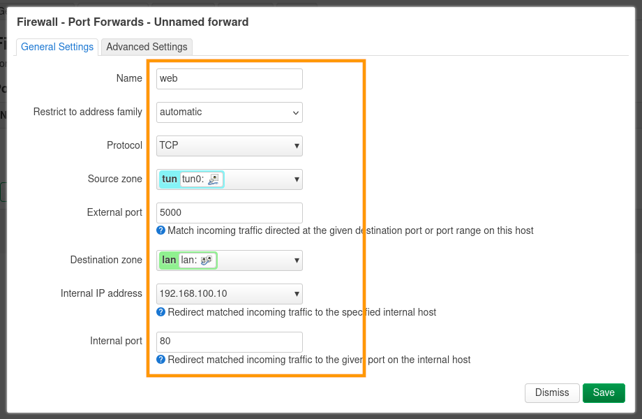
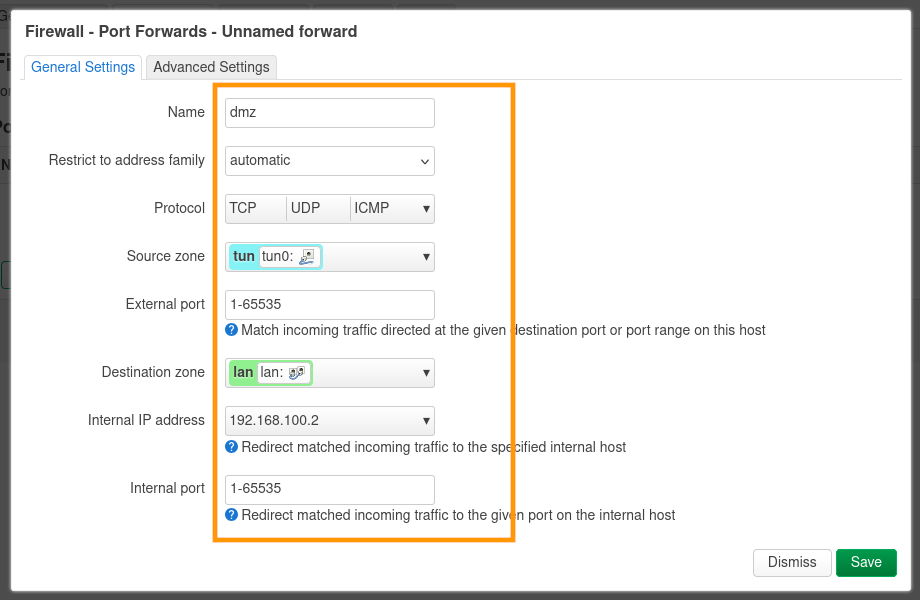
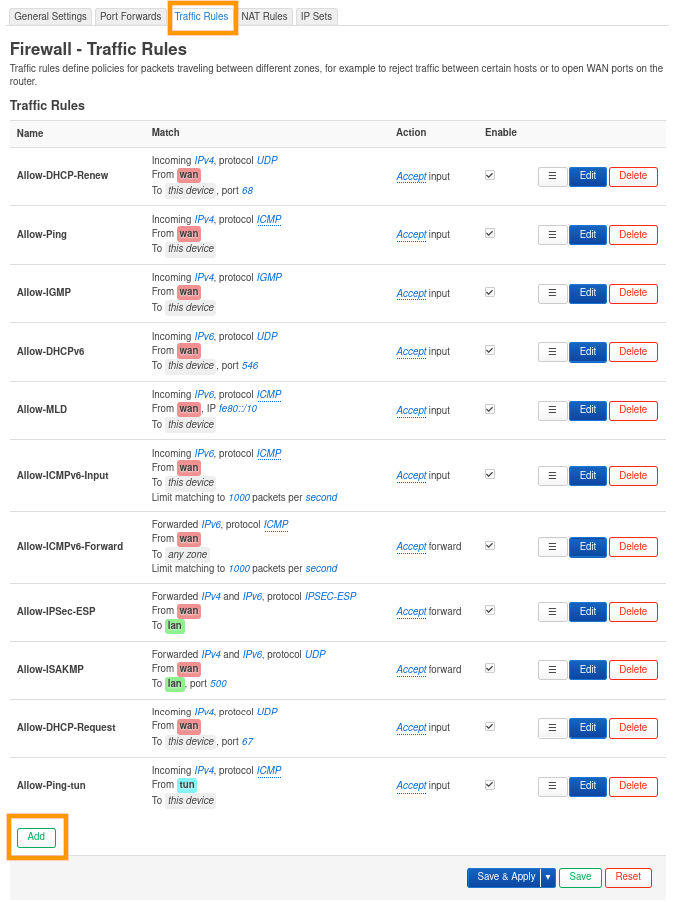
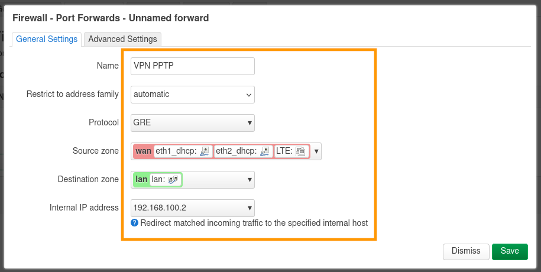

## Objectif

Votre équipement **OverTheBox** est protégé contre les menaces et intrusions externes, son pare-feu empêche les connexions extérieures sur votre réseau local.

Ce guide vous permet de configurer le pare-feu depuis l'interface OverTheBox afin d'accéder aux équipements de votre réseau local depuis l'extérieur.

Découvrez ainsi :

- Comment configurer une redirection de port, pour accéder à une interface web hébergée localement.
- Comment configurer une **DMZ**, pour utiliser votre propre routeur.
- Comment configurer une règle pare-feu, pour par exemple restreindre la connectivité du réseau local.
- Comment configurer un **VPN PPTP**.

## Prérequis

- Une **OverTheBox** fournie par OVHcloud ou une installation depuis [le projet Open Source](/pages/web_cloud/internet/overthebox/advanced_installer_limage_overthebox_sur_votre_materiel).
- Être connecté à l'interface web de l'**OverTheBox** depuis [overthebox.ovh](http://overthebox.ovh) ou [192.168.100.1](https://192.168.100.1).

## En pratique

### Configurer une redirection de port

> [!warning]
>
> - Les ports **5006 à 5009** et **1090** ne peuvent pas être utilisés ou redirigés car ils sont utilisés pour le fonctionnement interne de l'OverTheBox.
> - Il est impératif que l'appareil local cible de la redirection possède comme passerelle par défaut l'IP de l' **OverTheBox**.
>

Une redirection de ports permet aux appareils externes de se connecter sur une plage de ports d'un appareil du réseau local. Dans cet exemple, nous souhaitons rendre accessible depuis un site web hébergé sur notre réseau local.

- Rendez-vous dans l'onglet `Network > Firewall`{.action}.
- Rendez-vous dans la section `Port Forwards`{.action}.
- Cliquez sur le bouton `Add`{.action}.

{.thumbnail}

- Modifiez le paramètre `Name`{.action} pour donner un nom à la redirection. Pour notre exemple, la règle se nomme `web`.
- Modifiez le paramètre `Protocol`{.action} pour restreindre la redirection sur un protocole. Pour notre exemple, nous n'avons besoin que du protocole **HTTP** qui se base sur **TCP**, nous renseignons donc `TCP`.
- Modifiez le paramètre `Source Zone`{.action} pour changer la zone firewall de la redirection. Les redirections de ports sur **OverTheBox** se font au travers du tunnel, il faut donc renseigner la zone `tun`.
- Modifiez le paramètre `External port`{.action} pour configurer le port externe de la redirection. Pour notre exemple, nous souhaitons que le site web soit accessible via `http://ip_overthebox:5000`, nous renseignons donc `5000`.
- Modifiez le paramètre `Internal IP address`{.action} pour configurer l'adresse de l'équipement local. Pour notre exemple, le serveur a pour IP `192.168.100.10`.
- Modifiez le paramètre `Internal port`{.action} pour configurer le port interne de la redirection. Pour notre exemple, le serveur web écoute sur le port `80`.
- Cliquez sur `Save`{.action} pour sauvegarder vos modifications.
- Cliquez sur `Save & Apply`{.action} pour appliquer vos modifications.

{.thumbnail}

> [!primary]
>
> Il est possible de renseigner une plage de ports à l'aide de la notation `port1-port2` dans les champs `External port`{.action} et `Internal port`{.action}.
>
> Les plages `External port`{.action} et `Internal port`{.action} doivent comporter le même nombre de ports.
>

### Configurer une DMZ

Si vous souhaitez utiliser votre propre routeur pour gérer votre réseau local, vous pouvez configurer une **DMZ** qui va permettre d'autoriser n'importe quelle connexion depuis l'extérieur. La protection de votre réseau local sera à la charge de l'équipement local cible.

- Rendez-vous dans l'onglet `Network > Firewall`{.action}.
- Rendez-vous dans la section `Port Forwards`{.action}.
- Cliquez sur le bouton `Add`{.action}.

{.thumbnail}

- Modifiez le paramètre `Name`{.action} pour donner un nom à la redirection. Pour notre exemple, la règle se nomme `dmz`.
- Modifiez le paramètre `Protocol`{.action} pour restreindre la redirection sur un protocole. Pour notre exemple, nous ne souhaitons pas de restriction, nous renseignons donc `TCP+UDP+ICMP`.
- Modifiez le paramètre `Source Zone`{.action} pour changer la zone firewall de la redirection. Les redirections de ports sur **OverTheBox** se font au travers du tunnel, il faut donc renseigner la zone `tun`.
- Modifiez le paramètre `External port`{.action} pour configurer le port externe de la **DMZ**. Nous ne souhaitons aucun filtre, nous renseignons donc la plage maximale `1-65535`.
- Modifiez le paramètre `Internal IP address`{.action} pour configurer l'adresse de l'équipement local. Pour notre exemple, le routeur a pour IP `192.168.100.2`.
- Modifiez le paramètre `Internal port`{.action} pour configurer le port interne de la **DMZ**. Vous devez renseigner la même plage que le paramètre `External port`{.action} : `1-65535`
- Cliquez sur `Save`{.action} pour sauvegarder vos modifications.
- Cliquez sur `Save & Apply`{.action} pour appliquer vos modifications.

{.thumbnail}

### Configurer une règle de pare-feu

Une règle de pare-feu permet de contrôler le trafic entrant et sortant de votre réseau. Dans cet exemple, nous souhaitons rendre impossibles les connexions **FTP** depuis le réseau local.

- Rendez-vous dans l'onglet `Network > Firewall`{.action}.
- Rendez-vous dans la section `Traffic Rules`{.action}.
- Cliquez sur le bouton `Add`{.action}.

{.thumbnail}

- Modifiez le paramètre `Name`{.action} pour donner un nom à la règle. Pour notre exemple, la règle se nomme `Disallow-FTP-Lan`.
- Modifiez le paramètre `Protocol`{.action} pour restreindre la redirection sur un protocole. Pour notre exemple, nous ne souhaitons bloquer le port `21` globalement, nous renseignons donc `TCP+UDP`.
- Modifiez le paramètre `Source zone`{.action} pour changer la zone firewall de la règle. Pour notre exemple, nous souhaitons bloquer le trafic sortant du réseau local, il faut donc renseigner la zone `lan`.
- Les paramètres `Source address`{.action} et `Source Port` peuvent être modifiés pour mettre une règle sur un équipement spécifique. Ce n'est pas ce que nous souhaitons faire dans cet exemple, nous laissons donc les champs vides.
- Modifiez le paramètre `Destination zone`{.action} pour configurer la zone de destination sur laquelle s'applique la règle. Nous ne souhaitons aucun trafic sortant, nous renseignons donc `Any Zone`.
- Modifiez le paramètre `Destination port`{.action} pour configurer le port sur lequel s'applique la règle. Pour notre exemple, le trafic du protocole **FTP** utilise le port `21`.
- Modifiez le paramètre `Action`{.action} pour configurer l'action de la règle. Pour notre exemple, nous souhaitons bloquer le port, nous renseignons donc `reject`.
- Cliquez sur `Save`{.action} pour sauvegarder vos modifications.
- Cliquez sur `Save & Apply`{.action} pour appliquer vos modifications.

{.thumbnail}

### Configurer un serveur VPN PPTP

> [!primary]
>
> Dans le cadre d'une configuration en dehors de la zone `tun`, assurez-vous de configurer le routeur en amont pour accepter la connexion entrante.
>

Dans cet exemple, nous souhaitons configurer un serveur VPN PPTP sans passer par le tunnel de l'**OverTheBox**. L'ajout d'un serveur **VPN PPTP** à votre OverTheBox permet d'établir des connexions réseau sécurisées et privées, idéales pour des télétravailleurs ou des succursales éloignées.

- Rendez-vous dans l'onglet `Network > Firewall`{.action}.
- Rendez-vous dans la section `Port Forwards`{.action}.
- Cliquez sur le bouton `Add`{.action}.

{.thumbnail}

- Modifiez le paramètre `Name`{.action} pour donner un nom à la redirection. Pour notre exemple, la règle se nomme `VPN PPTP`.
- Modifiez le paramètre `Protocol`{.action} pour restreindre la redirection sur un protocole. Pour notre exemple, nous devons utiliser un protocole spécifique `GRE`, nous renseignons donc, dans le champ `custom`{.action} du menu déroulant, le numéro du protocole `47`.
- Modifiez le paramètre `Source Zone`{.action} pour changer la zone firewall de la redirection. Pour notre exemple, nous souhaitons passer par une interface **WAN**, il faut donc renseigner la zone `wan`.
- Modifiez le paramètre `Internal IP address`{.action} pour configurer l'adresse de l'équipement local. Pour notre exemple, le serveur VPN a pour IP `192.168.100.2`.
- Cliquez sur `Save`{.action} pour sauvegarder vos modifications.
- Cliquez sur `Save & Apply`{.action} pour appliquer vos modifications.

{.thumbnail}

## Aller plus loin

**OverTheBox** étant basé sur **OpenWRT**, vous pouvez également consulter la [documentation OpenWRT](https://openwrt.org/docs/start).

N'hésitez pas à échanger avec notre communauté d'utilisateurs sur vos produits Télécom sur notre site [OVHcloud Community](https://community.ovh.com/c/telecom).
